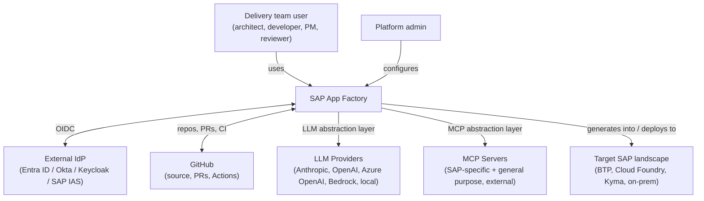
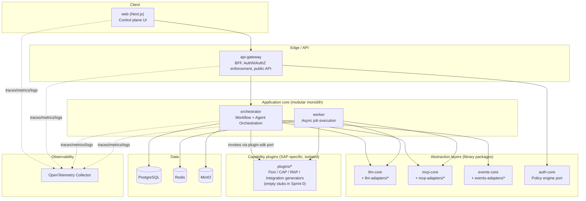
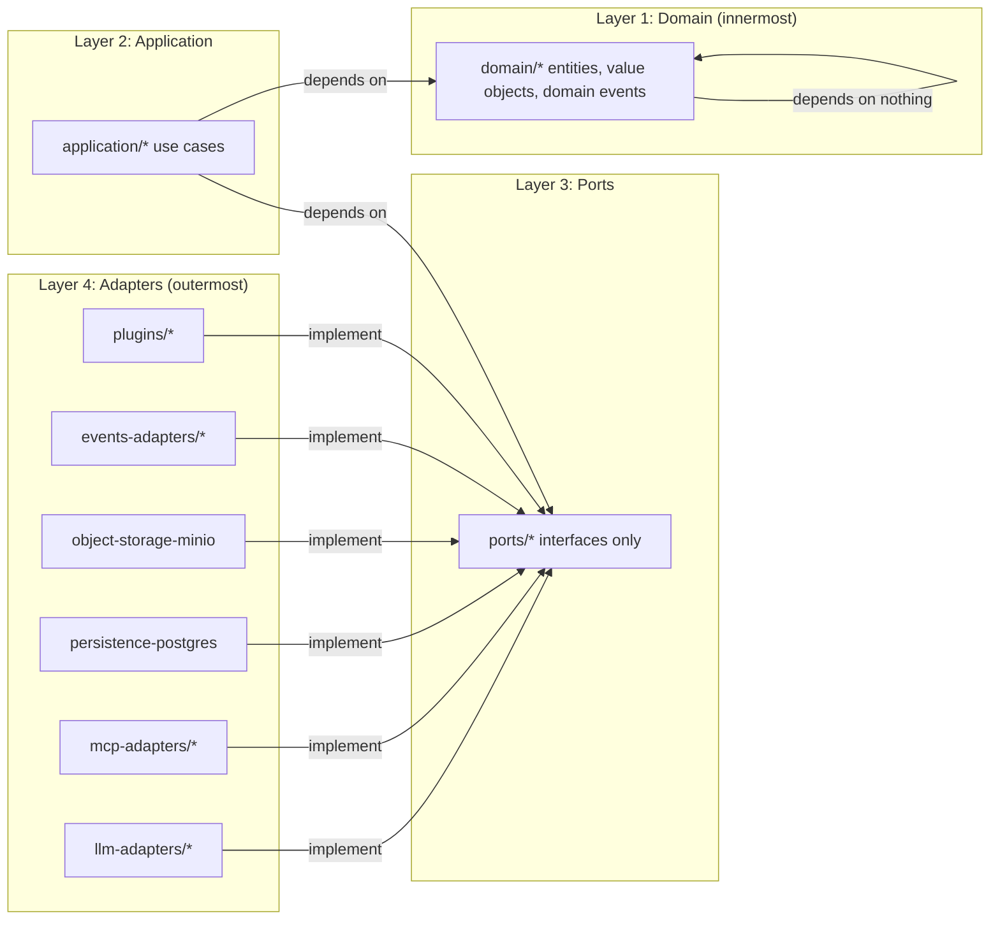

# 01 — High-Level Architecture

## System context

The platform never talks to an LLM provider, an MCP server, or an SAP target system directly from domain code — every arrow crossing the platform boundary above passes through an abstraction layer defined in [ports](03-monorepo-and-packages.md) and implemented by adapters.

## Logical architecture (C4 container view)

## Layering (Clean / Hexagonal)

Every package in `packages/` sits in exactly one of these layers. Dependencies only point inward; enforced mechanically (see [10](10-coding-standards-and-naming.md) and [12](12-risks-and-technical-debt.md)), not by convention alone.

**Rule:** `domain/*` has zero dependencies on any other layer or any framework (no Express, no Prisma, no LLM SDK types). `application/*` depends only on `domain/*` and `ports/*` (interfaces), never on a concrete adapter package. Adapters are the only packages allowed to import a third-party SDK.

## Why a modular monolith, not microservices, for Sprint 0–2

Given the number of moving parts implied by the vision (agents, MCP, multiple LLMs, multiple SAP stacks), the instinct is to split everything into services immediately. That is a classic source of premature distributed-systems tax: network calls where a function call would do, duplicated cross-cutting concerns, and operational overhead with no user yet.

Instead: **one deployable application core (`orchestrator` + `worker`) with strict internal module boundaries**, extracted into separate services only when a concrete scaling or team-ownership need proves it (see [ADR-0003](../adr/0003-modular-monolith-first.md)). The hexagonal layering above is what makes that extraction cheap later — a package behind a port can become a service behind an API without touching its callers.

## Related documents
- Domain model and bounded contexts: [02-domain-model.md](02-domain-model.md)
- Monorepo/package strategy: [03-monorepo-and-packages.md](03-monorepo-and-packages.md)
- Service boundaries: [04-service-boundaries.md](04-service-boundaries.md)
