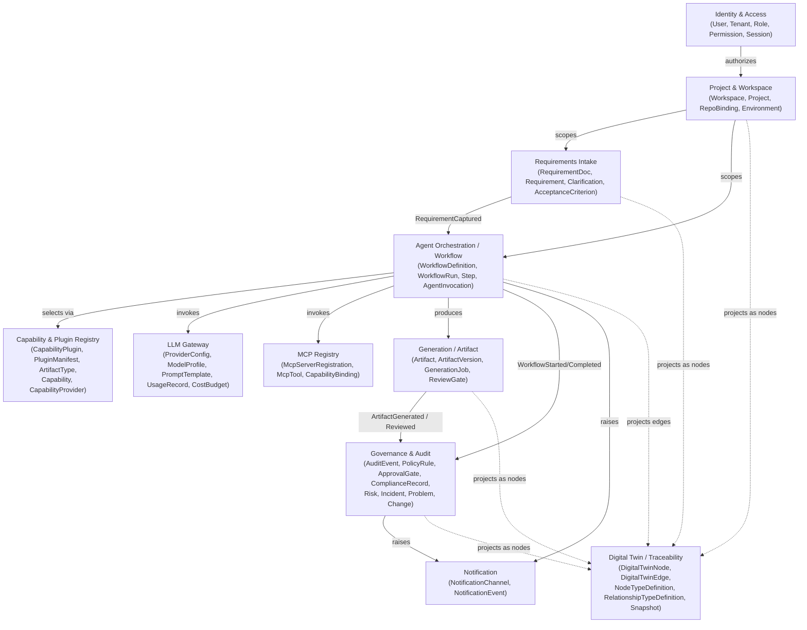

# 02 — Domain Model

All bounded contexts below are **SAP-agnostic by construction**. None of them know what a Fiori app or a CDS view is — that knowledge lives only behind the Capability & Plugin Registry, inside `plugins/*`. If you find yourself wanting to add a field like `fioriAnnotations` or `absl_class_name` to any entity here, stop: that belongs in a plugin's own data, referenced by opaque `artifactType` string, not in the core.

## Bounded contexts (context map)

`DT` (Digital Twin / Traceability) is a deliberate fan-in: it subscribes to events from every other context but is never depended on by them — see [16-project-digital-twin.md](16-project-digital-twin.md).

Arrows are **domain events**, not method calls — see [06-event-model.md](06-event-model.md). Contexts never share tables; cross-context references are by opaque ID only.

## Context summaries

### Identity & Access
Owns authentication identity and authorization data. Aggregates: `Tenant`, `User`, `Role`, `Permission`, `Session`. Downstream of an external IdP for authentication (see [08](08-authentication-and-rbac.md)); this context owns *authorization* (who can do what, where), not credential storage.

### Project & Workspace
The unit a delivery team works in. Aggregates: `Workspace` (a tenant's organizational grouping), `Project` (one SAP delivery engagement — gains `requiredExecutionProfiles: ExecutionProfileId[]` post-review, see [14-execution-profiles.md](14-execution-profiles.md)), `RepositoryBinding` (link to a GitHub repo), `Environment` (dev/test/prod target descriptor — generic, e.g. `{ name, kind, connectionRef }`, never SAP-typed here), `TargetSystemConnection` (a credential-bearing reference to a customer's SAP BTP/CF/Kyma/on-prem system — added post-review as its own aggregate rather than a generic secret, see [ADR-0015](../adr/0015-target-system-credential-management.md); the connection itself carries only an encrypted reference, never plaintext credential material — also the resolution target for an `ExecutionProfile`'s Enterprise-tier `AdapterBindingRef`s), `Deployment` and `ApplicationVersion` (added post-review — `ApplicationVersion` is a named, immutable bundle of `Artifact`/`ArtifactVersion` references constituting one release; `Deployment` records that a specific `ApplicationVersion` was deployed to a specific `Environment` under a specific execution profile, with a status; see [16-project-digital-twin.md](16-project-digital-twin.md)).

### Requirements Intake
Captures and structures business requirements before generation starts. Aggregates: `RequirementDocument`, `Requirement` (gains a `kind` field post-review — `business | functional | non-functional | user-story` — so a User Story is a shape of `Requirement`, not a separate aggregate; see [16-project-digital-twin.md](16-project-digital-twin.md)), `Clarification` (a question raised back to a human), `AcceptanceCriterion`. This is deliberately modeled as its own context so intake can evolve (structured forms, document upload, chat-based elicitation) without touching orchestration.

### Capability & Plugin Registry
The seam where SAP-specific knowledge is allowed to exist — but only as data the core reads, never as code the core executes inline. Aggregates: `CapabilityPlugin` (an installed plugin), `PluginManifest` (declared inputs/outputs, required MCP capabilities, required LLM capabilities, supported `ArtifactType`s, and — added post-review, see [14-execution-profiles.md](14-execution-profiles.md) — `supportedExecutionProfiles` and `portCategoriesUsed`), `ArtifactType` (an opaque, plugin-declared string like `"fiori-elements-app"` — the core treats it as an identifier, not a type it understands), `ExecutionProfile` (a named map from each of a fixed `PortCategory` enum — persistence, authentication, authorization, messaging, storage, sap-connectivity, external-api — to an opaque `AdapterBindingRef`, describing how a *generated application* is wired for Local POC, Hybrid, or Enterprise execution; see [ADR-0019](../adr/0019-execution-profiles-for-generated-applications.md)). As with plugins, the core stores and resolves `ExecutionProfile`s without knowing what SQLite, HANA, or XSUAA actually are — that mapping lives entirely inside plugin implementations.

Also added post-review, per [ADR-0022](../adr/0022-capability-model-provider-abstraction.md): `Capability` (the provider-agnostic, business-level request contract — e.g. "Generate Functional Specification" — with inputs, outputs, preconditions, required permissions, approval requirements, required context, expected `ArtifactType`s, and quality gates, all as policy-as-code references, never inline logic) and `CapabilityProvider` (one eligible provider for a capability — `providerType: 'agent' | 'plugin' | 'human' | 'external-service'`, `providerId`, `providerVersion`, `priority` — an ordered fallback chain structurally identical to `ModelProfile`'s, [ADR-0016](../adr/0016-mandatory-resilience-patterns.md)). A `WorkflowDefinition`'s steps reference a `Capability`, never a specific `AgentDefinition` or `CapabilityPlugin` directly — see [18-capability-model.md](18-capability-model.md). `CapabilityProvider` is deliberately not named `CapabilityBinding` — that name is already used by the MCP Registry context for a different concept (tool-access authorization); the two are not to be confused.

### Agent Orchestration / Workflow
The heart of "orchestrate multiple AI agents." Aggregates: `WorkflowDefinition` (a template — generic DAG/state machine of steps), `WorkflowRun` (an execution instance), `Step` (a unit of work — of kind `capability-request` or `human-approval`; see the Capability Model revision below), `AgentInvocation` (a record of one LLM/agent call within a step, for replay and audit), `AgentDefinition` (added post-review — a versioned, named agent role: purpose, responsibilities, allowed MCP tools, inputs/outputs, memory scope, escalation/approval policy references, context-loading strategy, pinned prompt version, tool permissions — authored as files under [.ai/agents/](../../.ai/agents/); see [15-ai-workspace.md](15-ai-workspace.md) and [ADR-0020](../adr/0020-ai-workspace-for-agent-definitions.md)). See [07-workflow-engine.md](07-workflow-engine.md).

**Revised per [ADR-0022](../adr/0022-capability-model-provider-abstraction.md):** a `Step` never references an `AgentDefinition` or a `CapabilityPlugin` directly — it references a `Capability` (Capability & Plugin Registry, above), resolved to a concrete `CapabilityProvider` at run time through `ports/capability-resolver.port.ts`. `AgentDefinition` no longer has a `Step` naming it; instead it declares `providesCapabilities: CapabilityId[]`, becoming one of possibly several providers for a capability rather than a workflow's hardcoded, sole fulfiller. This closes a real inconsistency the original design had: `plugin-generation` steps already resolved indirectly through a capability-shaped lookup while `agent-invocation` steps named an `AgentDefinition` directly — see [18-capability-model.md](18-capability-model.md) for the full before/after.

### LLM Gateway
Provider-agnostic model access. Aggregates: `ProviderConfig` (which providers/keys are enabled per tenant), `ModelProfile` (logical model name → concrete provider+model+params mapping, so workflows reference `"reasoning-large"` not `"claude-opus-4-8"`), `PromptTemplate` (versioned), `UsageRecord`, `CostBudget` (per tenant/project spend guardrails).

### MCP Registry
Provider-agnostic tool access. Aggregates: `McpServerRegistration` (an installed/configured MCP server, transport-agnostic), `McpTool` (a discovered tool + schema), `CapabilityBinding` (which plugin/workflow step is allowed to call which tool — a Zero Trust control point).

### Generation / Artifact
What actually gets produced. Aggregates: `Artifact` (a generated file/bundle, opaque `artifactType` + storage reference into MinIO — gains `generatedForExecutionProfile: ExecutionProfileId` post-review, see [14-execution-profiles.md](14-execution-profiles.md)), `ArtifactVersion` (same addition), `GenerationJob` (one plugin execution that produced artifact(s) — its `GenerationInput` gains `targetExecutionProfile: ExecutionProfileId`), `ReviewGate` (human review/approval attached to an artifact before it can be promoted).

### Governance & Audit
ITIL/PMO alignment made structural rather than aspirational. Aggregates: `AuditEvent` (append-only, derived from domain events), `PolicyRule` (policy-as-code reference, evaluated by `auth-core`), `ApprovalGate` (change-record-style approval, e.g. before deploying generated code), `ComplianceRecord` (links a workflow run back to the requirement and approvals that authorized it — the PMO traceability chain: requirement → workflow run → artifact → approval → deployment), and — added post-review, the concrete realization of the ITIL-alignment principle stated since Sprint 0 — `Risk`, `Incident`, `Problem`, `Change` (see [16-project-digital-twin.md](16-project-digital-twin.md)).

### Notification
Fan-out of relevant events to humans/systems (email, Slack, Teams, webhook). Kept as its own context so it can be swapped/extended without touching producers — producers only publish domain events, they never know who's listening.

### Digital Twin / Traceability
Added post-review ([ADR-0021](../adr/0021-project-digital-twin-knowledge-graph.md)). Owns the graph structure representing every artifact a project produces and the typed relationships between them — never the artifact content itself. Aggregates: `DigitalTwinNode` (a typed, versioned reference to a node in some other context — `sourceRef: { context, aggregateId, version }` — plus minimal display fields), `DigitalTwinEdge` (a typed, provenance-tagged relationship between two nodes — `provenance: 'declared' | 'ai-inferred'`), `NodeTypeDefinition` and `RelationshipTypeDefinition` (registries of opaque, declared type strings — the same "no SAP-specific taxonomy in core code" pattern already used for `ArtifactType` and `PortCategory`), `DigitalTwinSnapshot` (an immutable, named capture of the graph's full state at a milestone, e.g. a `Deployment`). Populated entirely by projecting domain events already emitted by every other context — see [16-project-digital-twin.md](16-project-digital-twin.md).

## Aggregate design rules

1. Aggregates are consistency boundaries — an aggregate is loaded and saved as a whole through one repository (`ports/*Repository`).
2. Cross-aggregate and cross-context references are by ID (`workspaceId`, `requirementId`), never by embedding another aggregate's object graph.
3. Every domain-meaningful state transition raises a domain event (past tense, e.g. `WorkflowRunCompleted`), recorded via the transactional outbox — see [06-event-model.md](06-event-model.md).
4. No aggregate in `domain/*` may reference a plugin, an MCP tool name, or an LLM model name as a typed field — only as an opaque string ID resolved through the relevant registry.
5. **No hard deletes on any aggregate that may be referenced cross-context.** Added post-review ([13-principal-architect-self-review.md](13-principal-architect-self-review.md) §4.2) — without this rule, Context A deleting an aggregate that Context B still references by ID silently produces a dangling reference with no error. Instead, such aggregates transition to an `archived`/`deleted` status; a cross-context reference always resolves to either a live aggregate or an explicitly archived one, never to nothing.
6. **State transitions that matter for reproducibility are pinned at the moment they're chosen, not re-resolved later.** Added post-review ([13-principal-architect-self-review.md](13-principal-architect-self-review.md) §3.2, §5.1): a `WorkflowRun` records the exact `WorkflowDefinition` version, `PromptTemplate` version, `AgentDefinition` version(s) for every `capability-request` step resolved to an agent provider, and resolved `ModelProfile` → provider/model mapping it used at start, on the run itself — not derived after the fact from "whatever is current." Extended per [ADR-0022](../adr/0022-capability-model-provider-abstraction.md): a `WorkflowRun` also records the exact resolved `CapabilityProvider` (`providerType`, `providerId`, `providerVersion`) for every `capability-request` step — which provider fulfilled a capability request is pinned at resolution time, not re-derived later, for the same reproducibility reason. This is what makes a run from six months ago reproducible and auditable, and prevents a live edit to a definition/prompt/agent/model profile/provider registration from silently altering runs already in flight.

## Request context (cross-cutting, not an aggregate)

Added post-review ([13-principal-architect-self-review.md](13-principal-architect-self-review.md) §2.1, §9): every port method (`ports/*`) takes an explicit `RequestContext` — `{ tenantId, actorId, correlationId, tenancyTier }` — as a parameter, rather than relying on ambient/thread-local state or on the database session variable RLS depends on being the only place tenant scoping is enforced. This gives tenant-isolation a second, application-layer control independent of the database layer (defense in depth — see [08-authentication-and-rbac.md](08-authentication-and-rbac.md)), and doubles as the natural home for the correlation ID that ties a chain of domain events back to one `WorkflowRun` ([06-event-model.md](06-event-model.md)) and the actor identity every `AuditEvent` needs.

## Read models (cross-cutting, not part of any single context)

Added post-review ([13-principal-architect-self-review.md](13-principal-architect-self-review.md) §5.2): cross-aggregate, cross-context reporting/dashboard queries are served by event-fed projections in `packages/read-models/*`, not by aggregate repositories. See [ADR-0014](../adr/0014-cqrs-read-models.md).

The Digital Twin / Traceability context (above) is the same read-side, event-projection relationship as `read-models` — populated from events, never written to directly by command-side use cases — applied to a graph-shaped query need (traversal, impact analysis) instead of a tabular one (dashboards, lists). It was promoted to a full bounded context rather than folded into `read-models` because it carries its own rules beyond a passive projection: provenance/confidence on edges, append-only versioning, and snapshotting. See [16-project-digital-twin.md](16-project-digital-twin.md).
