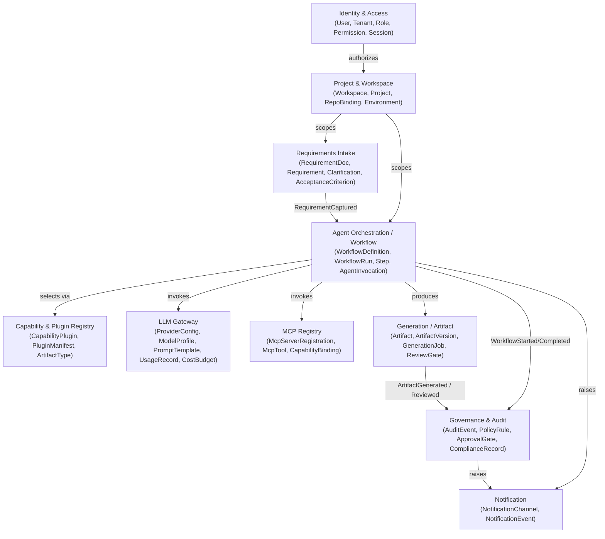

# 02 — Domain Model

All bounded contexts below are **SAP-agnostic by construction**. None of them know what a Fiori app or a CDS view is — that knowledge lives only behind the Capability & Plugin Registry, inside `plugins/*`. If you find yourself wanting to add a field like `fioriAnnotations` or `absl_class_name` to any entity here, stop: that belongs in a plugin's own data, referenced by opaque `artifactType` string, not in the core.

## Bounded contexts (context map)

Arrows are **domain events**, not method calls — see [06-event-model.md](06-event-model.md). Contexts never share tables; cross-context references are by opaque ID only.

## Context summaries

### Identity & Access
Owns authentication identity and authorization data. Aggregates: `Tenant`, `User`, `Role`, `Permission`, `Session`. Downstream of an external IdP for authentication (see [08](08-authentication-and-rbac.md)); this context owns *authorization* (who can do what, where), not credential storage.

### Project & Workspace
The unit a delivery team works in. Aggregates: `Workspace` (a tenant's organizational grouping), `Project` (one SAP delivery engagement), `RepositoryBinding` (link to a GitHub repo), `Environment` (dev/test/prod target descriptor — generic, e.g. `{ name, kind, connectionRef }`, never SAP-typed here).

### Requirements Intake
Captures and structures business requirements before generation starts. Aggregates: `RequirementDocument`, `Requirement`, `Clarification` (a question raised back to a human), `AcceptanceCriterion`. This is deliberately modeled as its own context so intake can evolve (structured forms, document upload, chat-based elicitation) without touching orchestration.

### Capability & Plugin Registry
The seam where SAP-specific knowledge is allowed to exist — but only as data the core reads, never as code the core executes inline. Aggregates: `CapabilityPlugin` (an installed plugin), `PluginManifest` (declared inputs/outputs, required MCP capabilities, required LLM capabilities, supported `ArtifactType`s), `ArtifactType` (an opaque, plugin-declared string like `"fiori-elements-app"` — the core treats it as an identifier, not a type it understands).

### Agent Orchestration / Workflow
The heart of "orchestrate multiple AI agents." Aggregates: `WorkflowDefinition` (a template — generic DAG/state machine of steps), `WorkflowRun` (an execution instance), `Step` (a unit of work: an agent task, a plugin invocation, or a human approval gate), `AgentInvocation` (a record of one LLM/agent call within a step, for replay and audit). See [07-workflow-engine.md](07-workflow-engine.md).

### LLM Gateway
Provider-agnostic model access. Aggregates: `ProviderConfig` (which providers/keys are enabled per tenant), `ModelProfile` (logical model name → concrete provider+model+params mapping, so workflows reference `"reasoning-large"` not `"claude-opus-4-8"`), `PromptTemplate` (versioned), `UsageRecord`, `CostBudget` (per tenant/project spend guardrails).

### MCP Registry
Provider-agnostic tool access. Aggregates: `McpServerRegistration` (an installed/configured MCP server, transport-agnostic), `McpTool` (a discovered tool + schema), `CapabilityBinding` (which plugin/workflow step is allowed to call which tool — a Zero Trust control point).

### Generation / Artifact
What actually gets produced. Aggregates: `Artifact` (a generated file/bundle, opaque `artifactType` + storage reference into MinIO), `ArtifactVersion`, `GenerationJob` (one plugin execution that produced artifact(s)), `ReviewGate` (human review/approval attached to an artifact before it can be promoted).

### Governance & Audit
ITIL/PMO alignment made structural rather than aspirational. Aggregates: `AuditEvent` (append-only, derived from domain events), `PolicyRule` (policy-as-code reference, evaluated by `auth-core`), `ApprovalGate` (change-record-style approval, e.g. before deploying generated code), `ComplianceRecord` (links a workflow run back to the requirement and approvals that authorized it — the PMO traceability chain: requirement → workflow run → artifact → approval → deployment).

### Notification
Fan-out of relevant events to humans/systems (email, Slack, Teams, webhook). Kept as its own context so it can be swapped/extended without touching producers — producers only publish domain events, they never know who's listening.

## Aggregate design rules

1. Aggregates are consistency boundaries — an aggregate is loaded and saved as a whole through one repository (`ports/*Repository`).
2. Cross-aggregate and cross-context references are by ID (`workspaceId`, `requirementId`), never by embedding another aggregate's object graph.
3. Every domain-meaningful state transition raises a domain event (past tense, e.g. `WorkflowRunCompleted`), recorded via the transactional outbox — see [06-event-model.md](06-event-model.md).
4. No aggregate in `domain/*` may reference a plugin, an MCP tool name, or an LLM model name as a typed field — only as an opaque string ID resolved through the relevant registry.
