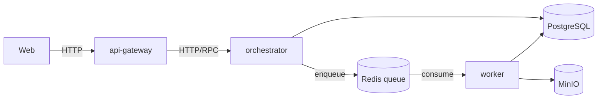

# 04 — Service Boundaries

## Deployable services (Sprint 0)

Only four processes are deployable in Sprint 0. Everything else is a library consumed by one of these.

| Service | Owns | Talks to | Scaling driver |
|---|---|---|---|
| `web` | Control-plane UI rendering, session cookie handling (BFF pattern) | `api-gateway` only, never other services or the DB directly | Request concurrency |
| `api-gateway` | Public API surface, request AuthN/AuthZ enforcement, input validation, rate limiting | `orchestrator` (internal RPC/HTTP), `auth-core` | Request concurrency, kept stateless |
| `orchestrator` | Workflow/Agent Orchestration context: starts/advances `WorkflowRun`s, invokes `llm-core`/`mcp-core`, dispatches long-running steps to `worker` via queue | Postgres, Redis (queue), `llm-core`, `mcp-core`, `events-core` | Workflow step fan-out |
| `worker` | Executes queued steps: plugin invocations, generation jobs, notification delivery | Redis (queue), Postgres, MinIO, `plugin-sdk` loader | Job volume, independently scalable from `orchestrator` |

## What is explicitly *not* a separate service yet

- **LLM Gateway** and **MCP Registry** are library packages (`llm-core`, `mcp-core`) embedded in `orchestrator`/`worker`, not standalone microservices. Rationale: they have no independent scaling or ownership need yet, and a network hop here would only add latency and failure modes to every agent call. The port boundary (`ports/llm-provider.port.ts`, `ports/mcp-connection.port.ts`) means extracting either into its own service later is a matter of swapping the in-process adapter for an HTTP-client adapter — callers don't change.
- **Auth** is not a standalone identity provider — `auth-core` is a library that talks to an external OIDC IdP and a policy engine; the platform never stores passwords. See [08](08-authentication-and-rbac.md).
- **Notification** is a library invoked by `worker`, not a service, until delivery volume or channel count justifies isolating it.

## Extraction criteria

A module graduates from "package inside `orchestrator`/`worker`" to "its own service" only when at least one of these is true, and the decision is recorded as an ADR:
1. It needs to scale independently at a materially different rate than its host process.
2. It needs a release cadence decoupled from the host process (e.g., a partner team owns it).
3. It needs a different runtime/language than Node.js (e.g., a Python-based ML component).
4. It becomes a reuse target for a second host process.

Splitting for any other reason (e.g., "it feels like it should be its own thing") is treated as premature and requires sign-off — see the modular-monolith-first decision in [ADR-0003](../adr/0003-modular-monolith-first.md).
