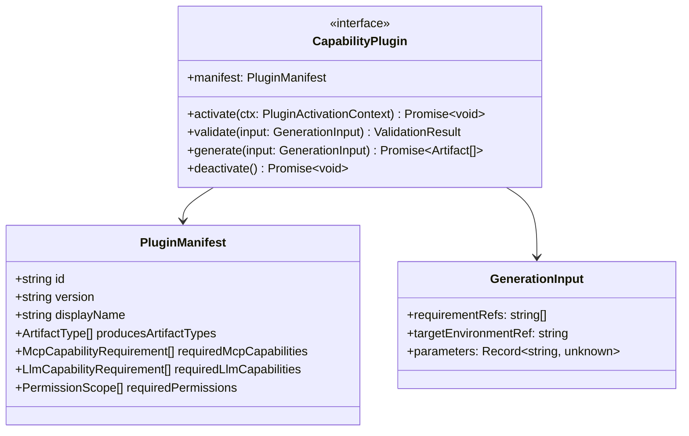

# 05 — Plugin Architecture

This is the mechanism that makes "no SAP-specific logic inside the core platform" enforceable rather than aspirational. Every SAP product surface (Fiori, SAPUI5, CAP Node/Java, RAP, ABAP, Integration Suite, BTP/CF/Kyma deployment) is implemented as a **Capability Plugin**, never as core code.

## The contract (`packages/plugin-sdk`)

`plugin-sdk` is intentionally small and stable: manifest shape, lifecycle methods, and the `GenerationInput`/`Artifact` types it exchanges with the core. It knows nothing about Fiori or ABAP — those are just string values a plugin author chooses for `producesArtifactTypes`.

## Discovery & loading

1. Plugins live in `plugins/<name>` (Sprint 0) or are installed as versioned npm packages implementing `@sap-app-factory/plugin-sdk` (future — this is why the contract package is separate and minimal).
2. At startup, a **Plugin Loader** (in `orchestrator`) reads each plugin's manifest and registers it into the **Capability & Plugin Registry** domain context — the registry is core, the plugins are not.
3. `WorkflowDefinition`s and `Step`s reference capabilities by `artifactType`/capability ID, resolved through the registry at run time — core orchestration code never imports a plugin package by name.

## Isolation & Zero Trust

Plugins are third-party-shaped code (even first-party ones, by discipline) and are treated as such:
- Each plugin invocation runs with a **scoped capability token** limiting which MCP tools and LLM model profiles it may call, derived from `requiredMcpCapabilities`/`requiredLlmCapabilities` in its manifest — least privilege, not ambient access to everything the host process can reach.
- Sprint 0 ships plugin execution in-process (`worker` calling `generate()` directly) but behind an `execute(plugin, input): Promise<Artifact[]>` seam in `plugin-sdk`'s host runner, so process-level isolation (Node `worker_threads`, or a separate container per plugin execution) can be introduced later without changing plugin authors' code — see [ADR-0006](../adr/0006-plugin-architecture.md) and the risk register in [12](12-risks-and-technical-debt.md).
- Every `generate()` call is wrapped with an OpenTelemetry span and emits `GenerationJobStarted`/`Completed`/`Failed` domain events regardless of what the plugin does internally — observability and audit are structural, not opt-in per plugin.

## Sprint 0 deliverable

Only the contract and loader, plus one or two intentionally empty example plugins (`plugins/fiori-generator` with a `generate()` that returns `[]` and a passing contract test). No real generation logic — see the non-goals in [00](00-vision-and-principles.md).

## Anti-pattern this prevents

Without this seam, the natural failure mode is: "just add an `if (artifactType === 'fiori')` branch in the orchestrator to special-case Fiori annotations." That one `if` is how core platforms accumulate irreversible SAP-specific debt. The rule: if core code needs to branch on SAP-specific knowledge, the branch belongs in a plugin's `generate()`, not in `orchestrator`/`worker`/`domain`/`application`. This is checked mechanically — see the banned-keyword CI guard in [12-risks-and-technical-debt.md](12-risks-and-technical-debt.md).
