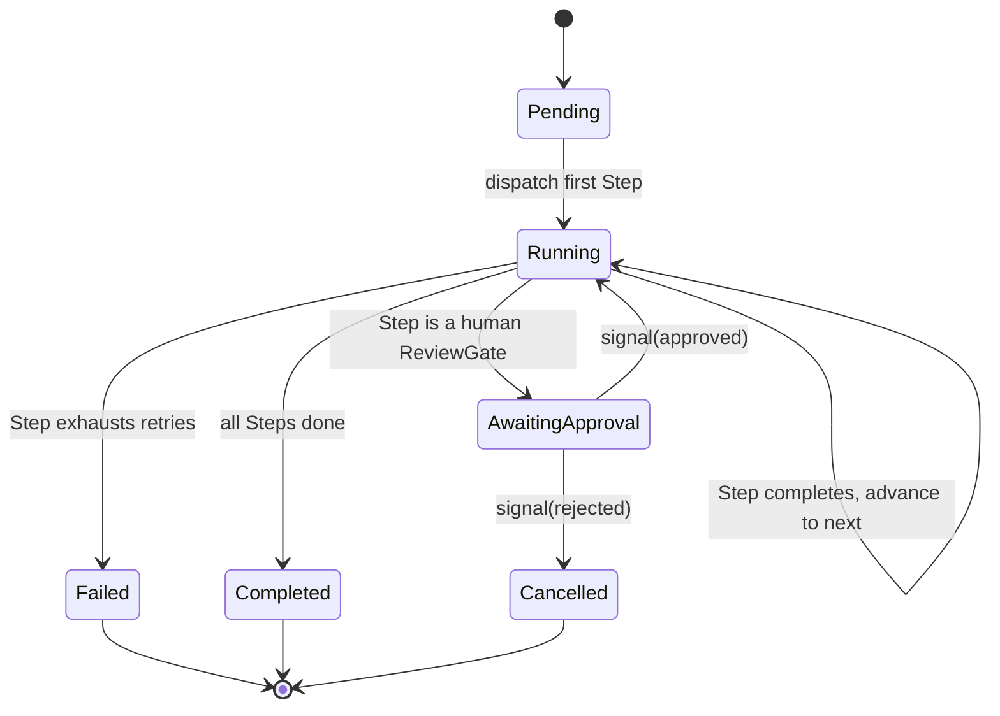

# 07 — Workflow Engine Proposal

This is the highest-consequence, hardest-to-reverse infrastructure choice in the plan, because "orchestrate multiple AI agents" implies durable, resumable, long-running, human-in-the-loop execution — the platform's actual value proposition. It is deliberately treated as a **port with a swappable adapter**, not a hard vendor commitment, in Sprint 0.

## The two real candidates

| | In-house engine (Postgres + Redis/BullMQ) | Temporal.io |
|---|---|---|
| Durable execution, automatic retries, replay | Must be built and hardened by us | Built-in, battle-tested |
| Long-running human approval gates (hours–days) | Achievable via `Step` status + polling/webhook resume | First-class (signals) |
| Operational cost | Low — reuses Postgres/Redis already in the stack | Additional cluster (Temporal server + Postgres/Cassandra + UI) to run and operate |
| Team ramp-up | Low — plain TS, Postgres, familiar patterns | Moderate — new execution model (workflow/activity split, determinism constraints) |
| Fit for Sprint 0 scale | Good | Overkill — no workflow complexity exists yet to justify it |
| Long-term fit as agent fan-out/parallelism grows | Will need deliberate investment (versioned workflow definitions, saga compensation) | Purpose-built for exactly this |

## Decision for Sprint 0

Build the **`WorkflowEngine` port** now, with a lightweight **in-house adapter** (Postgres tables for `workflow_run`/`workflow_step` state, BullMQ/Redis for step dispatch and retries) as one implementation. See [ADR-0008](../adr/0008-workflow-engine-in-house-first.md).

**Revised after principal-architect review** ([13-principal-architect-self-review.md](13-principal-architect-self-review.md) §1.4, §6.2): against the target of hundreds of workflow definitions, "defer Temporal until complexity is empirically justified" under-weighted how much of the platform's core reliability depends on getting durable execution right — crash-safe resumption, exactly-once step advancement, multi-day human-approval signals, safe concurrent fan-out, and definition-versioning-under-live-runs are all individually easy to get subtly wrong in a bespoke engine, and the resulting bugs tend to surface rarely and be hard to reproduce. **The default bias now favors spiking a proven durable-execution engine (Temporal, or a lighter-weight equivalent such as Restate) in Sprint 1, on a fixed timebox, rather than treating adoption as an open-ended "later."** The in-house adapter is still built and hardened in parallel — the point of the port is that the eventual choice between them is an adapter swap, not a rewrite of `orchestrator`. This remains the ADR most likely to move again once the Sprint 1 spike produces real data on both options.

## Port shape

```ts
interface WorkflowEnginePort {
  startRun(ctx: RequestContext, definitionId: string, input: WorkflowInput): Promise<WorkflowRunId>;
  advance(ctx: RequestContext, runId: WorkflowRunId, stepResult: StepResult): Promise<WorkflowRunStatus>;
  signal(ctx: RequestContext, runId: WorkflowRunId, signal: WorkflowSignal): Promise<void>; // e.g. human approval
  getStatus(ctx: RequestContext, runId: WorkflowRunId): Promise<WorkflowRunStatus>;
  cancel(ctx: RequestContext, runId: WorkflowRunId, reason: string): Promise<void>;
}
```

(This snippet predates the `RequestContext` rule added in the principal-architect review — `packages/ports/src/workflow-engine.port.ts` is the authoritative, current version; shown here updated to match.)

`orchestrator` depends only on `WorkflowEnginePort`. The in-house adapter and a hypothetical future Temporal adapter both implement it identically from the caller's point of view — this is the same hexagonal discipline applied to LLM and MCP access, applied here because this is the riskiest lock-in surface in the whole platform.

## Execution model (Sprint 0 skeleton)



A `Step` is generic: `{ kind: "capability-request" | "human-approval", capabilityId, input }`.

**Revised per [ADR-0022](../adr/0022-capability-model-provider-abstraction.md):** `Step` originally had a third kind, `"agent-invocation"`, which named a specific `AgentDefinition` directly — inconsistent with `"plugin-generation"`, which already resolved indirectly through a capability-shaped lookup. The two merge into one `"capability-request"` kind: the engine never interprets `capabilityId` itself — it resolves through `ports/capability-resolver.port.ts` to a concrete `CapabilityProvider` (an agent, a plugin, or in future a human/external service — see [18-capability-model.md](18-capability-model.md)), which is then invoked the same way regardless of which kind of provider it turns out to be. The workflow definition never names a provider; only the platform's capability registry does, which is what makes "swap which agent/plugin/human fulfills this step" a registry change instead of a workflow-definition edit.

## Sprint 0 deliverable

`WorkflowEnginePort` interface + in-house adapter skeleton (schema + start/advance/signal stubs, no real step execution logic) and one contract test proving the port/adapter pair round-trips a trivial two-step workflow. No real agent orchestration yet.

**Implemented (SAF-8b):** `packages/workflow-engine-adapters/in-memory` (`InMemoryWorkflowEngineAdapter`) — deliberately **in-memory**, not the Postgres+BullMQ adapter this document and ADR-0008 describe. [17-sprint0-architecture-inventory-review.md](17-sprint0-architecture-inventory-review.md) flagged building the real durable adapter *before* the SAF-24 Temporal-class spike as a sunk-cost risk to that spike's honesty; this stays a genuine skeleton (state machine, retry/timeout hooks, real `EventBusPort` integration — no persistence) until that spike runs. Passes `workflowEngineContractTests` for real, closing the gap [17-sprint0-architecture-inventory-review.md](17-sprint0-architecture-inventory-review.md) raised (that factory had never been run against a real adapter).
