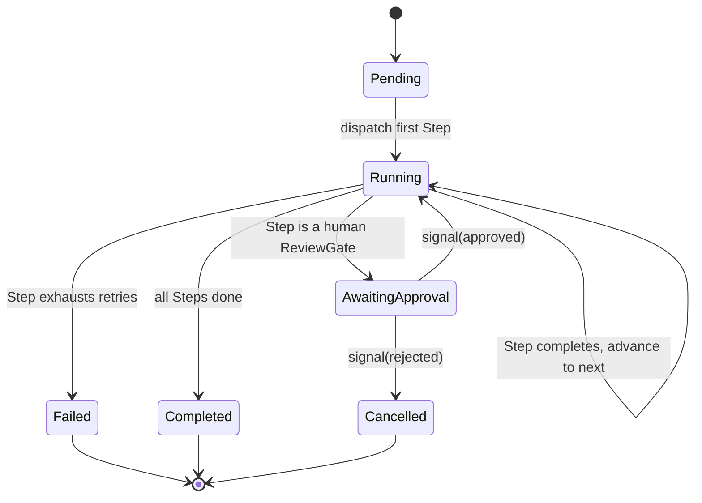

# 07 — Workflow Engine Proposal

This is the highest-consequence, hardest-to-reverse infrastructure choice in the plan, because "orchestrate multiple AI agents" implies durable, resumable, long-running, human-in-the-loop execution — the platform's actual value proposition. It is deliberately treated as a **port with a swappable adapter**, not a hard vendor commitment, in Sprint 0.

## The two real candidates

| | In-house engine (Postgres + Redis/BullMQ) | Temporal.io |
|---|---|---|
| Durable execution, automatic retries, replay | Must be built and hardened by us | Built-in, battle-tested |
| Long-running human approval gates (hours–days) | Achievable via `Step` status + polling/webhook resume | First-class (signals) |
| Operational cost | Low — reuses Postgres/Redis already in the stack | Additional cluster (Temporal server + Postgres/Cassandra + UI) to run and operate |
| Team ramp-up | Low — plain TS, Postgres, familiar patterns | Moderate — new execution model (workflow/activity split, determinism constraints) |
| Fit for Sprint 0 scale | Good | Overkill — no workflow complexity exists yet to justify it |
| Long-term fit as agent fan-out/parallelism grows | Will need deliberate investment (versioned workflow definitions, saga compensation) | Purpose-built for exactly this |

## Decision for Sprint 0

Build the **`WorkflowEngine` port** now, with a lightweight **in-house adapter** (Postgres tables for `workflow_run`/`workflow_step` state, BullMQ/Redis for step dispatch and retries) as the only implementation. Do **not** stand up Temporal in Sprint 0 — there is no workflow logic yet to justify its operational cost, and premature adoption of a heavy dependency is its own form of technical debt. Revisit via a dedicated ADR once real workflow definitions exist and their complexity (fan-out width, cross-day human gates, compensation logic) is known. See [ADR-0008](../adr/0008-workflow-engine-in-house-first.md).

This is explicitly flagged as the ADR most likely to be challenged in review — if the team already has strong Temporal operational experience, that changes the cost side of this table materially and the decision should be revisited before, not after, Sprint 0 work begins.

## Port shape

```ts
interface WorkflowEnginePort {
  startRun(definitionId: string, input: WorkflowInput): Promise<WorkflowRunId>;
  advance(runId: WorkflowRunId, stepResult: StepResult): Promise<WorkflowRunStatus>;
  signal(runId: WorkflowRunId, signal: WorkflowSignal): Promise<void>; // e.g. human approval
  getStatus(runId: WorkflowRunId): Promise<WorkflowRunStatus>;
  cancel(runId: WorkflowRunId, reason: string): Promise<void>;
}
```

`orchestrator` depends only on `WorkflowEnginePort`. The in-house adapter and a hypothetical future Temporal adapter both implement it identically from the caller's point of view — this is the same hexagonal discipline applied to LLM and MCP access, applied here because this is the riskiest lock-in surface in the whole platform.

## Execution model (Sprint 0 skeleton)



A `Step` is generic: `{ kind: "agent-invocation" | "plugin-generation" | "human-approval", capabilityRef, input }`. The engine never interprets `capabilityRef` — it resolves through the Capability & Plugin Registry ([05](05-plugin-architecture.md)) or the LLM Gateway ([02](02-domain-model.md)).

## Sprint 0 deliverable

`WorkflowEnginePort` interface + in-house adapter skeleton (schema + start/advance/signal stubs, no real step execution logic) and one contract test proving the port/adapter pair round-trips a trivial two-step workflow. No real agent orchestration yet.
