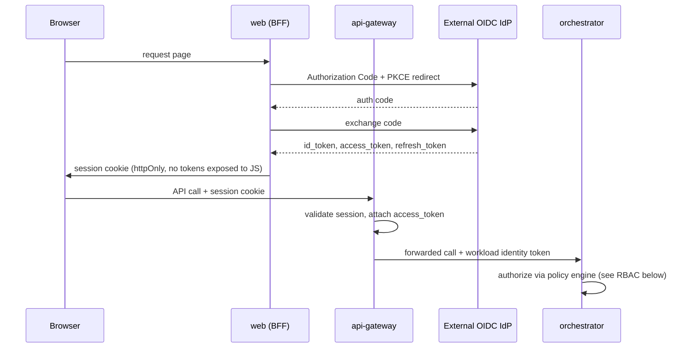

# 08 — Authentication Strategy & RBAC Model

## Authentication strategy

**Decision:** federate to external OIDC-compliant identity providers (Entra ID, Okta, SAP IAS, Keycloak for dev/self-hosted). The platform never stores passwords and is not itself an IdP. See [ADR-0010](../adr/0010-oidc-federation-zero-trust.md).

- `api-gateway` terminates the OIDC login flow (Authorization Code + PKCE), exchanges for short-lived signed access tokens (JWT, ~15 min) and a refresh token, and is the single enforcement point — `web` never talks to the IdP directly (BFF pattern), keeping tokens out of the browser's JS context.
- **Zero Trust**, concretely: every request to `orchestrator`/`worker` is authenticated and authorized regardless of origin (no "internal network = trusted"); service-to-service calls carry a signed workload identity token (short-lived, scoped) rather than a static shared secret; plugin invocations carry the scoped capability token described in [05](05-plugin-architecture.md).
- Secrets (IdP client secrets, LLM/MCP provider keys) are never in env files checked into the repo — `ports/secrets-vault.port.ts` abstracts a vault (dev adapter: `.env` via `packages/config` for local docker-compose only; production adapter: a real secrets manager, chosen later without touching callers).
- Sprint 0 runs Keycloak in `infra/docker-compose` purely as a disposable local OIDC provider for development — production IdP selection is a tenant/deployment configuration, never hardcoded.

## RBAC model (hybrid RBAC + ABAC)

Pure RBAC is not enough once decisions depend on environment (dev vs. prod target), data classification, or plugin risk tier — so roles grant coarse capability, and attribute-based policy rules narrow it per request. See [ADR-0011](../adr/0011-hybrid-rbac-abac-policy-as-code.md).

### Roles (Sprint 0 baseline set — extensible, never hardcoded in code)

| Role | Typical scope |
|---|---|
| `PlatformAdmin` | Cross-tenant platform configuration |
| `TenantAdmin` | Tenant-wide user/role/plugin management |
| `DeliveryLead` | Project creation, workflow approval gates |
| `Architect` | Requirement definition, workflow definition authoring |
| `Developer` | Trigger generation runs, view/edit artifacts |
| `Reviewer` | Approve/reject `ReviewGate`s |
| `Auditor` | Read-only across audit/governance data |
| `Viewer` | Read-only across project data |

### Permission model

Permissions are expressed as `resource:action` pairs scoped to a hierarchy: `tenant → workspace → project`. Example: `workflow:approve` granted at `project` scope. Roles are bundles of permissions; `PolicyRule`s (Governance context, [02](02-domain-model.md)) add attribute conditions on top, e.g. *"`workflow:approve` requires `environment.kind == 'prod'` to also require a second distinct approver"* (separation-of-duties, an ITIL-alignment requirement).

### Enforcement

- Policy evaluation is externalized behind `ports/policy-engine.port.ts`, implemented by an OPA (Rego) or Cedar adapter — **authorization logic is data (policy bundles), not scattered `if (user.role === ...)` checks in application code.**
- Policies are versioned, unit-tested (policy-as-code test suite in `testing-kit`), and reviewed like code — this is also what makes the model PMO/ITIL-auditable: every authorization decision is traceable to a specific policy version.
- `api-gateway` performs coarse-grained checks (can this user call this endpoint at all); `application/*` use cases perform fine-grained, resource-scoped checks via the same port — defense in depth, one policy engine, two enforcement points.

## Post-review additions

### Tenant isolation defense-in-depth (not RLS alone)
Principal-architect self-review ([13-principal-architect-self-review.md](13-principal-architect-self-review.md) §2.1) found that Row-Level Security keyed on a Postgres session setting ([09-database-proposal.md](09-database-proposal.md)) was the *only* tenant-isolation control — one code path that opens a connection without setting it is a cross-tenant leak. **Added:** every port method now takes an explicit `RequestContext` (`tenantId`, `actorId`, `correlationId`, `tenancyTier` — see [02-domain-model.md](02-domain-model.md)) threaded from `api-gateway` down to the repository call, so tenant scoping is enforced at the application layer independently of RLS, not only at the database layer. The corresponding fitness function (an automated cross-tenant-read test suite run in CI) is tracked in [12-risks-and-technical-debt.md](12-risks-and-technical-debt.md).

### Tool-call authorization beyond plugin-level capability binding
Principal-architect self-review ([13-principal-architect-self-review.md](13-principal-architect-self-review.md) §2.3) found that MCP capability bindings ([ADR-0004](../adr/0004-mcp-abstraction-layer.md)) scope *which* tools a plugin may call, but say nothing about an agent being manipulated (via injected content in requirements text or MCP tool output) into misusing a tool it's technically allowed to call — e.g., exfiltrating data through a legitimately-bound integration tool. **Added policy rule:** any tool call that touches a target system, a credential, or crosses the tenant boundary (egress) requires either a pre-approved allow-list scoped to the specific *workflow step* (not just the plugin) or a human `ReviewGate`, evaluated by the same policy engine — a policy-as-code addition, not new infrastructure.

### New permission: `connection:use` vs. `connection:manage`
Following [ADR-0015](../adr/0015-target-system-credential-management.md), the permission set gains `connection:manage` (configure a `TargetSystemConnection`) and `connection:use` (trigger an operation that consumes it) as distinct permissions, enabling separation of duties for tenants that require it — the person who configures a connection to a customer's production SAP landscape need not be the one authorized to trigger a deployment through it.

## Sprint 0 deliverable

`auth-core` package with: session handling against the dev Keycloak instance, `PolicyEnginePort` interface + a minimal OPA adapter loading a single example policy bundle, the role/permission schema in Postgres (empty seed data only, no UI), and the `RequestContext` type threaded through the port interfaces from the start (cheap to add now, expensive to retrofit once every port implementation assumes ambient tenant state).

### Implementation status (SAF-17, done)

- **Session handling:** `packages/auth-core` — real Authorization Code + PKCE against the dev Keycloak (`createOidcClient`, `beginAuthorizationRequest`, `exchangeAuthorizationCode`), real JWT validation against the IdP's live JWKS (`createAccessTokenValidator`), and a stateless AES-256-GCM session cookie (`sealSession`/`unsealSession`) since no session store exists yet.
- **`PolicyEnginePort`:** `OpaPolicyEngineAdapter`, evaluating against a real OPA server loading `infra/opa/policies/authz.rego` — implements this doc's separation-of-duties example (prod `workflow:approve` requires a distinct approver) plus a generic `resource:action` permission-grant fallback, both covered by real Rego unit tests (`opa test`, 6/6).
- **Role/permission schema:** `packages/context-identity` (`Role`, `Permission` domain aggregates) + `packages/persistence-postgres/identity` (`permissions`, `roles`, `role_permissions`, `user_roles` tables, RLS-scoped except the `role_permissions` join table — see that package's README). No seed data or UI yet, as scoped.
- **`api-gateway` enforcement points:** `GET /auth/login`, `GET /auth/callback`, `GET /me` prove the coarse-grained enforcement point end-to-end against live Keycloak/OPA. Fine-grained, resource-scoped checks inside `application/*` use cases are not yet built — no use case exists yet to enforce them in (tracked as a gap for the feature work that introduces the first real use case, not a Sprint 0 regression).
- **Known gaps, stated explicitly:** no `web` app yet consumes this (only `api-gateway`'s own routes exercise it); pending-login state is an in-memory `Map`, not Redis-backed (documented in `infra/README.md` and `apps/api-gateway/README.md`); access tokens aren't validated against `aud` (Keycloak's default token doesn't set it to the client_id without a custom mapper — a follow-up, not a Sprint 0 blocker).
