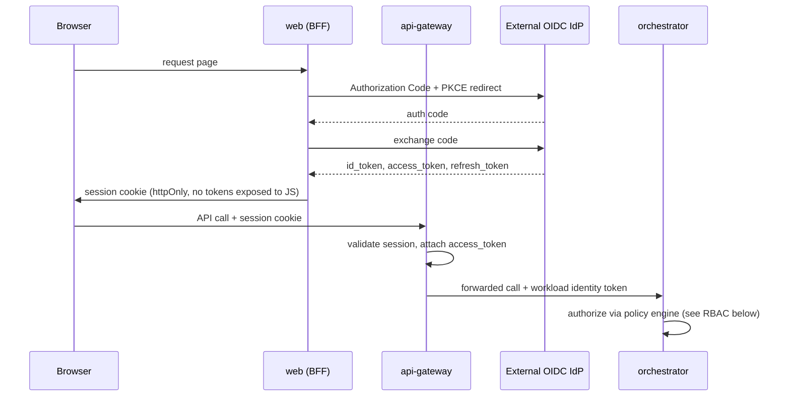

# 08 — Authentication Strategy & RBAC Model

## Authentication strategy

**Decision:** federate to external OIDC-compliant identity providers (Entra ID, Okta, SAP IAS, Keycloak for dev/self-hosted). The platform never stores passwords and is not itself an IdP. See [ADR-0010](../adr/0010-oidc-federation-zero-trust.md).

- `api-gateway` terminates the OIDC login flow (Authorization Code + PKCE), exchanges for short-lived signed access tokens (JWT, ~15 min) and a refresh token, and is the single enforcement point — `web` never talks to the IdP directly (BFF pattern), keeping tokens out of the browser's JS context.
- **Zero Trust**, concretely: every request to `orchestrator`/`worker` is authenticated and authorized regardless of origin (no "internal network = trusted"); service-to-service calls carry a signed workload identity token (short-lived, scoped) rather than a static shared secret; plugin invocations carry the scoped capability token described in [05](05-plugin-architecture.md).
- Secrets (IdP client secrets, LLM/MCP provider keys) are never in env files checked into the repo — `ports/secrets-vault.port.ts` abstracts a vault (dev adapter: `.env` via `packages/config` for local docker-compose only; production adapter: a real secrets manager, chosen later without touching callers).
- Sprint 0 runs Keycloak in `infra/docker-compose` purely as a disposable local OIDC provider for development — production IdP selection is a tenant/deployment configuration, never hardcoded.

## RBAC model (hybrid RBAC + ABAC)

Pure RBAC is not enough once decisions depend on environment (dev vs. prod target), data classification, or plugin risk tier — so roles grant coarse capability, and attribute-based policy rules narrow it per request. See [ADR-0011](../adr/0011-hybrid-rbac-abac-policy-as-code.md).

### Roles (Sprint 0 baseline set — extensible, never hardcoded in code)

| Role | Typical scope |
|---|---|
| `PlatformAdmin` | Cross-tenant platform configuration |
| `TenantAdmin` | Tenant-wide user/role/plugin management |
| `DeliveryLead` | Project creation, workflow approval gates |
| `Architect` | Requirement definition, workflow definition authoring |
| `Developer` | Trigger generation runs, view/edit artifacts |
| `Reviewer` | Approve/reject `ReviewGate`s |
| `Auditor` | Read-only across audit/governance data |
| `Viewer` | Read-only across project data |

### Permission model

Permissions are expressed as `resource:action` pairs scoped to a hierarchy: `tenant → workspace → project`. Example: `workflow:approve` granted at `project` scope. Roles are bundles of permissions; `PolicyRule`s (Governance context, [02](02-domain-model.md)) add attribute conditions on top, e.g. *"`workflow:approve` requires `environment.kind == 'prod'` to also require a second distinct approver"* (separation-of-duties, an ITIL-alignment requirement).

### Enforcement

- Policy evaluation is externalized behind `ports/policy-engine.port.ts`, implemented by an OPA (Rego) or Cedar adapter — **authorization logic is data (policy bundles), not scattered `if (user.role === ...)` checks in application code.**
- Policies are versioned, unit-tested (policy-as-code test suite in `testing-kit`), and reviewed like code — this is also what makes the model PMO/ITIL-auditable: every authorization decision is traceable to a specific policy version.
- `api-gateway` performs coarse-grained checks (can this user call this endpoint at all); `application/*` use cases perform fine-grained, resource-scoped checks via the same port — defense in depth, one policy engine, two enforcement points.

## Sprint 0 deliverable

`auth-core` package with: session handling against the dev Keycloak instance, `PolicyEnginePort` interface + a minimal OPA adapter loading a single example policy bundle, and the role/permission schema in Postgres (empty seed data only, no UI).
