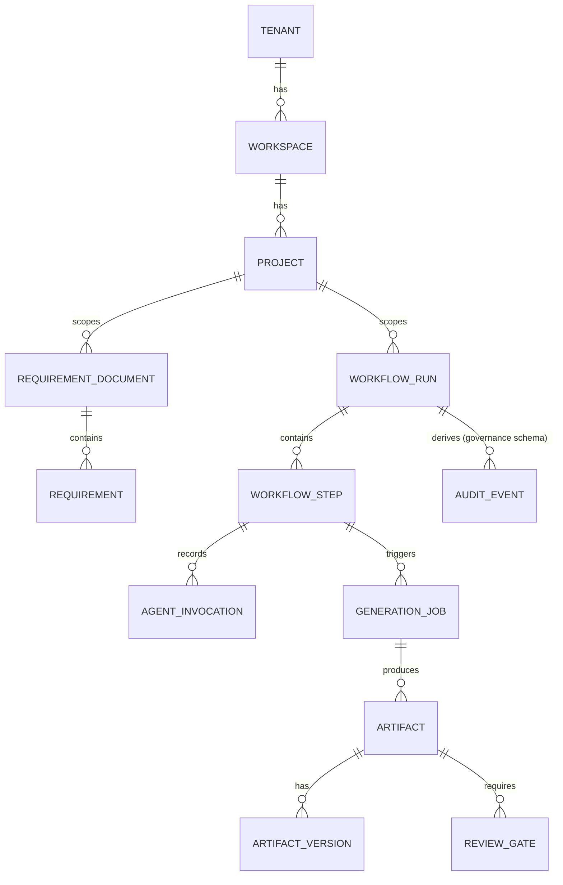

# 09 — Database Proposal

## PostgreSQL as sole system of record

**Decision:** one PostgreSQL instance per environment (dev/staging/prod), organized as **one Postgres schema per bounded context**, not one database-per-context and not one flat public schema. See [ADR-0009](../adr/0009-postgresql-schema-per-context-drizzle.md).

```
identity.*            project.*             requirements.*
capability_registry.*  workflow.*            llm_gateway.*
mcp_registry.*         generation.*          governance.*
digital_twin.*         reporting.*           outbox.*
```

`digital_twin` (added post-review, [ADR-0021](../adr/0021-project-digital-twin-knowledge-graph.md)) and `reporting` (added post-review, [ADR-0014](../adr/0014-cqrs-read-models.md)) are both read-side, event-projected schemas — populated by subscribing to other schemas' domain events, never written to directly by a command-side use case. They differ only in query shape: `reporting` is tabular (dashboards, lists), `digital_twin` is graph-shaped (traversal, impact analysis).

`outbox` (added with SAF-11, [ADR-0007](../adr/0007-event-driven-transactional-outbox.md)) is the one schema **not owned by a single bounded context** — it holds `outbox.events`, written by every context's application layer as part of the transactional-outbox pattern. A single shared table (rather than one outbox table per context schema) was chosen because Postgres transactions aren't schema-scoped: a command handler writing to, say, `workflow.workflow_runs` and `outbox.events` in one transaction is exactly as atomic as writing to two tables in the same schema would be. One shared table also means one relay polls/listens against one place, rather than one per context. The cross-context reference rule below doesn't apply to it — `outbox.events` is infrastructure, not a bounded-context aggregate.

Rationale: physical schema separation gives each bounded context ([02-domain-model.md](02-domain-model.md)) a hard boundary that's visible in `\dn` and enforceable via Postgres grants (a context's own migration role owns its schema), while staying in one instance keeps Sprint 0 operationally simple. This also leaves a clean path to physically split a context into its own database later (pg_dump the schema, point a new connection at it) if it's extracted into its own service per the criteria in [04-service-boundaries.md](04-service-boundaries.md) — because no cross-schema foreign keys are allowed (rule below), that split is mechanical, not a rewrite.

### Cross-context reference rule
No foreign key ever crosses a schema boundary. Context B holding a reference to Context A's aggregate stores A's ID as a plain column (`requirement_id uuid`, no FK constraint) and resolves it through A's repository/API if it needs data — never through a join. This is the DDD aggregate boundary rule made physical.

### Multi-tenancy
Every table carries `tenant_id text not null` (corrected from an earlier `uuid` — `RequestContext.tenantId` is typed `string` everywhere in the codebase, never constrained to UUID format, so a `uuid` column would reject the same non-UUID tenant ids the rest of the platform accepts; found while implementing SAF-14). Sprint 0 does not build per-tenant physical isolation, but every table is designed so that Postgres Row-Level Security policies (`USING (tenant_id = current_setting('app.tenant_id', true))`, missing-ok so an unset session variable fails closed rather than erroring or matching everything) can be turned on per context without a schema rewrite — RLS policies are written and tested in Sprint 0 even before there is a second tenant, so the pattern is proven, not retrofitted under pressure later.

## ORM / migration tool

**Decision:** Drizzle ORM + Drizzle Kit for migrations. Rationale over Prisma: Drizzle compiles to close-to-SQL, has no proprietary schema DSL or binary query engine, and its generated SQL is portable — consistent with the "no vendor lock-in" principle. Each context's `persistence-postgres/<context>` module owns its own Drizzle schema file and migration folder, scoped to its Postgres schema, and is the only place SQL is written — `application/*` only ever calls a `Repository` port.

## Redis

Used for: BullMQ job queues (workflow step dispatch, plugin execution jobs — [07](07-workflow-engine.md)), rate-limiting counters at `api-gateway`, and short-lived session/cache data. Not used as a system of record for anything — everything in Redis is reconstructible from Postgres.

## MinIO (S3-compatible object storage)

Stores generated artifact binaries/bundles (`Artifact`/`ArtifactVersion` in the Generation context). Postgres stores only the object key/metadata (`bucket`, `key`, `contentHash`, `sizeBytes`), never the blob itself — kept behind `ports/object-store.port.ts` so a production deployment can point the same code at AWS S3/Azure Blob/GCS without touching application code.

## Illustrative ERD (core aggregates, IDs only across schemas)



(FK-looking lines above are logical/ID references per the cross-context rule, not physical foreign keys where they cross schema boundaries.)

## Post-review additions

### Partitioning and archival (was missing)
Principal-architect self-review ([13-principal-architect-self-review.md](13-principal-architect-self-review.md) §1.1, §6.4) found no partitioning or archival plan for the fastest-growing tables. A conservative estimate (500 projects × ~50 runs/project/year × 20 steps × 2 invocations) puts `agent_invocation` at 1M+ rows/year, tens of millions within the platform's 10-year horizon — `audit_event` and `workflow_step` grow similarly. **Added:** these three tables are created as monthly range-partitioned tables (on `created_at`) from their first migration; aging data is archived to MinIO and its partition dropped, per [ADR-0017](../adr/0017-data-retention-crypto-shredding.md), rather than deleted row-by-row against a live, indexed table.

### High availability (was missing)
A single instance per environment with no replication is a single point of failure for every tenant sharing it. **Added:** streaming replication with automated failover (e.g., Patroni or a managed-service equivalent) is a required Sprint 1/2 operational capability for the pooled tier, not deferred indefinitely.

### PII handling (was missing)
`agent_invocation` and `audit_event` will incidentally contain PII (requirement text, user identifiers) once real usage begins, which conflicts with the append-only design's compliance value once an erasure request arrives. **Added:** PII is never stored inline in these tables — see the per-subject encrypted vault and crypto-shredding erasure mechanism in [ADR-0017](../adr/0017-data-retention-crypto-shredding.md).

### Tenancy tiering (was missing)
"One instance per environment, RLS for tenant separation" was an unstated assumption that every tenant gets the same isolation guarantee. **Added:** [ADR-0013](../adr/0013-tenancy-isolation-tiering.md) introduces Pooled/Silo/Dedicated tiers for tenants with stronger isolation, data-residency, or on-prem requirements, resolved per-request via a new `ports/tenant-connection-resolver.port.ts` rather than a hardcoded connection string.

### Cross-aggregate reporting (was missing)
Aggregate repositories are the wrong shape for dashboard/reporting queries at 500+ projects. **Added:** a dedicated `reporting` schema holds event-fed projections, queried directly instead of through write-side repositories — see [ADR-0014](../adr/0014-cqrs-read-models.md).

### Project Digital Twin graph storage (added post-review)
Full-lifecycle artifact traceability ("Requirement implements CAP Service," "Deployment contains Application Version") needs graph traversal queries a relational schema alone handles awkwardly at depth. **Added:** a `digital_twin` schema queried through **Apache AGE**, an open-source, Cypher-compatible graph extension running inside the same Postgres instance — real graph query semantics without a new database technology to operate. Behind a new `ports/graph-store.port.ts`, so a dedicated graph engine (Neo4j, Neptune, or a managed equivalent) remains available as a later adapter swap if traversal performance at true scale demands it. See [ADR-0021](../adr/0021-project-digital-twin-knowledge-graph.md) and [16-project-digital-twin.md](16-project-digital-twin.md).

## Sprint 0 deliverable

Drizzle schema + first migration for `identity` and `governance` schemas only (enough to seed a user/role/audit-event and prove the migration pipeline and RLS pattern), plus the docker-compose Postgres/Redis/MinIO services. The `governance.audit_event` migration is written as a partitioned table from this first migration (proving the pattern early, per the addition above), even though volume doesn't demand it yet. No other context's tables are built yet — they arrive with their owning feature work.

**Implemented (SAF-14), with two scope adjustments stated explicitly:**
1. **`User`/`Role`/`Permission`/`Session` are not built here.** They're `identity` context aggregates per [02-domain-model.md](02-domain-model.md), but building their RBAC schema is explicitly `auth-core`'s Sprint 0 deliverable ([08-authentication-and-rbac.md](08-authentication-and-rbac.md)), not this story's — pulling them forward would duplicate that story's scope. `Tenant` (already a real aggregate since SAF-8) proves the pattern instead.
2. **The Redis/MinIO services this line still mentions were not added** — see [infra/README.md](../../infra/README.md) § Why Redis and MinIO aren't here yet (SAF-13's own reviewed decision, unchanged by this story).

Delivered: `packages/persistence-postgres/identity` (`TenantRepository`) and `packages/persistence-postgres/governance` (`AuditEventRepository`, on the partitioned table). Both verified against a real Postgres, including a hard requirement found while doing so: the container's bootstrap user is a **superuser**, and Postgres superusers bypass RLS unconditionally regardless of `FORCE` — every repository must connect as a separate, non-superuser role (`saf_app`) for RLS to do anything at all. See either package's README for the full RLS strategy, and `testing-kit`'s new `repositoryContractTests` (built before either Drizzle package existed, per the mandated ordering) for the shared, generic tenant-isolation proof every future `persistence-postgres/<context>` module must also pass.
