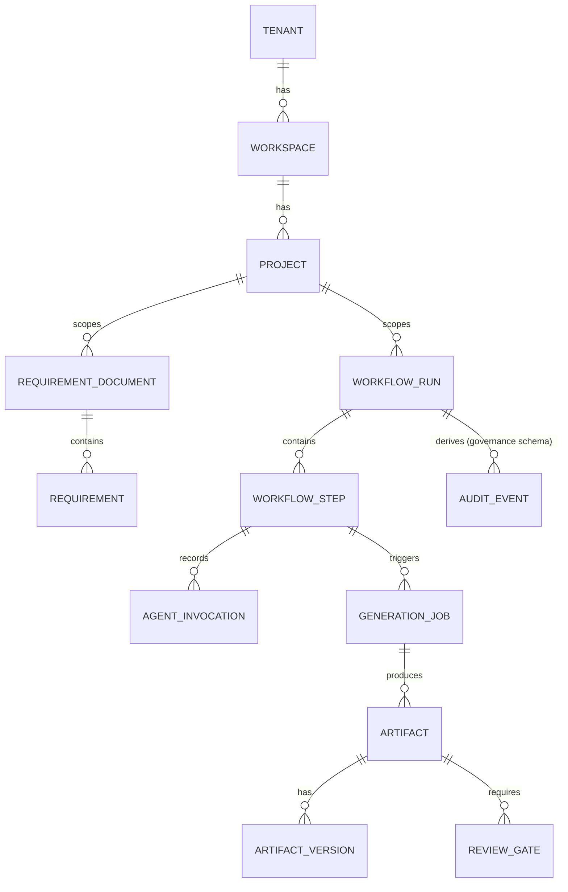

# 09 — Database Proposal

## PostgreSQL as sole system of record

**Decision:** one PostgreSQL instance per environment (dev/staging/prod), organized as **one Postgres schema per bounded context**, not one database-per-context and not one flat public schema. See [ADR-0009](../adr/0009-postgresql-schema-per-context-drizzle.md).

```
identity.*            project.*             requirements.*
capability_registry.*  workflow.*            llm_gateway.*
mcp_registry.*         generation.*          governance.*
```

Rationale: physical schema separation gives each bounded context ([02-domain-model.md](02-domain-model.md)) a hard boundary that's visible in `\dn` and enforceable via Postgres grants (a context's own migration role owns its schema), while staying in one instance keeps Sprint 0 operationally simple. This also leaves a clean path to physically split a context into its own database later (pg_dump the schema, point a new connection at it) if it's extracted into its own service per the criteria in [04-service-boundaries.md](04-service-boundaries.md) — because no cross-schema foreign keys are allowed (rule below), that split is mechanical, not a rewrite.

### Cross-context reference rule
No foreign key ever crosses a schema boundary. Context B holding a reference to Context A's aggregate stores A's ID as a plain column (`requirement_id uuid`, no FK constraint) and resolves it through A's repository/API if it needs data — never through a join. This is the DDD aggregate boundary rule made physical.

### Multi-tenancy
Every table carries `tenant_id uuid not null`. Sprint 0 does not build per-tenant physical isolation, but every table is designed so that Postgres Row-Level Security policies (`USING (tenant_id = current_setting('app.tenant_id')::uuid)`) can be turned on per context without a schema rewrite — RLS policies are written and tested in Sprint 0 even before there is a second tenant, so the pattern is proven, not retrofitted under pressure later.

## ORM / migration tool

**Decision:** Drizzle ORM + Drizzle Kit for migrations. Rationale over Prisma: Drizzle compiles to close-to-SQL, has no proprietary schema DSL or binary query engine, and its generated SQL is portable — consistent with the "no vendor lock-in" principle. Each context's `persistence-postgres/<context>` module owns its own Drizzle schema file and migration folder, scoped to its Postgres schema, and is the only place SQL is written — `application/*` only ever calls a `Repository` port.

## Redis

Used for: BullMQ job queues (workflow step dispatch, plugin execution jobs — [07](07-workflow-engine.md)), rate-limiting counters at `api-gateway`, and short-lived session/cache data. Not used as a system of record for anything — everything in Redis is reconstructible from Postgres.

## MinIO (S3-compatible object storage)

Stores generated artifact binaries/bundles (`Artifact`/`ArtifactVersion` in the Generation context). Postgres stores only the object key/metadata (`bucket`, `key`, `contentHash`, `sizeBytes`), never the blob itself — kept behind `ports/object-store.port.ts` so a production deployment can point the same code at AWS S3/Azure Blob/GCS without touching application code.

## Illustrative ERD (core aggregates, IDs only across schemas)



(FK-looking lines above are logical/ID references per the cross-context rule, not physical foreign keys where they cross schema boundaries.)

## Sprint 0 deliverable

Drizzle schema + first migration for `identity` and `governance` schemas only (enough to seed a user/role/audit-event and prove the migration pipeline and RLS pattern), plus the docker-compose Postgres/Redis/MinIO services. No other context's tables are built yet — they arrive with their owning feature work.
