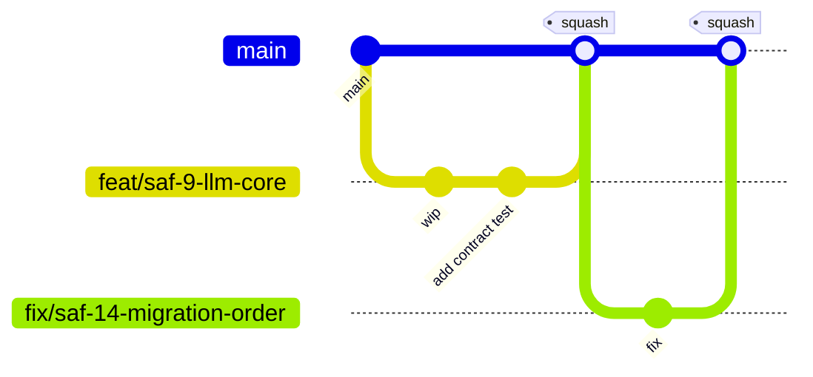

# 11 — Git Strategy & CI/CD Strategy

## Git strategy

- **Trunk-based development** on `main`. No long-lived `develop`/`release` branches — they rot and cause exactly the merge pain a 10-year platform can't afford.
- **Short-lived branches**: `feat/<ticket>-<slug>`, `fix/<ticket>-<slug>`, `chore/<ticket>-<slug>` — see naming table in [10](10-coding-standards-and-naming.md).
- **Conventional Commits** (`feat:`, `fix:`, `chore:`, `refactor:`, `docs:`), enforced by commit-lint in CI — this is what lets Changesets and release notes generate automatically instead of being hand-written.
- **`main` is protected**: PR required, CI green required (lint, typecheck, test, build, dependency-cruiser, contract tests), at least one review required, squash merge only (keeps `main` history one commit per change, bisectable).
- **Changesets** for versioning: a PR touching a published-meaningful package (`ports`, `plugin-sdk` today; more later) must include a changeset file describing the semver bump and rationale — CI fails the PR if it's missing for a changed package under `packages/`.
- **No direct pushes to `main`**, no force-push to `main`, ever — including by CI service accounts.

## CI/CD strategy

**Tooling:** GitHub Actions + Turborepo remote caching (affected-package-only pipelines — a change to one plugin doesn't rebuild/retest the whole monorepo).

### Pipeline stages (every PR)
1. **Lint** — ESLint + Prettier check + `dependency-cruiser` boundary check (layering violations fail here, not in review)
2. **Typecheck** — `tsc -b` across the project-reference graph
3. **Unit test** — Vitest, per affected package, coverage floors enforced ([10](10-coding-standards-and-naming.md))
4. **Contract test** — port/adapter contract suites (`testing-kit`)
5. **Build** — affected packages/apps
6. **Integration test** — ephemeral docker-compose (Postgres/Redis/MinIO/Keycloak) + Playwright for `web`, spun up only for PRs touching `apps/*` or adapters
7. **Security scan** — dependency audit (`pnpm audit` / OSV), secret scanning, SAST (CodeQL)
8. **Architecture fitness checks** — banned-keyword guard, plugin-isolation guard (see [12](12-risks-and-technical-debt.md))

### Deployment stages (on merge to `main` / on tag)
- **Dev**: auto-deploy every merge to `main` — fast feedback, low blast radius.
- **Staging**: auto-deploy on version tag (created by Changesets' release PR merge).
- **Prod**: manual approval gate, tied to a change record — this is the concrete ITIL-alignment mechanism: no prod deploy without a linked approval, and the deploy pipeline itself writes the `ApprovalGate`/`AuditEvent` records described in [02-domain-model.md](02-domain-model.md), so the platform's own governance model dogfoods on its own deploys.
- Containers are built once and promoted across environments unchanged (build once, deploy many) — never rebuilt per environment, to guarantee what was tested in staging is what ships to prod.
- Container images are signed (cosign) and scanned before the prod gate — supply-chain integrity, not just app-level testing.

### Environments
`dev`, `staging`, `prod`, each a separate docker-compose overlay in Sprint 0 (`infra/docker-compose/*.yml`); a Kubernetes/Cloud Foundry/Kyma target is a later adapter on the same deploy pipeline contract, not a Sprint 0 concern — deployment target is itself configuration, consistent with "no vendor lock-in."

## Sprint 0 deliverable
`.github/workflows/ci.yml` running stages 1–5 and 7 against the empty scaffolds; stage 6 wired but only exercised once `apps/*` have a health endpoint to test; deployment stages defined but pointed at a throwaway dev target only.
