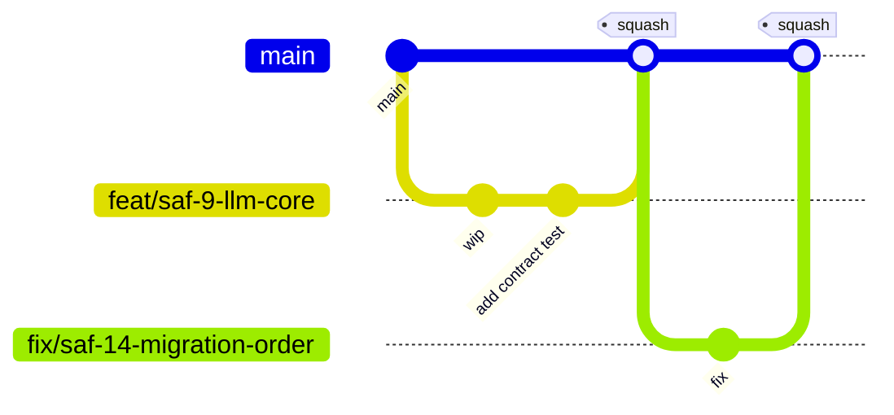

# 11 — Git Strategy & CI/CD Strategy

## Git strategy

- **Trunk-based development** on `main`. No long-lived `develop`/`release` branches — they rot and cause exactly the merge pain a 10-year platform can't afford.
- **Short-lived branches**: `feat/<ticket>-<slug>`, `fix/<ticket>-<slug>`, `chore/<ticket>-<slug>` — see naming table in [10](10-coding-standards-and-naming.md).
- **Conventional Commits** (`feat:`, `fix:`, `chore:`, `refactor:`, `docs:`), enforced by commit-lint in CI — this is what lets Changesets and release notes generate automatically instead of being hand-written.
- **`main` is protected**: PR required, CI green required (lint, typecheck, test, build, dependency-cruiser, contract tests), at least one review required, squash merge only (keeps `main` history one commit per change, bisectable).
- **Changesets** for versioning: a PR touching a published-meaningful package (`ports`, `plugin-sdk` today; more later) must include a changeset file describing the semver bump and rationale — CI fails the PR if it's missing for a changed package under `packages/`.
- **No direct pushes to `main`**, no force-push to `main`, ever — including by CI service accounts.

## CI/CD strategy

**Tooling:** GitHub Actions + Turborepo remote caching (affected-package-only pipelines — a change to one plugin doesn't rebuild/retest the whole monorepo).

### Pipeline stages (every PR)
1. **Build** — affected packages/apps. Runs first, not fifth: every package resolves its workspace dependencies through its `package.json` `exports` field (pointing at `dist/`, never source directly), so cross-package type-aware lint/typecheck cannot resolve a single import until dependencies are built — confirmed empirically while scaffolding SAF-8 (a stale/missing `dist` produced cascading `no-unsafe-*` ESLint errors with no real type error behind them). Documented here as a corrected ordering, not the original design.
2. **Lint** — ESLint + Prettier check + `dependency-cruiser` boundary check (layering violations fail here, not in review)
3. **Typecheck** — `tsc -b` across the project-reference graph
4. **Unit test** — Vitest, per affected package, coverage floors enforced ([10](10-coding-standards-and-naming.md))
5. **Contract test** — port/adapter contract suites (`testing-kit`)
6. **Integration test** — ephemeral docker-compose (Postgres/Redis/MinIO/Keycloak) + Playwright for `web`, spun up only for PRs touching `apps/*` or adapters
7. **Security scan** — dependency audit (`pnpm audit` / OSV), secret scanning, SAST (CodeQL)
8. **Architecture fitness checks** — banned-keyword guard, plugin-isolation guard (see [12](12-risks-and-technical-debt.md))

### Deployment stages (on merge to `main` / on tag)
- **Dev**: auto-deploy every merge to `main` — fast feedback, low blast radius.
- **Staging**: auto-deploy on version tag (created by Changesets' release PR merge).
- **Prod**: manual approval gate, tied to a change record — this is the concrete ITIL-alignment mechanism: no prod deploy without a linked approval, and the deploy pipeline itself writes the `ApprovalGate`/`AuditEvent` records described in [02-domain-model.md](02-domain-model.md), so the platform's own governance model dogfoods on its own deploys.
- Containers are built once and promoted across environments unchanged (build once, deploy many) — never rebuilt per environment, to guarantee what was tested in staging is what ships to prod.
- Container images are signed (cosign) and scanned before the prod gate — supply-chain integrity, not just app-level testing.

### Environments
`dev`, `staging`, `prod`, each a separate docker-compose overlay in Sprint 0 (`infra/docker-compose/*.yml`); a Kubernetes/Cloud Foundry/Kyma target is a later adapter on the same deploy pipeline contract, not a Sprint 0 concern — deployment target is itself configuration, consistent with "no vendor lock-in."

## Sprint 0 deliverable

`.github/workflows/ci.yml` (SAF-15, done 2026-07-15) — four jobs:

- **`build-lint-typecheck-test`** — stages 1–5, in the documented order (Build before Lint/Typecheck, since cross-package type-aware lint/typecheck can't resolve an import until the dependency is built). Contract tests aren't a separate stage: every adapter package's `testing-kit` contract suite runs inline as part of that package's own `test` script.
- **`integration`** — stage 6, for real now that all four `apps/*` exist: spins up the actual `infra/docker-compose` stack (Postgres/Keycloak/OPA/otel-collector), polls for health exactly as `infra/README.md` documents doing by hand, then re-runs every real-infra-gated package's `test` script directly (not via `turbo run test` — Turborepo's default env mode doesn't factor `SAF_TEST_*` vars into a task's cache hash, so a cache hit could silently replay a stale "skipped" result instead of exercising real infra; found and documented in the SAF-16/SAF-17 backlog entries). This job needs its own `pnpm run build` step even though `build-lint-typecheck-test` already ran one — it's a separate job on a fresh runner with no `dist/` carried over, and workspace packages resolve each other through `package.json` `exports` pointing at `dist/`, never source.
- **`security`** — stage 7, `continue-on-error: true` (informational only; the required-checks list above doesn't name it, and SAST via CodeQL needs GitHub Advanced Security, whose licensing on this repo isn't decided yet). Uses OSV-Scanner, not `pnpm audit` — `pnpm audit` is not currently usable at all: verified by hand, it fails outright (`410 Gone`) because it calls npm's legacy per-package audit endpoint, which npm has retired in favor of a bulk endpoint pnpm doesn't yet call. OSV-Scanner (already named as the alternative in this doc's own "pnpm audit / OSV" wording) queries the OSV.dev database directly and, run locally against this lockfile, found 4 real, currently-unaddressed vulnerabilities (see the SAF-15 backlog entry) `pnpm audit` never got the chance to report.
- **`deploy-dev`** — a deliberate placeholder, on push to `main` only: no Dockerfile, container registry, or real target environment exists yet for any app, so this job exists to keep the pipeline's *shape* real (merge to `main` triggers a dev deploy) without fabricating a target that isn't there.

Stage 8 (architecture fitness checks beyond the dependency-cruiser boundary check already covered under Lint) is SAF-19's new content, not built here — this pipeline already has the slot (`build-lint-typecheck-test`'s Lint step) for it to land in.
