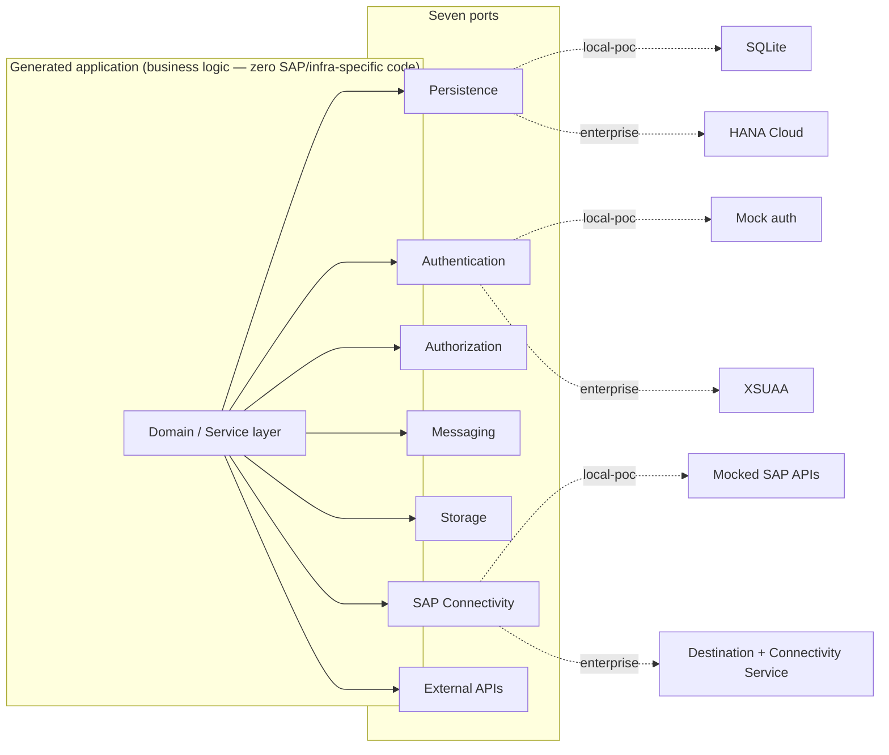

# 14 — Execution Profiles for Generated Applications

This document details [ADR-0019](../adr/0019-execution-profiles-for-generated-applications.md). It describes the architecture of **applications the platform generates**, not the platform's own runtime — see the scope note at the top of that ADR. It also carries the "does this introduce technical debt" self-review the user asked for when this capability was proposed (§6).

## Why this belongs in the architecture, not just in plugin implementations

The platform's core promise is that a generated CAP/Fiori application is production-grade SAP delivery, not a prototype. That promise is worthless if the only way to see it work is a fully provisioned BTP subaccount with HANA Cloud, XSUAA, and Destination Service configured — most of the platform's value (fast iteration, convincing demos, low-friction adoption) depends on a generated app running believably on a laptop with zero SAP entitlements. Making that possible *without* forking business logic per environment is a hexagonal-architecture problem, and hexagonal architecture is the platform's own foundational pattern ([01-high-level-architecture.md](01-high-level-architecture.md)) — this ADR applies that same pattern one level down, to the platform's output, rather than inventing a new one.

## The seven ports (generated-application side)

These are ports in the *generated application's* architecture — distinct from, and not to be confused with, the platform's own ports (`packages/ports/*`, used by `orchestrator`/`worker` at generation time). A generated CAP service's business logic depends on these seven interfaces and nothing else for anything environment-specific:

| Port category | Local POC adapter | Hybrid | Enterprise adapter |
|---|---|---|---|
| **Persistence** | SQLite (CAP's built-in local db service) | Either, per service | SAP HANA Cloud |
| **Authentication** | Mock authentication (fixed local users) | Either | XSUAA / SAP IAS (OIDC/OAuth2) |
| **Authorization** | Mock roles (static assignment matching `@requires`/`@restrict`-style annotations) | Either | XSUAA scopes / role collections from a real IAS-issued token |
| **Messaging** | In-memory / local event emulation | Either | SAP Event Mesh / Advanced Event Mesh (via Integration Suite or a BTP messaging service) |
| **Storage** (blob/file) | Local filesystem or an embedded object store | Either | SAP Object Store service / customer-specified bucket |
| **SAP Connectivity** (calls into the customer's backend SAP system) | Mocked SAP APIs (recorded/stubbed OData, RFC, BAPI responses) | Either | BTP Destination Service + Cloud Connector + Connectivity Service |
| **External APIs** (third-party, non-SAP) | Mocked external APIs (stubbed fixtures) | Either | Real calls, typically still routed through Destination Service for credential/URL management |

"SAP Connectivity" here is unrelated to the platform's own MCP abstraction ([ADR-0004](../adr/0004-mcp-abstraction-layer.md)), which lets the platform's *agents* call MCP-wrapped tools *during generation*. This port is called by the *generated application itself, at its own runtime, after deployment* — a different layer entirely. Keeping these conceptually distinct, and saying so explicitly here, is deliberate: conflating "the platform calling tools to generate code" with "the generated code calling SAP systems once deployed" is a confusion this document exists to foreclose before it happens.

## Execution profiles are composable, not three separate mechanisms

An `ExecutionProfile` is a named map from each of the seven port categories to a chosen adapter binding. `local-poc` and `enterprise` are the two "pure" presets (all-mock, all-real). `hybrid` is not a third mechanism — it is simply any profile whose per-port bindings aren't uniformly one or the other (e.g., Persistence bound to real HANA Cloud for integration testing while SAP Connectivity stays mocked because the real backend isn't reachable from a developer's machine). This mirrors how SAP's own CAP framework already supports a "hybrid testing" mode (`cds bind`, profile-scoped `cds.requires` configuration) — the platform formalizes and extends a pattern CAP-based plugins can implement natively, rather than fighting the framework.

## Domain model additions

Added to the domain model in [02-domain-model.md](02-domain-model.md) (Capability & Plugin Registry and Project & Workspace contexts):

- **`ExecutionProfile`**: `{ id, name, adapterBindings: Record<PortCategory, AdapterBindingRef> }`. Built-in profiles (`local-poc`, `enterprise`) are platform-seeded; `hybrid` variants are project-specific compositions, not a fixed fourth built-in.
- **`PortCategory`**: a fixed, platform-defined enum — `persistence | authentication | authorization | messaging | storage | sap-connectivity | external-api`. This enum is the one place the core platform's data model is aware these categories exist; it contains no further SAP-specific detail (no mention of HANA, XSUAA, SQLite anywhere in `packages/context-*`).
- **`AdapterBindingRef`**: an opaque reference — either a `mock` marker or a pointer to a `TargetSystemConnection` ([ADR-0015](../adr/0015-target-system-credential-management.md)) for a real binding. The core platform never resolves what a binding actually does; only the plugin and `generated-app-kit` do.
- **`PluginManifest`** gains `supportedExecutionProfiles: ExecutionProfileId[]` and `portCategoriesUsed: PortCategory[]` — a plugin declares both which profiles it can generate for and which of the seven ports its output actually touches (a documentation-only plugin touches none).
- **`GenerationInput`** gains `targetExecutionProfile: ExecutionProfileId`.
- **`Artifact`/`ArtifactVersion`** gain `generatedForExecutionProfile: ExecutionProfileId`, so a later "why doesn't this artifact run in Enterprise" question has a structural answer.
- **`Project`** gains `requiredExecutionProfiles: ExecutionProfileId[]` — which profiles this delivery engagement needs generated, set once during intake, not re-derived per generation run.

No aggregate above stores what SQLite, HANA, or XSUAA are — that mapping lives entirely inside plugin implementations and `generated-app-kit`, preserving "no SAP-specific logic inside the core platform" ([ADR-0006](../adr/0006-plugin-architecture.md)) for the platform's own core, while extending the equivalent rule ("no SAP-specific logic inside the *generated application's* domain layer") to the product's output.

## Shared adapter library: `packages/generated-app-kit`

A new platform package, versioned and published for generated applications to depend on at runtime (not a Sprint 0 build target — see backlog). It provides:

- The seven port interfaces (TypeScript, framework-agnostic where possible).
- Mock/local adapter implementations usable directly by any plugin's Local POC output.
- Thin Enterprise-tier adapters that wrap official SAP SDKs (`@sap/xssec`, `@sap/cds` HANA driver, `@sap/cf-destinations` or equivalent) behind the same port interfaces — the adapters are glue, not reimplementations of SAP's own client libraries, so the platform never takes on maintaining SAP protocol logic itself.
- A shared contract-test suite (extending the `testing-kit` pattern already used for the platform's own ports) that both the mock and Enterprise adapter for a given port must pass — see the mock/real drift risk in §6.

Plugins that generate runnable applications scaffold business logic that imports `generated-app-kit`'s ports; they do not hand-roll their own mock-auth, mock-persistence, or mock-SAP-API implementations. This is the same "don't duplicate a cross-cutting concern per adapter" lesson already applied to LLM/MCP resilience ([ADR-0016](../adr/0016-mandatory-resilience-patterns.md)), applied here to keep N plugins from independently reinventing (and inconsistently maintaining) the same seven adapters.

## Generated CI/fitness inheritance (decided now, built later)

A generated application should inherit the platform's own discipline of catching boundary violations mechanically rather than by convention: plugins are expected to scaffold a lightweight dependency-boundary check (a dependency-cruiser-equivalent config, generated alongside the business code) into the generated repository itself, so "no SAP-specific code in the domain layer" is enforced in the *customer's* CI, not just assumed. This is decided as an architectural expectation now; it is not a Sprint 0 deliverable — see backlog.

## Self-review: does this introduce technical debt?

Performed against the same standard as [13-principal-architect-self-review.md](13-principal-architect-self-review.md), scoped to this capability.

1. **Mock/real behavioral drift ("works in Local POC, fails in Enterprise").** The single largest risk this capability introduces — a mocked SAP API returning different pagination/error semantics than the real OData service is a systemic bug class, not a one-off. **Mitigation:** every `generated-app-kit` port ships a shared contract-test suite; both its mock and Enterprise adapters must pass it, exactly like the platform's own port/adapter contract-test discipline. Logged as a risk in [12-risks-and-technical-debt.md](12-risks-and-technical-debt.md) (R19).
2. **Combinatorial adapter duplication across plugins.** If each application-generating plugin implemented its own seven adapters, N plugins × 7 ports would duplicate maintenance and drift independently. **Mitigation:** `generated-app-kit` centralizes adapter implementations; plugins consume, not reimplement. Logged as R20.
3. **A second credential store for real (Enterprise-tier) bindings.** Rejected explicitly in [ADR-0019](../adr/0019-execution-profiles-for-generated-applications.md)'s alternatives — Enterprise SAP Connectivity bindings resolve through the existing `TargetSystemConnection` mechanism ([ADR-0015](../adr/0015-target-system-credential-management.md)), not a new one.
4. **CI cost of testing against real Enterprise-tier services.** Running contract tests against live HANA Cloud/XSUAA/Destination Service on every commit is slow and requires live BTP entitlements. **Mitigation:** the platform's own CI-cadence pattern (fast checks on every PR, a slower nightly/pre-release pipeline for the expensive tier) is reused rather than invented — mock-adapter contract tests run on every PR; Enterprise-adapter contract tests run against sandboxed BTP resources on a slower cadence. Logged as R21.
5. **Scope creep risk.** This capability could be used as a justification to build a first real plugin "to prove profiles work" ahead of schedule. **Explicitly rejected:** this ADR extends the *contract* (`plugin-sdk` manifest fields, the domain-model additions above) — it does not require or authorize any plugin's real generation logic to ship earlier than already planned. `generated-app-kit` itself is a Sprint 1/2 backlog item, not Sprint 0.
6. **Unnecessary complexity considered and rejected:** a fourth, fixed "hybrid" bundle distinct from per-port composability was considered and rejected in [ADR-0019](../adr/0019-execution-profiles-for-generated-applications.md) — composability handles it for free, so no extra mechanism was added.

Net assessment: this capability adds one new shared package (`generated-app-kit`), a small, bounded domain-model extension (an enum and a handful of fields on existing aggregates), and reuses three already-established platform patterns (ports & adapters, contract testing, `TargetSystemConnection`) rather than inventing new ones. No new bounded context, no new deployable service, and no weakening of any existing fitness function was required.
