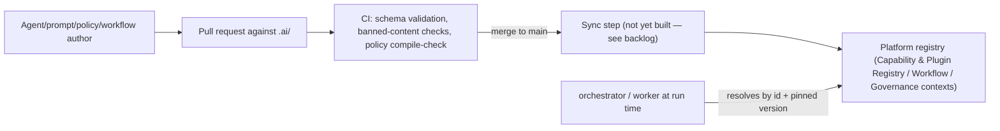

# 15 — AI Workspace (`.ai/`)

This document details [ADR-0020](../adr/0020-ai-workspace-for-agent-definitions.md). It describes the `.ai/` workspace at the repository root: a version-controlled, file-based authoring surface for the agent definitions, prompts, policies, workflows, and knowledge sources needed to eventually orchestrate dozens of specialized AI agents. See [.ai/README.md](../../.ai/README.md) for the folder itself.

## Why a file-based workspace, not database rows from day one

Everything in `.ai/` — an agent's purpose and permissions, a prompt's exact wording, a policy's condition, a workflow's step sequence — is exactly the kind of content that benefits from git's properties: PR review, diffable history, blame, branching for experimentation, and rollback by reverting a commit. This mirrors a choice already made elsewhere in this platform: ADRs are files, not database rows, for the same reason. The platform's runtime aggregates (`PromptTemplate`, `WorkflowDefinition`, `PolicyRule`, and the new `AgentDefinition` — see below) are the **resolved, indexed projection** of this authored content, not a second place where it's independently edited — the same relationship [ADR-0014](../adr/0014-cqrs-read-models.md) established between write-side aggregates and read-model projections, applied here between git-authored content and its runtime registry entry.

This is a GitOps-shaped pattern, not a new one invented for this platform — the same shape as Kubernetes manifests or Terraform files, applied to agent behavior instead of infrastructure.

## Mapping onto the existing domain model

| `.ai/` folder | Runtime concept | Context |
|---|---|---|
| `agents/*/agent.md` | **`AgentDefinition`** (new aggregate — see below) | Agent Orchestration / Workflow |
| `prompts/*/vN/` | `PromptTemplate` (versioned, exactly as already designed) | LLM Gateway |
| `policies/*` | `PolicyRule` (policy-as-code, exactly as already designed) | Governance |
| `workflows/*` | `WorkflowDefinition` (versioned, exactly as already designed) | Agent Orchestration / Workflow |
| `knowledge/*` | Served via a `knowledge-retrieval` MCP tool — indexed content, not a new aggregate | MCP Registry (tool binding only) |
| `templates/*` | Not a runtime concept — an authoring aid only, like `tools/generators` for code packages | N/A |

Four of the six folders map onto concepts **that already existed** before this extension (`PromptTemplate`, `PolicyRule`, `WorkflowDefinition`, and MCP tool bindings) — this workspace does not introduce four new runtime mechanisms, it gives four already-designed mechanisms a consistent, reviewable authoring home. Only one genuinely new concept is introduced: `AgentDefinition`.

## New domain model addition: `AgentDefinition`

Added to the Agent Orchestration / Workflow context ([02-domain-model.md](02-domain-model.md)): `AgentDefinition { id, version, purpose, responsibilities, allowedMcpTools: ToolBindingRef[], inputs, outputs, memoryScope: 'none'|'run'|'project'|'tenant', escalationPolicyRefs: PolicyRuleId[], approvalPolicyRefs: PolicyRuleId[], contextLoadingStrategy: ContextLoadingStrategy[], pinnedPromptVersion: PromptTemplateId, toolPermissions: Record<ToolBindingRef, ToolPermissionPolicyId> }`. A `Step` of kind `agent-invocation` references one `AgentDefinition` by id + version, exactly as a `plugin-generation` step already references a capability by id — no new `Step` kind was needed.

### Memory: deliberately not a new abstraction

An agent's `memoryScope` determines the narrowest applicable read/write boundary (none, this `WorkflowRun`, this `Project`, this tenant) for whatever it needs to remember between invocations. Critically, **memory is not a new persistence mechanism** — it's read and written through the platform's existing `Repository<T>` port, scoped by the existing `RequestContext` ([08-authentication-and-rbac.md](08-authentication-and-rbac.md)), subject to the same tenant isolation, retention, and crypto-shredding rules ([ADR-0017](../adr/0017-data-retention-crypto-shredding.md)) as every other piece of project data. An agent that wants a private vector store, a private cache, or a private file it alone can read is not memory — it's unreviewed shadow infrastructure, and is exactly the failure mode this design forecloses by giving memory nowhere else to live.

### Escalation, approval, and tool permissions: reused, not reinvented

An `AgentDefinition` never embeds its own escalation/approval/tool-permission logic — it references `PolicyRule`s by id, evaluated by the same policy engine ([ADR-0011](../adr/0011-hybrid-rbac-abac-policy-as-code.md)) that already enforces the platform's RBAC/ABAC model, and the same "any tool call touching a target system, a credential, or the tenant boundary requires approval regardless of manifest permission" rule already established for plugins ([08-authentication-and-rbac.md](08-authentication-and-rbac.md) §Post-review additions) now applies uniformly to agents too. Tool permissions reuse the scoped capability token mechanism from [ADR-0006](../adr/0006-plugin-architecture.md), generalized from "plugin invocations carry a scoped token" to "any invocation — plugin execution or agent invocation — carries one."

### Context loading strategy: a fixed taxonomy, not arbitrary retrieval code

Four named strategies only — `static-bundle`, `retrieval-augmented`, `run-scoped-history`, `project-memory` (see [.ai/templates/agent.template.md](../../.ai/templates/agent.template.md)) — chosen per agent, never an agent-specific retrieval implementation. `retrieval-augmented` is served through the `knowledge-retrieval` MCP tool, which is why `knowledge/` needed no new abstraction layer of its own: it's just another MCP-served capability, subject to the same capability binding, resilience wrapper ([ADR-0016](../adr/0016-mandatory-resilience-patterns.md)), and Zero Trust rules as any other tool.

## Evolution path: how this becomes part of SAP App Factory itself

`.ai/` starts as an internal authoring convention with no runtime consumer — the same starting point `plugin-sdk` had before any real plugin existed. The intended graduation path, mirroring how `plugin-sdk` graduated from a Sprint 0 contract to the mechanism third parties will eventually use:

1. **Now (architecture only):** `.ai/` folder structure, templates, and one illustrative worked example (`requirements-analyst`) — proves the schema holds together, nothing is loaded by any runtime.
2. **Sprint 1/2 (backlog, not yet built):** a `packages/agent-sdk` package (parallel to `plugin-sdk`) formalizing `AgentDefinition`/`PromptTemplate`/`PolicyRule`/`WorkflowDefinition` as TypeScript types, plus a sync/loader that ingests `.ai/` content into the platform's registries on merge to `main`, plus CI validation (schema lint, banned-content checks — no secrets, no real customer data in `knowledge/`).
3. **Later:** once `agent-sdk` and the registry are proven internally against the platform's own agents, the same schema becomes the customer/partner-facing mechanism for authoring new agents — the product literally ships using the same `.ai/` conventions the platform team dogfoods, the same way a generated application's hexagonal structure mirrors the platform's own.

## Relationship to the Project Digital Twin

Added post-review ([ADR-0021](../adr/0021-project-digital-twin-knowledge-graph.md)): every project's Digital Twin ([16-project-digital-twin.md](16-project-digital-twin.md)) is itself a natural retrieval target for an agent's `retrieval-augmented` context-loading strategy, exposed as a `digital-twin-search`/`graph-query` MCP tool alongside `knowledge-retrieval` — an agent asking "what already implements this requirement" queries the twin the same way it queries `.ai/knowledge/`, through the same MCP abstraction, with no new context-loading strategy required. The impact-analysis and root-cause-assistance agents described in that document are themselves ordinary `.ai/agents/*` definitions.

## Self-review: does this introduce technical debt?

Scoped review, same standard as [13-principal-architect-self-review.md](13-principal-architect-self-review.md) and [14-execution-profiles.md](14-execution-profiles.md) §6.

1. **Memory as an ungoverned shadow database.** The most likely failure mode for "agent memory" done carelessly. **Mitigation:** memory is explicitly not a new mechanism — narrow scope enum, existing `Repository<T>` port, existing retention/crypto-shredding rules. No agent may introduce a private store; this is stated as a hard rule in [.ai/README.md](../../.ai/README.md).
2. **Boilerplate drift across "dozens of specialized agents."** Without shared structure, escalation rules, tool-permission scopes, and prompt preambles would be copy-pasted and independently drift per agent. **Mitigation:** `templates/*` for structure, `prompts/_shared/*` for prompt fragments, and the rule that policies are referenced by id, never restated — the same "factor it once" lesson already applied to `generated-app-kit` ([ADR-0019](../adr/0019-execution-profiles-for-generated-applications.md)) and the LLM/MCP resilience wrapper ([ADR-0016](../adr/0016-mandatory-resilience-patterns.md)).
3. **`.ai/` content reviewed less rigorously than code because it "looks like docs."** A prompt or policy change here changes production agent behavior as materially as a code change. **Mitigation:** stated explicitly as Ground rule 1 in [.ai/README.md](../../.ai/README.md) — same PR review discipline as [CODING_STANDARDS.md](../../CODING_STANDARDS.md), no exemption.
4. **Indirect prompt injection via `knowledge/` content.** Retrieved knowledge, even vetted, can carry injected instructions. **Mitigation:** knowledge content is explicitly treated as untrusted input at the point it re-enters an agent's context, reusing the input-validation-at-boundary rule already in [CODING_STANDARDS.md](../../CODING_STANDARDS.md) rather than inventing a new one; combined with the existing rule that any tool call touching a credential/target system/egress requires approval regardless of what an agent's own manifest permits.
5. **A second credential/permission model for agents, parallel to the one already built for plugins.** Considered and rejected: agent tool permissions reuse the scoped capability token mechanism from [ADR-0006](../adr/0006-plugin-architecture.md), generalized rather than duplicated.
6. **Scope creep — building `agent-sdk` or a real agent now, ahead of schedule.** Explicitly out of scope for this extension: only the file-based workspace, templates, and domain-model addition are decided now; the loader/SDK is a named Sprint 1/2 backlog item, not built here.

Net assessment: one new domain concept (`AgentDefinition`), fitted into an existing `Step` kind with no new orchestration primitive; four of six `.ai/` folders map onto mechanisms that already existed; memory, tool permissions, and escalation/approval all reuse existing platform mechanisms rather than introducing new ones. The main residual risk carried forward is operational discipline (rule 2 and 3 above), not architectural — exactly the kind of risk a written, referenced convention (this document, [.ai/README.md](../../.ai/README.md)) is suited to managing.
