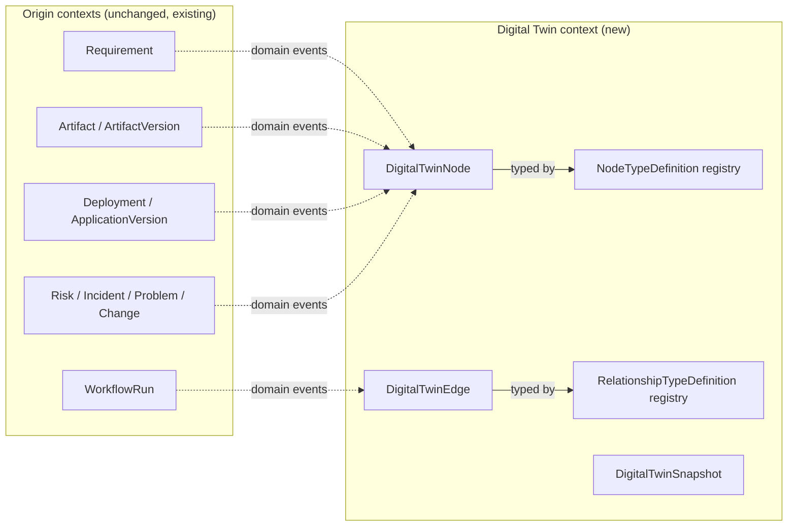

# 16 — Project Digital Twin

This document details [ADR-0021](../adr/0021-project-digital-twin-knowledge-graph.md): every project gets a Digital Twin — a knowledge graph representing every artifact produced across its lifecycle, with typed, traceable relationships between them.

## What the Digital Twin is (and isn't)

It is a **graph overlay, not a second source of truth**. Every node references the real data it represents by ID in whichever context already owns it; the graph itself stores only enough to traverse and display (label, status, a pointer). This is the same relationship [ADR-0014](../adr/0014-cqrs-read-models.md) established between write-side aggregates and reporting projections, applied to a graph-shaped query need instead of a tabular one. If the Digital Twin disappeared and was rebuilt from the event log tomorrow, nothing would be lost — exactly like any other read-model.

## 1. Data model

### Reuse before invention

Of the 20+ example artifact types in the request, most are **not** new aggregates — they're `kind`/`artifactType` variants of concepts that already exist:

| Requested artifact type | Modeled as |
|---|---|
| Business / Functional / Non-Functional Requirement, User Story | `Requirement` (Requirements Intake context) with a `kind` field — added post-review |
| Acceptance Criteria | `AcceptanceCriterion` (already existed, attached to `Requirement`) |
| Architecture doc, FS, TS, Documentation, User Manual, Demo Script, Recording | `Artifact` / `ArtifactVersion` (Generation context) with new `artifactType` values (`"architecture-doc"`, `"functional-spec"`, `"technical-spec"`, `"user-manual"`, `"demo-script"`, `"recording"`) — no schema change, since `artifactType` was already an open string |
| UI Screen, CAP Service, Entity, OData Service | `Artifact`/`ArtifactVersion` with new `artifactType` values, at a **finer granularity than the generated bundle** — a plugin that generates a whole CAP project registers one Digital Twin node per service/entity/OData endpoint, each with a locator (file path / CDS namespace) into the parent `Artifact`, not one node for the whole bundle |
| Test | `Artifact` (`artifactType: "test-suite"`) for the generated test code; its Digital Twin node's `status` (pass/fail/skipped) is updated per CI run, with the detailed report itself stored as a further `Artifact` (`artifactType: "test-report"`) |

### Genuinely new aggregates

Only two existing contexts and one new context needed additions:

- **Project & Workspace** gains `Deployment` (a record that a specific `ApplicationVersion` was deployed to a specific `Environment`, under a specific execution profile, with a status) and `ApplicationVersion` (a named, immutable bundle of `Artifact`/`ArtifactVersion` references constituting one release).
- **Governance & Audit** gains `Risk`, `Incident`, `Problem`, `Change` — the ITIL concepts [00-vision-and-principles.md](00-vision-and-principles.md) already named as a principle (#11) but hadn't yet modeled. This context was already the natural home (it owns `ApprovalGate`, `PolicyRule`, `ComplianceRecord`, `AuditEvent`).
- **Digital Twin / Traceability** (new context) owns only the graph structure: `DigitalTwinNode`, `DigitalTwinEdge`, `NodeTypeDefinition`, `RelationshipTypeDefinition`, `DigitalTwinSnapshot`.

Net: **2 new aggregates in existing contexts, 4 new aggregates in an existing context, 5 new aggregates in one new context** — eleven new aggregates total, covering a twenty-plus-item artifact list, because most of that list was already covered by two existing, deliberately open-typed aggregates (`Requirement`, `Artifact`). See §8 for why this ratio matters.

### Node envelope (core, opaque)

```
DigitalTwinNode {
  id, projectId, nodeType: string,        // opaque, registry-declared — see below
  sourceRef: { context, aggregateId, version },
  label, status,
  createdAt, versionHistory: NodeVersionEntry[]
}
```

### Edge envelope (core, opaque)

```
DigitalTwinEdge {
  id, projectId,
  fromNodeId, toNodeId,
  relationshipType: string,               // opaque, registry-declared
  provenance: 'declared' | 'ai-inferred',
  confidence?: number,                    // required when provenance is 'ai-inferred'
  status: 'active' | 'retired',           // never hard-deleted — same rule as domain model rule 5
  createdBy: { actorId } | { agentDefinitionId },
  createdAt, retiredAt?, retiredReason?
}
```

## 2. Knowledge graph

**Model:** a property graph (typed nodes and edges, each with key/value properties) — not RDF/OWL. A property graph matches the actual need (bounded-depth traversal for traceability and impact analysis) without the ontology-reasoning overhead RDF/SPARQL is built for; that overhead isn't justified by anything in this platform's near-term requirements.

**Storage:** a new `digital_twin` Postgres schema, queried through **Apache AGE** — an open-source, Cypher-compatible graph extension running inside the same Postgres instance the platform already operates. This gets real graph-native query semantics (variable-length path traversal, cycle-safe queries) without adding a new database technology to operate, consistent with "boring technology in the core." Both node and edge tables are queryable through the same connection pool, backup/replication, and partitioning strategy already established for every other schema ([ADR-0009](../adr/0009-postgresql-schema-per-context-drizzle.md)).

**Abstraction:** a new `ports/graph-store.port.ts` — `upsertNode`, `retireNode`, `upsertEdge`, `retireEdge`, `traverse(fromNodeId, relationshipTypes[], maxDepth)`, `snapshot(projectId)`. The Sprint-later default adapter is `graph-adapters/postgres-age`; a dedicated graph engine (Neo4j, Amazon Neptune, or a managed equivalent) is a documented future adapter for the day traversal performance at true scale (tens of thousands of nodes/edges across an active project, over a 10-year archive) demands it — an adapter swap behind the port, not a rewrite of every consumer, the same pattern already applied to the workflow engine, event transport, and every other hard-to-reverse infrastructure choice in this platform.



## 3. Relationship model

Relationship types are **opaque, registry-declared strings** — the third application of the pattern already used for `ArtifactType` ([05-plugin-architecture.md](05-plugin-architecture.md)) and `PortCategory` ([ADR-0019](../adr/0019-execution-profiles-for-generated-applications.md)). A new relationship type must be registered (name, inverse name, category, cardinality, one-line definition) before use — checked in CI, exactly like the other two registries — so "dozens of specialized agents" proposing relationships don't produce an unbounded pile of near-duplicate ad hoc strings (`"implements"`, `"implements-partially"`, `"kind-of-implements"`).

### Illustrative core catalog

| Category | Relationship (→ inverse) | Example |
|---|---|---|
| Traceability | `implements` → `implemented-by` | Requirement → CAP Service |
| Traceability | `displayed-by` → `displays` | Requirement → UI Screen |
| Traceability | `validated-by` → `validates` | Requirement → Test |
| Traceability | `documents` → `documented-by` | User Manual → UI Screen |
| Structural | `contains` → `contained-by` | Deployment → Application Version, Application Version → Artifact |
| Structural | `depends-on` → `depended-on-by` | UI Screen → OData Service, CAP Service → Entity |
| Derivation | `derived-from` → `derives` | User Story → Business Requirement, Functional Spec → Business Requirement |
| Governance | `affects` → `affected-by` | Incident → Deployment, Change → CAP Service |
| Governance | `threatens` → `threatened-by` | Risk → Requirement, Risk → Deployment |
| Governance | `mitigates` → `mitigated-by` | Change → Risk |
| Versioning | `supersedes` → `superseded-by` | ArtifactVersion N → N-1 |

Every relationship type declares its inverse explicitly, so traversal direction never depends on remembering which way a given type "usually" reads — a query for "what implements Requirement X" and "what does CAP Service Y implement" are the same edge, walked in opposite directions.

## 4. Versioning strategy

Extends the reproducibility rule already in [02-domain-model.md](02-domain-model.md) (rule 6: `WorkflowRun` pins the exact `WorkflowDefinition`/`PromptTemplate`/`AgentDefinition`/`ModelProfile` versions it used):

- **Nodes** are append-only version histories — a node's current state is a projection over `versionHistory`, never an in-place edit. Each version entry references the exact source-aggregate version that produced it (e.g., which `ArtifactVersion`, which `Requirement` revision).
- **Edges** are never hard-deleted — a relationship that becomes invalid (a CAP Service is removed, so it no longer implements anything) is marked `status: retired` with a reason and timestamp, reusing the "no hard deletes on cross-referenced aggregates" rule already established (domain model rule 5) rather than inventing a new one for this context.
- **`DigitalTwinSnapshot`**: at key milestones (a `Deployment`, a `Change` approval), the platform may capture a named, immutable snapshot of the graph's full current state — every current node version and edge status at that moment. This is what makes "what was traced to what when this incident occurred" answerable months later, and ties naturally into `ComplianceRecord` (Governance & Audit) for audit purposes.

## 5. Traceability strategy

This is the concrete mechanism behind the PMO-alignment and ITIL-alignment principles stated since Sprint 0 ([00-vision-and-principles.md](00-vision-and-principles.md)) but not, until now, actually modeled:

- **Forward traceability:** Business Requirement → (`derived-from`) Functional Requirement / User Story → Acceptance Criteria → (`implements`) CAP Service / UI Screen → (`validated-by`) Test → (`contains`, via Application Version) Deployment.
- **Backward traceability:** from any node, walk incoming edges to answer "why does this exist" — from a CAP Service, walk back to the Requirement(s) it implements; from an Incident, walk back through `affects`/`contains` to the Deployment, Application Version, and ultimately the Changes and Requirements behind it.
- **Traceability completeness** is a checkable property, not an aspiration: a policy-as-code rule (same mechanism as [ADR-0011](../adr/0011-hybrid-rbac-abac-policy-as-code.md) and the `.ai/policies` pattern from [ADR-0020](../adr/0020-ai-workspace-for-agent-definitions.md)) can require "every `Requirement` has at least one `implements`/`displayed-by`/`validated-by` edge" before a `ReviewGate` allows promotion past Local POC — reusing the existing gate mechanism rather than inventing new gating logic.

## 6. Impact analysis

Impact analysis is bounded-depth graph traversal, both directions, from a candidate change: forward to find what depends on the changed node (what would break), backward to find what requirements/decisions justify it (what's at stake if it's removed or altered).

This is a natural fit for the AI Workspace ([ADR-0020](../adr/0020-ai-workspace-for-agent-definitions.md)) rather than a bespoke mechanism: an illustrative `impact-analysis-agent` would declare `graph-query` as its one Allowed MCP tool, take a node + proposed change as Input, and produce a structured Impact Report (affected nodes grouped by type, affected `Requirement`s, affected `Test`s, an estimated risk level) as Output — no approval requirement of its own, since it only reads and reports; the `Change` it informs carries its own approval gate. Its output edges (if it proposes new relationships it discovered) are `provenance: 'ai-inferred'`, per §3 and §7.

Impact analysis is the direct enabler of ITIL Change Management: before a `Change` is approved, running impact analysis against the graph and attaching the resulting Impact Report to the `Change`'s `ReviewGate` is how "assess before you change" becomes an enforced step rather than a checklist item a human might skip.

## 7. Search strategy

Two complementary modes, both staying inside the existing stack rather than adding new infrastructure:

- **Structured/graph search** — traverse by relationship type, filter by `nodeType`/`status`/project, served directly by `GraphStorePort`. This is the primary mode for traceability and impact analysis.
- **Semantic search** — natural-language queries ("find requirements related to payment approval") over node labels and linked content summaries, via Postgres full-text search plus `pgvector` embeddings (`ports/search-index.port.ts`, default adapter `search-adapters/postgres-fts-pgvector`) — again staying in Postgres rather than adding Elasticsearch/a dedicated vector database as a new Sprint-later dependency, with the same documented adapter-swap path if scale later demands a dedicated engine.

Both are exposed to agents as MCP tools (`digital-twin-search`, `graph-query`) — the same mechanism `.ai/knowledge`'s `knowledge-retrieval` tool already uses ([15-ai-workspace.md](15-ai-workspace.md)), so an agent's `retrieval-augmented` context-loading strategy can pull from the project's own Digital Twin exactly the way it pulls from the general `knowledge/` corpus, with no new context-loading strategy needed.

Semantic indexing is applied selectively at first (Requirements and Incidents — the highest-value nodes for "find something similar" queries), not indiscriminately across every node type, to bound embedding-generation cost — governed by the existing `CostBudget`/`UsageRecord` mechanism in the LLM Gateway context, not a new cost-control mechanism.

## 8. Future AI reasoning strategy

The graph's job today is to be **correct and structured**; AI reasoning is a consumer of it through mechanisms that already exist, not a new "reasoning engine" bounded context:

- **Relationship inference** — an agent proposes new edges with `provenance: 'ai-inferred'` and a confidence score; these are never trusted for impact analysis or traceability-completeness checks until confirmed via `ReviewGate`, exactly like a generated `Artifact` requires review before promotion.
- **Gap detection** — a periodic agent scan for orphan nodes (a `Requirement` with no downstream `implements`/`displayed-by`/`validated-by` edge, a `CAPService` node with no upstream `Requirement`) raises them as `Clarification`s or `Risk`s — reusing existing domain concepts rather than inventing "gap" as a new type.
- **Change-impact prediction** — the impact-analysis agent (§6) runs automatically before a `Change`'s `ReviewGate` is opened, attaching its report as supporting evidence for the human approver.
- **Root-cause assistance** — for an `Incident`, an agent walks backward (Incident → Deployment → Application Version → Artifacts → Changes → Requirements) to suggest likely root causes as an `ai-inferred`, human-reviewed hypothesis, not an automatic conclusion — the graph-assisted realization of ITIL Problem Management.
- **Cross-project similarity** (later, once enough tenants have enough history) — embeddings enable "find similar past requirements/incidents," strictly scoped within one tenant's own projects via the existing `RequestContext`/tenant-isolation rules; never cross-tenant, no exception.

None of this requires a new bounded context, a new agent-integration mechanism, or a new permission model — every item above is "one more `.ai/agents/*` definition consuming an MCP tool, gated by the same `ReviewGate`/policy mechanism everything else uses."

## Self-review: does this introduce technical debt?

Scoped review, same standard as prior extensions ([13](13-principal-architect-self-review.md), [14](14-execution-profiles.md) §6, [15](15-ai-workspace.md) self-review).

1. **Becoming a second source of truth.** The single biggest risk for any graph/projection layer. **Mitigation:** nodes store only a `sourceRef` + minimal display fields; the graph is populated exclusively by projecting domain events, never written to directly by a command-side use case — identical discipline to [ADR-0014](../adr/0014-cqrs-read-models.md)'s read-models.
2. **Relationship-type sprawl.** Without registration, "dozens of specialized agents" proposing relationships would produce dozens of near-duplicate ad hoc strings. **Mitigation:** the same registry-and-CI-check pattern already applied to `ArtifactType` and `PortCategory` — the third use of one mechanism, not a new one.
3. **Graph query performance at 500+ projects over 10 years.** **Mitigation:** the `GraphStorePort` abstraction keeps a dedicated graph engine available as an adapter swap; partitioning/archival discipline (already established for other high-volume tables, [ADR-0009 revision](../adr/0009-postgresql-schema-per-context-drizzle.md)) applies to node/edge history tables too; queries are project-scoped by default, never cross-project.
4. **AI-inferred edges polluting impact analysis with false confidence.** **Mitigation:** mandatory `provenance`/confidence tagging and a `ReviewGate` before an inferred edge counts as ground truth — stated explicitly in §6/§8, not left implicit.
5. **New-bounded-context proliferation.** Considered directly: this extension adds eleven new aggregates against a twenty-plus-item requested artifact list, because `Requirement` and `Artifact` were deliberately designed (in Sprint 0) as open-typed enough to absorb most of it without a new aggregate per artifact type — see §1's reuse table. Where new aggregates were added (`Risk`/`Incident`/`Problem`/`Change`, `Deployment`/`ApplicationVersion`), each fits an existing context rather than justifying a new one; only the graph structure itself warranted a new bounded context, because it has real rules of its own (provenance, versioning, snapshotting) beyond a passive projection.
6. **Multi-tenancy.** No new risk introduced beyond what's already governed — every graph query is scoped by the existing `RequestContext`/tenant isolation rules ([08-authentication-and-rbac.md](08-authentication-and-rbac.md)); this is stated explicitly for cross-project similarity search in §8 because it's the one place a careless implementation could accidentally leak across tenants.
7. **Scope creep.** This ADR decides the graph model, storage, and registries — it does not build `graph-adapters/postgres-age`, the impact-analysis agent, or semantic search. Those are named Sprint-later backlog items, matching the discipline already applied to `generated-app-kit` and `agent-sdk`.

Net assessment: eleven new aggregates (four of them ITIL concepts realizing a principle stated since Sprint 0 but not yet modeled), one new bounded context whose only job is graph structure, and three mechanisms reused directly from prior decisions (the read-model-projection relationship, the opaque-registered-type pattern, and the ReviewGate/policy-as-code gating pattern) rather than invented fresh. No new database technology is introduced as an operational dependency — Apache AGE runs inside the Postgres instance the platform already operates.
