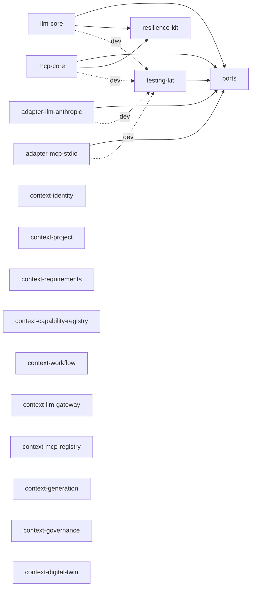

# 17 — Architecture Inventory Report: Sprint 0 Checkpoint (SAF-1 → SAF-10)

**Reviewer stance:** independent Enterprise Architecture Review Board. This report does not assume the architecture is correct — every claim below is checked against the actual repository state as of this commit (not against the design docs' intentions), and every score/recommendation is argued, not asserted. Implementation is paused pending approval of this report, per the instruction that triggered it.

**Scope:** everything built in SAF-1, 2, 7, 20a, 8, 9, 10 — 18 real workspace packages, ~2,114 lines of production TypeScript, ~563 lines of test code, 53 passing tests, zero dependency-cruiser violations, zero circular dependencies. No `apps/`, `plugins/`, or `tools/` directory exists yet.

---

## 1. Repository Structure

### Complete repository tree (as it actually exists today)

```
sap-app-factory/
├── .ai/                                  # AI Workspace (ADR-0020) — agents/prompts/policies/workflows/knowledge/templates, all markdown
├── .changeset/                           # Changesets config (SAF-1)
├── docs/
│   ├── adr/                              # 21 ADRs, all Accepted
│   ├── architecture/                     # 17 architecture docs (this is #17)
│   ├── backlog/                          # sprint-0-backlog.md
│   └── folder-structure.md               # pointer to PROJECT_STRUCTURE.md
├── packages/
│   ├── context-capability-registry/       # 1 aggregate (CapabilityPlugin), 3 tests
│   ├── context-digital-twin/              # 1 aggregate (DigitalTwinNode), 3 tests
│   ├── context-generation/                # 1 aggregate (Artifact), 3 tests
│   ├── context-governance/                # 1 aggregate (Risk), 3 tests
│   ├── context-identity/                  # 1 aggregate (Tenant), 3 tests
│   ├── context-llm-gateway/                # 1 aggregate (ModelProfile), 3 tests
│   ├── context-mcp-registry/               # 1 aggregate (McpServerRegistration), 3 tests
│   ├── context-project/                    # 2 aggregates (Workspace, TargetSystemConnection), 6 tests
│   ├── context-requirements/                # 1 aggregate (Requirement), 6 tests
│   ├── context-workflow/                    # 1 aggregate (WorkflowRun), 4 tests
│   ├── llm-adapters/anthropic/               # AnthropicLlmAdapter (100% mocked), 2 tests
│   ├── llm-core/                             # withResilience(), 3 tests
│   ├── mcp-adapters/stdio/                   # StdioMcpAdapter (100% mocked), 2 tests
│   ├── mcp-core/                             # withMcpResilience(), 2 tests
│   ├── ports/                                # 12 port interfaces, no implementation
│   ├── resilience-kit/                       # retryWithBackoff/withTimeout, 4 tests
│   └── testing-kit/                          # fixtures + 4 contract-test factories, 3 tests
├── ADR_TEMPLATE.md, ARCHITECTURE_PRINCIPLES.md, CODING_STANDARDS.md,
│   CONTRIBUTING.md, DEFINITION_OF_DONE.md, DEFINITION_OF_READY.md,
│   ENGINEERING_PRINCIPLES.md, PROJECT_STRUCTURE.md, SECURITY_BASELINE.md,
│   TECHNICAL_DEBT_POLICY.md                # 10 root governance documents
├── dependency-cruiser.config.cjs, eslint.config.mjs, tsconfig.base.json,
│   turbo.json, pnpm-workspace.yaml, package.json, .npmrc, .gitignore
└── README.md
```

**Not present, and correctly so:** `apps/`, `plugins/`, `tools/`. `PROJECT_STRUCTURE.md` documents these as the eventual home for the four deployable apps, capability plugins, and scaffolding generators — none exist yet because no backlog item has reached them.

### Why every top-level folder exists

| Folder | Why it exists |
|---|---|
| `.ai/` | AI Workspace — authoring surface for agent/prompt/policy/workflow definitions (ADR-0020). Pure documentation/config, no runtime consumer yet — deliberately, per that ADR. |
| `.changeset/` | Per-package semver, needed because `ports` and `plugin-sdk` (future) are meant to version independently (ADR-0001). |
| `docs/` | The architecture/decision record, separate from the 10 root governance docs which are the "constitution," not the "history." |
| `packages/` | Every workspace package. |

### Folder that should not exist yet — none at the top level

No top-level folder is premature. `apps/`, `plugins/`, `tools/` are absent, matching their actual backlog readiness (see §9). The one candidate for "shouldn't exist in its current form yet" is not a folder but a naming pattern inside `packages/` — see §5.

---

## 2. Package Inventory

For each package: Responsibility / Public API / Internal responsibilities / Status / Dependencies / Future planned responsibilities / Justified today or speculative.

### `@sap-app-factory/ports`
- **Responsibility:** the abstraction seam — every port interface, zero implementation.
- **Public API:** 12 ports (`LlmProviderPort`, `McpConnectionPort`, `EventBusPort`, `Repository<T>`, `ObjectStorePort`, `SecretsVaultPort`, `WorkflowEnginePort`, `PolicyEnginePort`, `RateLimiterPort`, `TenantConnectionResolverPort`, `GraphStorePort`, `SearchIndexPort`) + `RequestContext`.
- **Internal responsibilities:** none — pure type declarations.
- **Status:** complete for Sprint 0's declared scope. Zero runtime logic (correctly — it's a contract package).
- **Dependencies:** none.
- **Future:** grows only when `PROJECT_STRUCTURE.md` names a new port; not before.
- **Justified today:** yes — 5 packages already depend on it.

### `@sap-app-factory/testing-kit`
- **Responsibility:** shared test fixtures + contract-test harness.
- **Public API:** `createTestRequestContext()`, `llmProviderContractTests()`, `mcpConnectionContractTests()`, `eventBusContractTests()`, `workflowEngineContractTests()`.
- **Internal responsibilities:** none exposed beyond the above.
- **Status:** 2 of 4 contract-test factories have a real adapter exercising them (`llmProviderContractTests` via `adapter-llm-anthropic`, `mcpConnectionContractTests` via `adapter-mcp-stdio`). `eventBusContractTests` and `workflowEngineContractTests` exist and typecheck, but **no adapter has ever run them** — they are unvalidated against anything except the fake adapters used to build the harness itself in SAF-20a. This is a real, open gap, not a completed capability.
- **Missing:** no `repositoryContractTests` factory, despite `Repository<T>` being one of the 12 ports and SAF-14 (Drizzle) being the next port/adapter pair on the backlog that will need one.
- **Dependencies:** `@sap-app-factory/ports`, `vitest` (a genuine runtime dependency — the factories call `describe`/`it` at call time, not just for typechecking).
- **Justified today:** yes.

### `@sap-app-factory/resilience-kit`
- **Responsibility:** generic (port-agnostic) retry + timeout primitive.
- **Public API:** `retryWithBackoff()`, `withTimeout()`, `RetryOptions`.
- **Status:** complete for its stated scope; genuinely deduplicated (extracted mid-SAF-10 specifically to avoid copy-pasting `llm-core`'s SAF-9 implementation).
- **Dependencies:** `node:timers` only.
- **Future:** SAF-27 (Redis-backed cross-replica circuit-breaker state) will very likely extend this package or add a sibling to it.
- **Justified today:** yes — 2 real consumers (`llm-core`, `mcp-core`), created in response to actual duplication, not anticipated duplication.

### `@sap-app-factory/llm-core`
- **Responsibility:** LLM Gateway orchestration — wraps an `LlmProviderPort` adapter with resilience.
- **Public API:** `withResilience()`.
- **Status:** real logic, real tests (3, wiring-only by design). **Never invoked from anywhere except its own test file.** No composition root exists to wire a real adapter through it in a real request path.
- **Dependencies:** `ports`, `resilience-kit`; dev: `testing-kit`.
- **Future:** cost/`CostBudget` enforcement, `ModelProfile` resolution (currently the caller must already know which adapter to pass in — there is no routing-by-`modelProfileId` logic at all).
- **Justified today:** conditionally. The code is correct and tested, but its architectural purpose (a routing/resilience layer between many adapters and application code) is unproven — today it wraps exactly one adapter that always exists, so it is currently indistinguishable in effect from calling that adapter directly with a try/catch. Its justification will be proven, not assumed, once a second adapter and a real composition root exist.

### `@sap-app-factory/adapter-llm-anthropic`
- **Responsibility (as named):** implements `LlmProviderPort` for Anthropic.
- **Responsibility (as built):** returns a hardcoded string and zero vectors. **Contains no Anthropic-specific code whatsoever** — no SDK import, no endpoint, no auth header, no model-name mapping. It is byte-for-byte interchangeable with a generic fake.
- **Status:** passes `llmProviderContractTests` — this is a genuine, valuable proof that the contract-test mechanism works against a real package boundary. It is not evidence of Anthropic integration.
- **Dependencies:** `ports`; dev: `testing-kit`.
- **Justified today:** **this is the sharpest finding in this report — see §5.** A vendor-named package with zero vendor-specific content is a naming/identity problem, not a logic problem.

### `@sap-app-factory/mcp-core`
Same shape and same caveats as `llm-core`, for `McpConnectionPort`. 2 tests, never invoked outside its own spec file.

### `@sap-app-factory/adapter-mcp-stdio`
Same shape and same caveat as `adapter-llm-anthropic`: named for the stdio transport, contains zero stdio/subprocess logic. See §5.

### `@sap-app-factory/context-identity` … `context-digital-twin` (10 packages)
- **Responsibility:** one bounded context each, per `02-domain-model.md`.
- **Public API:** one (two for `context-project`) domain aggregate — a factory function, state-transition functions, a status union type.
- **Status:** each has exactly **one aggregate out of the several documented for that context** (e.g., `context-identity` has `Tenant` but not `User`/`Role`/`Permission`/`Session`; `context-workflow` has `WorkflowRun` but not `WorkflowDefinition`/`Step`/`AgentInvocation`/`AgentDefinition`). This is **explicit, deliberate Sprint 0 scope** (SAF-8: "one example aggregate ... proving the folder-scoped zero-dependency rule"), not an oversight — but it means every one of these ten packages is, today, a fraction of its documented bounded context.
- **Dependencies:** zero, cross-package. No `src/application/` folder exists in any of them.
- **Justified today:** yes, as a fitness-function proof. Not yet justified as *complete* contexts — that's expected and tracked, not a defect.

---

## 3. Dependency Graph

### Actual graph (generated from `dependency-cruiser`, not hand-drawn)



The ten `context-*` packages have **zero edges to anything** — not to `ports`, not to each other, not to any adapter. This is correct for their current scope (pure domain, no application layer) and it is also the reason the layering rules haven't been tested by real code yet (see §6).

### Circular dependencies
**None.** `dependency-cruiser`'s `no-circular` rule runs on every lint invocation; 0 findings across 246 modules / 251 internal dependencies as of this report.

### Clean Architecture / layer violations
**None currently exist in committed code.** All 8 layering rules (`domain-no-application`, `domain-no-adapters-or-apps-or-plugins`, `domain-no-ports`, `domain-no-runtime-third-party-deps`, `application-no-cross-context`, `application-no-adapters-or-apps-or-plugins`, `application-no-npm-deps-except-ports`, `adapters-no-application`) pass. **Important caveat:** four of these eight rules (everything about the `application` layer) have never been exercised against real code, because no context has an `application` folder yet. They are proven only against throwaway fixtures built during SAF-7/SAF-8. This is a real, open risk: the rules are believed correct, not battle-tested.

### Hidden coupling
One instance, and it's a naming coupling, not a code coupling: `llm-core`/`mcp-core` and their respective adapter packages share no direct code dependency, but they are implicitly coupled by *interface shape* (both implement the exact same `LlmProviderPort`/`McpConnectionPort`). This is the intended coupling (that's what a port is for) — flagged only so it's not mistaken for "no coupling at all."

### Packages with excessive dependencies
None. Maximum workspace-dependency count for any package today is 2 (`llm-core`, `mcp-core`: `ports` + `resilience-kit`).

### Packages that should depend on abstractions instead of concretions
None found. `llm-core`/`mcp-core` depending on `resilience-kit` directly (a concrete utility, not a port) is correct, not a violation — `resilience-kit` has no swappable-implementation concept (it's a pure algorithm, like depending on a math library), so introducing a `ResiliencePort` abstraction over it would be speculative ceremony, not architecture.

---

## 4. Bounded Context Review

For each context: capability / aggregate roots / entities / value objects / commands / events / data ownership / external deps / upstream / downstream, then "could this belong inside another context?"

| Context | Business capability | Aggregate roots (built) | Commands (built) | Events (built) | Data ownership | External deps | Upstream | Downstream | Could it belong elsewhere? |
|---|---|---|---|---|---|---|---|---|---|
| **Identity** | AuthZ data (who can do what) | `Tenant` | `createTenant`, `suspendTenant`, `archiveTenant` | none emitted yet | its own (future) schema | none | none | Project (tenant scoping) | No — authorization is a distinct concern from every other context's data. |
| **Project** | Delivery-team workspace + connection mgmt | `Workspace`, `TargetSystemConnection` | create/archive, create/revoke | none | its own | none | Identity | Requirements, Workflow | No, but **`TargetSystemConnection` is a real candidate for its own context** (see below) — its threat model (ADR-0015) is deliberately distinct from ordinary project data. |
| **Requirements** | Structure business requirements | `Requirement` (with `kind`) | create/approve/archive | none | its own | none | Project | Workflow, Digital Twin | No. |
| **Capability Registry** | Plugin registry (not what plugins do) | `CapabilityPlugin` | register/deprecate | none | its own | none | none | Workflow | No. |
| **Workflow** | Multi-agent orchestration | `WorkflowRun` | start/transition | none | its own | none | Requirements, Capability Registry, LLM Gateway, MCP Registry | Governance, Digital Twin | No. |
| **LLM Gateway** | Provider-agnostic model access | `ModelProfile` | create/retire | none | its own | none | none | Workflow | No. |
| **MCP Registry** | Provider-agnostic tool access | `McpServerRegistration` | register/disable | none | its own | none | none | Workflow | No. |
| **Generation** | What gets produced | `Artifact` | create/submit/approve/archive | none | its own | MinIO (future) | Workflow | Governance, Digital Twin | No. |
| **Governance** | ITIL/PMO alignment | `Risk` | identify/mitigate/accept | none | its own | none | Generation, Workflow | Notification (undecided — see below) | No. |
| **Digital Twin** | Cross-context traceability graph | `DigitalTwinNode` | create/retire | none | its own (graph structure only) | Apache AGE (future) | *every other context* | Search, agents | No — its entire reason to exist is being the one context every other context feeds, which would be lost if folded into any single upstream context. |

**Notes on completeness, honestly stated:** no context has emitted a real domain event yet (the `Events (built)` column is empty across the board) — every context's aggregate functions are pure, synchronous, in-memory transformations with no outbox write, because `events-core` (SAF-11) doesn't exist yet. "Commands" above are the actual exported functions, not a formal CQRS command-object pattern (none exists yet, and none is currently planned to — `Repository<T>`-based application services will be the first commands with real I/O).

**A genuine open question this review surfaces:** `02-domain-model.md`'s context map still lists an **eleventh** context, Notification, which has never had a package created for it and which `PROJECT_STRUCTURE.md` never included (this was already flagged as an unresolved doc inconsistency during SAF-8, not newly discovered here — but it bears directly on this section's "downstream" column for Governance/Workflow, both of which are documented as raising events "to Notification" with nothing on the receiving end). This should be resolved — either build `context-notification` or formally retire it from the context map — before more contexts document it as a downstream consumer.

---

## 5. Placeholder Analysis

**Every package that exists today has real, tested logic.** There is no package that is an empty stub. The placeholder concern in this codebase is a different, and honestly more dangerous, shape: **packages with a specific identity (a vendor name, a transport name) but fully generic content.**

### `@sap-app-factory/adapter-llm-anthropic`
- **Why it was created:** to prove the LLM contract-test harness against a real (not fake) adapter package, per SAF-9's explicit backlog wording.
- **Should it remain, as named:** **no, not as currently named and positioned.** A package named for a specific vendor, sitting in `packages/llm-adapters/anthropic`, that contains zero vendor-specific code creates a false signal: anyone scanning the package list reasonably concludes "Anthropic integration exists." It does not. When real Anthropic integration is built later, whoever does it faces an ambiguous choice — overwrite this file (losing the proven contract-test fixture) or create a second package (leaving a dead fake one behind, or worse, two similarly-named packages).
- **Recommendation:** rename the concept, not necessarily delete the code. Either (a) move this exact implementation into `testing-kit` as a named, honestly-labeled fake (e.g., `createFakeLlmProvider()`), deleting the standalone vendor-named package, or (b) keep it as a standalone package but rename it to something that doesn't claim vendor identity (e.g., `packages/llm-adapters/_reference` or `packages/llm-adapters/in-memory`) until the day it grows a real HTTP call to Anthropic's API, at which point the vendor name is earned. Option (a) is cleaner; option (b) preserves the "prove a real adapter package, not just a fake object" value SAF-9 was going for. This report defers the choice to the team but flags it as something to decide before a third adapter is built following the same pattern.

### `@sap-app-factory/adapter-mcp-stdio`
Identical finding, identical recommendation, one transport-name instead of one vendor-name.

### The ten `context-*` packages
- **Why they exist:** SAF-8's explicit, stated goal — prove the folder-scoped domain-layer boundary with one real aggregate per context.
- **Should they remain:** yes, unambiguously. Unlike the two adapters above, nothing about a `Tenant` aggregate or a `Risk` aggregate claims to be more complete than it is — a reader of `context-identity`'s code sees exactly one aggregate and no illusion of more.
- **Should anything be removed:** no. These are honestly partial, not deceptively complete.

### `TargetSystemConnection` inside `context-project`
Not a placeholder in the empty-stub sense, but worth flagging under this heading because of its unusual security profile (ADR-0015: envelope encryption, BYOK, a distinct threat model from ordinary project data) living inside a general-purpose context package alongside `Workspace`. Today, with one aggregate and no real encryption behind it, this costs nothing. It is worth revisiting whether `TargetSystemConnection` earns its own package once real envelope-encryption logic, KMS integration, and the `connection:use`/`connection:manage` permission split (SECURITY_BASELINE.md) actually get built — bundling privileged-credential logic into the same package as ordinary workspace CRUD is a coupling that's free today and won't stay free.

---

## 6. Architecture Compliance

| Principle | Status | Evidence |
|---|---|---|
| **Clean Architecture** | Compliant, but only lightly tested | Domain has zero framework deps (mechanically enforced); application layer doesn't exist yet anywhere, so its rules are unexercised by real code (see §3). |
| **Domain-Driven Design** | Compliant, early-stage | 10 (documented: 11, see §4) bounded contexts, aggregate invariants demonstrated (e.g., `WorkflowRun`'s terminal-state guard), but each context has one aggregate of several planned. |
| **SOLID** | Largely compliant | Adapters are substitutable behind ports (proven twice, via contract tests). Single Responsibility holds per file. No interface is doing too much. |
| **Hexagonal Architecture** | Compliant | Ports/adapters split proven twice end-to-end (LLM, MCP) including a real adapter passing a real contract-test suite. |
| **Event-Driven Architecture** | **Not yet implemented** | `EventBusPort` is an interface only. No `events-core`, no outbox, no publish/subscribe call exists in any committed code path. `eventBusContractTests` exists but has never been run against a real adapter. Score this as "designed, unbuilt," not "compliant." |
| **Plugin Architecture** | **Not yet implemented, but defensively enforced** | No `plugin-sdk`, no `plugins/` folder. The dependency-cruiser rules already forbid any domain/application code from importing a `plugins/` path — enforced before the feature exists, which is the right order. |
| **MCP abstraction** | Compliant, proven once | `McpConnectionPort` + `mcp-core` (resilience) + one real adapter, all wired and tested. Capability-binding/Zero-Trust enforcement (the actual point of this abstraction per ADR-0004) does not exist yet — today's stdio adapter accepts any `capabilityTokenId` string with zero validation. |
| **LLM abstraction** | Compliant, proven once | Same shape as MCP. `ModelProfile`-based routing (resolving a logical name to a concrete adapter) does not exist — `llm-core` currently wraps whichever single adapter instance it's given. |
| **Local-first architecture (execution profiles, ADR-0019)** | **Not started** | Zero code. `generated-app-kit` and the seven generated-application ports don't exist. This is correctly scheduled as Sprint 1/2 (SAF-31) — not a compliance failure, just not begun. |
| **Project Digital Twin strategy** | **Foundation only** | `DigitalTwinNode` matches the documented shape (opaque `sourceRef`, no hard delete). The defining claim of ADR-0021 — that the graph is populated *entirely* by projecting domain events — has no wiring at all; nothing publishes or subscribes to a `digitaltwin.*` event anywhere. |

---

## 7. Technical Debt Assessment

| # | Finding | Category | Cost today | Cost by Sprint 5 | Cost by Sprint 10 |
|---|---|---|---|---|---|
| 1 | Vendor/transport-named packages with fully generic content (`adapter-llm-anthropic`, `adapter-mcp-stdio`) | Premature specificity / misleading naming | **Low** — rename or relocate 2 small packages | **Medium** — if 2-3 more vendor adapters copy the pattern before correction, it's now 4-5 packages and a "this is how we name things" precedent | **High** — becomes the established convention; correcting it means a breaking rename across every consumer and every doc that references the old names |
| 2 | `tools/generators` is documented (`CONTRIBUTING.md`, `PROJECT_STRUCTURE.md`) as the way to scaffold a new package, but **does not exist**. Every package in this report was hand-written, package.json by package.json, contradicting the project's own stated convention. | Missing tooling / DX debt | **Low-Medium** — 18 packages already show the exact boilerplate a generator should template | **Medium** — every future package continues paying the hand-authoring tax; drift between packages' boilerplate becomes likely (already: some packages have `@types/node`, most don't, with no enforced rule on which need it) | **High** — dozens of packages, each a slightly different hand-copy of the pattern, no generator can safely retrofit them all at once |
| 3 | No `repositoryContractTests` factory in `testing-kit`, despite `Repository<T>` being a documented port and SAF-14 (next up) requiring exactly this | Missing abstraction (test coverage gap) | **Low** — add one factory before SAF-14 starts | **Low-Medium** — if SAF-14 ships without it, the first `Repository<T>` adapter (Drizzle) sets an untested precedent | **Medium** — every subsequent repository implementation inherits the same gap |
| 4 | `llm-core`/`mcp-core` are fully built and tested but have never been exercised by a real caller — their actual value (routing across multiple adapters, real resilience under real failure) is unproven | Premature abstraction (provisionally) | **None** — no cost to leave as-is | **Low** — becomes clear once a second adapter or a real composition root exists whether the abstraction earns its keep | **Low** — by then it's proven one way or the other |
| 5 | Continuing to build out the in-house `WorkflowEnginePort` adapter (SAF-8b) before the ADR-0008 Temporal-class spike (SAF-24) happens | Future scalability risk / sunk-cost risk | **Low** — SAF-8b hasn't started | **Medium** — if SAF-8b grows real logic before SAF-24 runs, switching becomes a rewrite instead of an adapter swap, exactly the failure mode ADR-0008 exists to avoid | **High** — a fully-built in-house engine with real production workflows on it is extremely expensive to reconsider |
| 6 | `TargetSystemConnection`'s eventual privileged-credential logic (KMS, BYOK, envelope encryption) shares a package with ordinary `Workspace` CRUD | Future maintainability/security concern | **None** | **Low** — separate before real encryption code arrives | **Medium** — a shared package now carrying both "manage a workspace name" and "handle customer production credentials" is a harder thing to security-review in isolation |
| 7 | Four of eight dependency-cruiser layering rules (everything about the `application` layer) have never fired against real code | Missing validation, not missing code | **None** | **Low** — first real `application/` folder (whichever context gets one first) is the actual test | **Low** — by then, proven |
| 8 | Undecided fate of the Notification context (documented, never built, two other contexts already document it as a downstream consumer) | Documentation/architecture drift | **Low** — one paragraph decision | **Low** | **Low-Medium** — more contexts may accumulate "raises to Notification" language before it's resolved either way |

**No security concerns found in shipped code** — there is no auth, no secrets handling, no real credential flow, no network call anywhere in the current codebase to have a vulnerability in. The security posture of this checkpoint is entirely about documentation (`SECURITY_BASELINE.md`) versus zero attack surface, which is the correct state for where Sprint 0 is.

---

## 8. Architecture Scorecard

| Dimension | Score /10 | Why |
|---|---|---|
| Modularity | 9 | 18 packages, zero circular deps, zero violations, clean single-direction dependency graph. |
| Maintainability | 7 | Strong fitness-function discipline, but finding #2 (no generator, despite claiming one) means the actual day-to-day authoring experience isn't yet matching the documented one. |
| Extensibility | 8 | Ports/adapters pattern proven twice with real contract tests — adding a third adapter to either port is a well-worn path now. |
| Testability | 9 | 53 tests, 100% coverage on everything tested, contract-test harness proven against 2 real adapters, and proven to actually fail when an adapter is broken (not just "runs"). |
| Security | 5 | Thorough on paper (`SECURITY_BASELINE.md`); zero real code to validate it against yet. Neither higher nor lower is defensible at this checkpoint — this is a placeholder score until real auth/secrets code exists. |
| Scalability | 6 | Thoughtful designs (tenancy tiering, partitioning, resilience) exist only as documents; nothing has been load-tested or even run against real infrastructure yet. |
| Developer Experience | 6 | Turbo caching and lint/build/test wiring genuinely work well; undercut by finding #2 — the promised scaffolding tool doesn't exist, so onboarding a new package today means reading this report's package inventory as a template, not running a command. |
| Architecture Clarity | 7 | Exceptionally well documented (21 ADRs, 10 governance docs, 17 architecture docs) — arguably more documentation than code at this stage, which is a lot to onboard against for the value delivered so far. |
| Domain Modeling | 7 | Real invariants demonstrated (terminal-state guards, no-hard-delete), but 1-of-N aggregates per context makes it too early to fully judge context cohesion. |
| Separation of Concerns | 9 | Domain/application/port/adapter boundaries are mechanically enforced, not just documented, and the resilience-kit extraction shows the discipline holding under real pressure (a duplication was caught and fixed within the same session it was introduced). |

---

## 9. Sprint 0 Readiness

| Backlog item | Ready? | What must change first, if not |
|---|---|---|
| SAF-11 (events-core + postgres-outbox + contract test) | **Ready** | None — same proven core+adapter+contract-test pattern as SAF-9/10. |
| SAF-12 (plugin-sdk + example plugin stub) | **Ready** | None — a plugin discovered by id with no real generation logic is a different, more defensible case than a vendor-named fake adapter (see §5); the loader mechanism, not vendor fidelity, is what's being proven. |
| SAF-8b (WorkflowEnginePort in-house adapter skeleton) | **Conditionally ready** | Keep it a genuine skeleton (interfaces + minimal state machine, per its original backlog wording) and stop there until SAF-24's Temporal-class spike happens — see debt item #5. Do not let this grow real production logic first. |
| SAF-13 (docker-compose) | **Ready** | None — Docker confirmed installed and running in this environment; pure infra config, no code dependency. |
| SAF-14 (Drizzle schema + migration + RLS) | **Not fully ready** | Add a `repositoryContractTests` factory to `testing-kit` first (debt item #3) — otherwise the first `Repository<T>` implementation ships with a weaker verification standard than every other port this session. |
| SAF-3–6 (apps: web, api-gateway, orchestrator, worker) | **Not fully ready** | This is where the composition-root/DI-wiring pattern gets exercised for the very first time in this codebase — it has never been done here, only described in docs. Recommend building the smallest possible one first (e.g., `api-gateway` with a health endpoint wiring one port) and proving that pattern before repeating it across all four apps, rather than building all four in parallel against an unproven pattern. |
| SAF-16 (OpenTelemetry) | **Not ready** | Needs an app to exist first (SAF-3–6). |
| SAF-17 (auth-core / Keycloak) | **Partially ready** | The package itself could be built and contract-tested against a live Keycloak from `docker-compose` (SAF-13) independent of an app; full integration needs `api-gateway` (SAF-4). |
| SAF-15 (CI pipeline YAML) | **Ready, and already de-risked** | The Build-before-Lint ordering bug found during SAF-8 is already corrected in `11-git-and-cicd-strategy.md` — writing the actual YAML now should follow that corrected order from the start. |
| SAF-19 (fitness CI checks: banned-keyword guard, plugin-boundary, README-required) | **Mostly ready** | The plugin-import-boundary rule already exists in spirit (domain/application already forbidden from importing `plugins/`); the finer nuance — *only* `apps/orchestrator`/`apps/worker` may import `plugins/*`, via the loader only — can't be encoded until those two apps exist to name in the rule. |
| SAF-21 (Sprint 0 demo verification) | **Not ready** | Depends on everything above. |

---

## 10. Executive Recommendation

### **Continue with minor adjustments.**

Not "pause and refactor": nothing built in SAF-1 through SAF-10 needs to be undone. The layering discipline is real (mechanically enforced, not aspirational), the contract-test pattern has been proven twice against genuine package boundaries, and every issue found during this work was fixed at the root cause, in the same session it was discovered, rather than deferred — that pattern is itself evidence the process is working, not evidence of accumulating debt.

Not "redesign": no bounded context, no port, and no layering rule is structurally wrong. The one open modeling question (Notification) is a documentation-completeness gap, not a design flaw.

**Adjustments to make before or during the next few stories, in priority order:**
1. Resolve the naming/identity problem in `adapter-llm-anthropic` and `adapter-mcp-stdio` (§5) — cheapest fix available today, gets materially more expensive if repeated.
2. Add `repositoryContractTests` to `testing-kit` before SAF-14 starts.
3. Keep SAF-8b to a genuine skeleton — do not let it grow real logic ahead of the SAF-24 Temporal-class spike.
4. Build one app, not four in parallel, first — prove the composition-root pattern once before repeating it.
5. Decide Notification's fate (build it or formally retire it from the context map) before another context documents it as a downstream consumer.

None of these block starting SAF-11. All five are small, bounded, and cheap exactly because this review happened now rather than five sprints from now.
