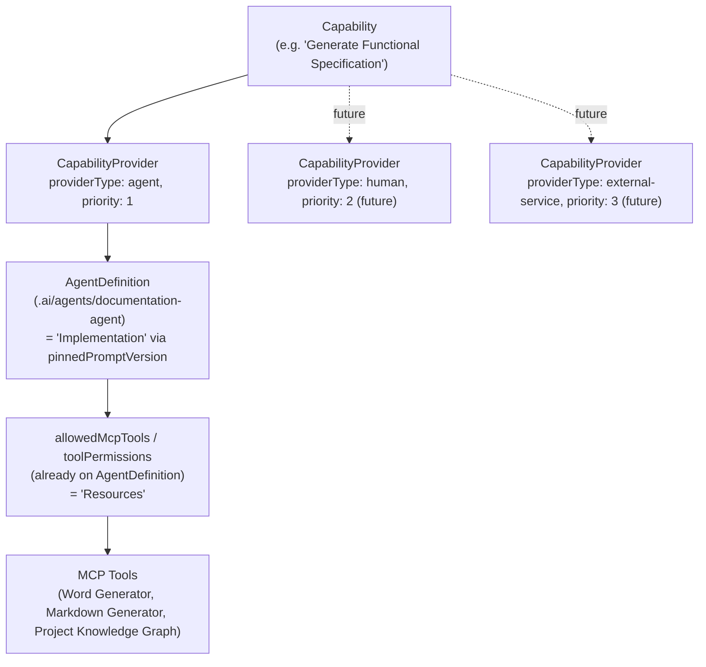
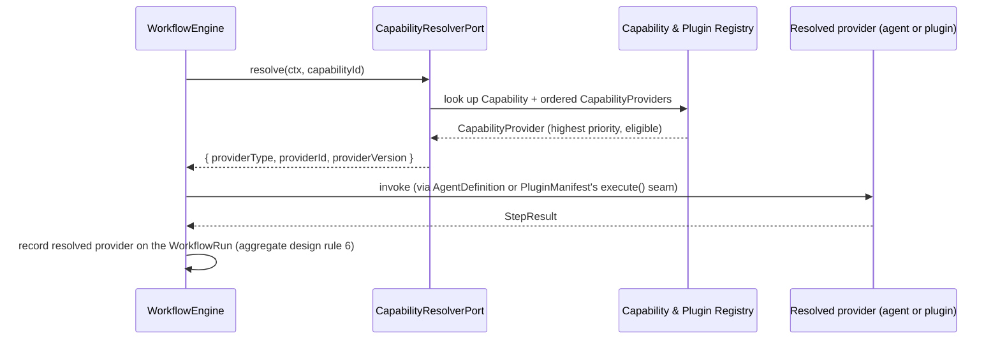

# 18 — Capability Model

This document details [ADR-0022](../adr/0022-capability-model-provider-abstraction.md): workflows request capabilities, never specific agents, plugins, or any other concrete provider.

## The problem this closes

Before this decision, a `Step` was `{ kind: "agent-invocation" | "plugin-generation" | "human-approval", capabilityRef, input }`. A `plugin-generation` step already resolved indirectly through a capability-shaped lookup; an `agent-invocation` step instead named a specific `AgentDefinition` by id and version directly. That inconsistency meant the workflow definition — the thing meant to be stable, versioned, and reusable — hardcoded *which kind of thing* fulfilled a step, and for agents, *which specific one*. Changing "generate a functional specification" from an AI agent to a human consultant, a different agent, or a future external service would require editing every workflow that named the old provider, instead of swapping a binding — exactly the coupling this platform's hexagonal architecture exists to prevent everywhere else.

No code implements `Step`, `WorkflowDefinition`, `AgentInvocation`, or any part of this today (confirmed against the actual Sprint 0 codebase — see [17-sprint0-architecture-inventory-review.md](17-sprint0-architecture-inventory-review.md)). This is the cheapest moment to fix it.

**Implementation status (SAF-12):** `Capability` and `CapabilityProvider` (with `resolveCapabilityProvider()`, the priority fallback rule) are now real domain code in `packages/context-capability-registry/src/domain/`, and `CapabilityResolverPort` is now real code in `packages/ports` (the 13th port, as this document anticipated). `Step`/`WorkflowDefinition` remain undecided as code — they arrive with the workflow engine adapter (SAF-8b) and, eventually, the `.ai/` loader (SAF-32) — so the sentence above is still accurate for those two specifically.

## The resolution chain

Conceptually this is five layers (Capability → Provider → Implementation → Resources → MCP Tools), matching the request exactly. The **data model** realizes it with **two new aggregates**, not four — see "What's genuinely new vs. reused" below.

## Domain model additions (Capability & Plugin Registry context)

- **`Capability`**: `{ id, name, description, inputs, outputs, preconditions, requiredPermissions, approvalRequirements: PolicyRuleId[], requiredContext, expectedArtifacts: ArtifactType[], qualityGates: PolicyRuleId[] }`. Sits *above* `ArtifactType`, not in place of it — a capability's `expectedArtifacts` reference the existing, already-opaque `ArtifactType` strings; `Capability` is the business-level request, `ArtifactType` remains the output-shape identifier.
- **`CapabilityProvider`**: `{ id, capabilityId, providerType: 'agent' | 'plugin' | 'human' | 'external-service', providerId, providerVersion, priority }`. `priority` orders an automatic fallback chain — structurally identical to `ModelProfile`'s fallback chain ([ADR-0016](../adr/0016-mandatory-resilience-patterns.md)), the same pattern applied at this layer instead of invented fresh.

### What's genuinely new vs. reused

| Layer in the request | Realized as |
|---|---|
| Capability | New aggregate, above. |
| Provider | New aggregate (`CapabilityProvider`), above — a thin pointer, not a new data model. |
| Implementation | **Reused**: `AgentDefinition.pinnedPromptVersion` (agent providers) or `PluginManifest`'s version (plugin providers) — both already existed and were already required to be pinned by aggregate design rule 6. |
| Resources | **Reused**: `AgentDefinition`'s `allowedMcpTools`/`toolPermissions` (agent providers, [ADR-0020](../adr/0020-ai-workspace-for-agent-definitions.md)) or `PluginManifest`'s `requiredMcpCapabilities`/`requiredLlmCapabilities` (plugin providers, [ADR-0006](../adr/0006-plugin-architecture.md)). |
| MCP Tools | **Already existed** — `McpServerRegistration`/`McpTool`/`CapabilityBinding` (MCP Registry context) — untouched by this decision. |

Building "Implementation" and "Resources" as their own new aggregates was considered and rejected — see [ADR-0022](../adr/0022-capability-model-provider-abstraction.md) alternatives. This is not a shortcut; it is the same "don't duplicate a concept that already has a home" discipline applied everywhere else in this platform (most recently: `resilience-kit`'s extraction during SAF-10, in the same session as this decision).

## Naming collision, resolved explicitly

`CapabilityProvider` (new, Capability & Plugin Registry — "who fulfills a capability") is **not** `CapabilityBinding` (existing, MCP Registry — "which plugin/step may call which tool," the Zero Trust tool-access control point from [ADR-0004](../adr/0004-mcp-abstraction-layer.md)). Both names contain "Capability"; they answer different questions. Stated here once, explicitly, so it isn't rediscovered as confusion later.

**A second one, found while building SAF-12:** `context-capability-registry`'s existing `CapabilityPlugin` (a registry record — id, pluginId, version, status; built in SAF-8, before this ADR) is not `@sap-app-factory/plugin-sdk`'s `CapabilityPlugin` (the lifecycle interface — manifest, `activate`/`validate`/`generate`/`deactivate` — that an installed plugin actually implements). The registry record points at an implementation of the interface; they live in different packages that never import each other, but the shared name is worth stating once rather than rediscovering later.

## Impact on the Workflow Engine

`Step` collapses from three kinds to **two**: `"capability-request" | "human-approval"`. `agent-invocation` and `plugin-generation` merge, because from the workflow's point of view both were always "ask the platform to fulfill this," and the platform — not the workflow definition — decides who does it. This is a net reduction in the number of `Step` kinds, not an addition.

A new port, `ports/capability-resolver.port.ts` (`CapabilityResolverPort`, the 13th port), makes this cross-context lookup an adapter-swappable seam instead of a direct import — consistent with how every other cross-context concern in this architecture is handled (never a direct application-to-application import across contexts). `WorkflowEnginePort` itself needs no change: it was already abstract enough (`StepResult { stepId, output, succeeded }` never named "agent" or "plugin") — a clean confirmation the original port design didn't need revising, only the domain-level `Step` shape sitting above it.

## Impact on Plugin Architecture

Plugins **expose** capabilities: installing a plugin can introduce a new `Capability` into the registry (with the plugin itself registered as a `CapabilityProvider`), or a plugin can register as an *additional* provider for a capability that already exists (introduced by another plugin, or defined directly in the platform's core catalog). This is a modest rewording of [ADR-0006](../adr/0006-plugin-architecture.md), not a change to it: `PluginManifest.producesArtifactTypes` already existed; it now additionally implies "this plugin is eligible to provide the capability/capabilities whose `expectedArtifacts` include these types." No change to plugin isolation, the scoped capability token mechanism, or the loader.

## Impact on the AI Workspace (`.ai/`)

Agents **become providers** of capabilities — they are never directly targeted by a `Step` again. An `AgentDefinition` gains one conceptual field, `providesCapabilities: CapabilityId[]`, declaring which capability(ies) it's registered as a provider for. Its existing eleven fields (Purpose, Responsibilities, Allowed MCP tools, Inputs, Outputs, Memory, Escalation rules, Approval requirements, Context loading strategy, Prompt version, Tool permissions — [ADR-0020](../adr/0020-ai-workspace-for-agent-definitions.md)) are unchanged; they are exactly "Implementation" and "Resources" as reused above. `.ai/agents/requirements-analyst/agent.md`'s `Escalation rules`/`Approval requirements` sections now additionally state whether the same rule is asserted at the `Capability` level (shared across every provider of that capability) or is agent-specific — most should move to the `Capability` level over time, since duplicating "generate a functional spec should require review" per provider is exactly the drift this ADR exists to prevent, but no existing `.ai/` content is changed by this decision alone (there is currently exactly one agent, and it does not yet declare a capability it provides).

## Impact on the Project Digital Twin

No mechanism change. `ADR-0021`'s node/relationship types were already opaque, registry-declared strings specifically so the graph could absorb new concepts without a redesign — this is the first real test of that claim, and it holds: `Capability` and `CapabilityProvider` become two more `NodeTypeDefinition` entries; `fulfilled-by` (Artifact/GenerationJob → CapabilityProvider) and `requires-capability` (WorkflowRun/Step → Capability) become two more `RelationshipTypeDefinition` entries. Nothing about `GraphStorePort`, node/edge versioning, or provenance tagging changes.

## Self-review: does this introduce unnecessary complexity?

1. **Net new concepts:** 2 aggregates (`Capability`, `CapabilityProvider`), 1 port (`CapabilityResolverPort`, 13th). **Net removed:** one `Step` kind (3 → 2). This is a small, bounded addition, weighed against a real, already-present coupling it closes.
2. **Rejected the literal 4-new-aggregate reading of the request** in favor of reusing `AgentDefinition`/`PluginManifest` fields for "Implementation"/"Resources" — deliberately chosen to avoid duplicating data that already has a home, per [ADR-0022](../adr/0022-capability-model-provider-abstraction.md) alternatives.
3. **Zero code impact.** No package built in SAF-1 through SAF-10 implements any part of `Step`, `WorkflowDefinition`, or `AgentInvocation` — this is a pure documentation-level correction, made before any real workflow content would need to be migrated.
4. **New risk, and its mitigation:** a `Capability` with zero registered `CapabilityProvider`s is a dead end at run time. Mitigated by a fitness function (see [12-risks-and-technical-debt.md](12-risks-and-technical-debt.md)) requiring at least one provider before a `Capability` can be referenced by a `WorkflowDefinition` — the same "no orphan reference" discipline already applied elsewhere.
5. **Reused patterns, not invented ones:** the provider fallback chain mirrors `ModelProfile`'s (ADR-0016); the cross-context lookup uses a port, like every other cross-context concern; the Digital Twin absorbs it via its existing opaque-type registry with no changes.

## Does this improve long-term extensibility?

**Yes.** Three concrete reasons, not asserted but argued:

1. **It removes a coupling that would otherwise compound.** Every workflow definition authored against the old `agent-invocation`/`plugin-generation` split would have needed migration the day a second provider type (a human consultant, an external service — both explicitly named in the request) needed to fulfill an existing capability. Fixing it now, while zero workflow definitions exist, costs a documentation change; fixing it later would cost a breaking migration across every authored workflow.
2. **It is the same pattern this architecture already trusts, applied one layer up.** Ports/adapters decouple business logic from infrastructure; execution profiles ([ADR-0019](../adr/0019-execution-profiles-for-generated-applications.md)) decouple generated-app business logic from environment; this decouples workflow definitions from *who does the work*. Three applications of one idea is consistency, not novelty risk — the same reason the review in [17-sprint0-architecture-inventory-review.md](17-sprint0-architecture-inventory-review.md) could trust the Digital Twin would absorb this without a redesign, and it did.
3. **It centralizes governance where it belongs.** Approval requirements and quality gates now live on the `Capability` — the thing that's constant regardless of who fulfills it — rather than being duplicated per provider and left to drift, which is a concrete, near-term correctness benefit (not just a hypothetical future one), given the AI Workspace already had per-agent escalation/approval fields that would otherwise need to stay manually in sync with an equivalent plugin-side mechanism.
