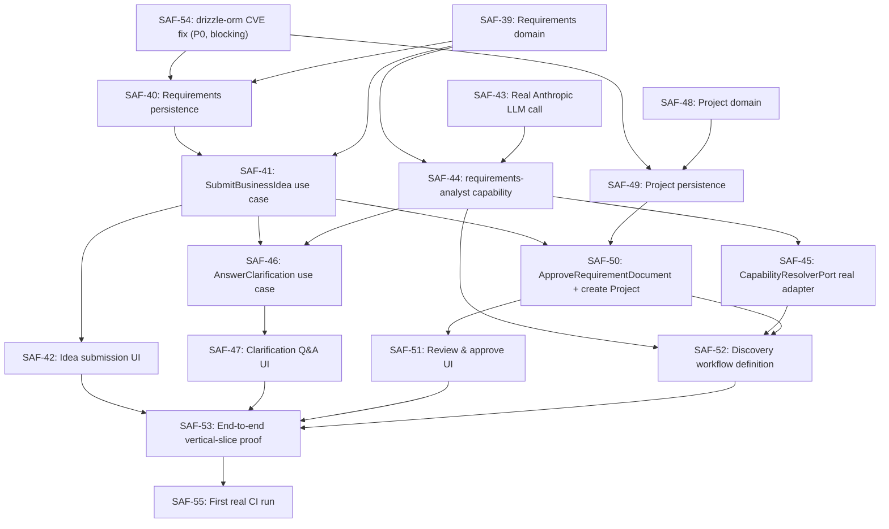

# Sprint 1 Backlog — Discovery Workspace (R0.2)

**Theme:** Intelligent Project Discovery
**Mission:** Transform a business idea into an approved software project through an AI-guided discovery experience.
**Status:** Approved; execution-ready. Implementation is organized by the execution package at [docs/execution/sprint-1/](../execution/sprint-1/README.md), which merges this backlog's original 6 epics/2 slices into one Vertical Slice (VS-1 — Discovery Workspace) and adds four new tickets below (SAF-57–60) plus a scoped-down pull-forward of SAF-34/35 — see that package's [01-sprint-1-backlog.md](../execution/sprint-1/01-sprint-1-backlog.md) for the full reasoning. This ticket-numbered backlog remains the source of record for individual story-level acceptance criteria; the execution package is the source of record for how they're sequenced and packaged into Vertical Slices.

This backlog is planned against the frozen Sprint 0 architecture ([ARCHITECTURE_FREEZE.md](../../ARCHITECTURE_FREEZE.md)) and follows [ENGINEERING_PRINCIPLES.md](../../ENGINEERING_PRINCIPLES.md)'s Engineering Planning Principles and [PROJECT_PLAYBOOK.md](../../PROJECT_PLAYBOOK.md)'s "how to begin a sprint" process. Every story below is a slice of one vertical capability — none introduces a new bounded context, port, or architectural concept; all of them implement aggregates, an agent, and a workflow already designed in [02-domain-model.md](../architecture/02-domain-model.md), [.ai/agents/requirements-analyst/agent.md](../../.ai/agents/requirements-analyst/agent.md), and [18-capability-model.md](../architecture/18-capability-model.md), but not yet built.

## Why this scope, not a bigger or smaller one

- **`RequirementDocument`, `Clarification`, `AcceptanceCriterion`** are already-designed aggregates in the Requirements Intake context ([02-domain-model.md](../architecture/02-domain-model.md)) with zero code behind them yet — this sprint builds them because the Discovery mission needs them, not because they're convenient to build.
- **The `requirements-analyst` agent** is already authored as a `.ai/` definition, `status: draft`, with a named capability (`structure-business-requirement`) and no real invocation path — this sprint gives it one, for the first time.
- **`Project`** is named in [02-domain-model.md](../architecture/02-domain-model.md)'s Project & Workspace context summary but has no code yet (`context-project/src/domain/` only has `Workspace` and `TargetSystemConnection`) — this sprint adds the minimum shape the Discovery outcome needs (id, workspace reference, name, description, originating `RequirementDocument` reference), explicitly deferring `requiredExecutionProfiles` and any other field a later sprint's generation work will need — that's Sprint 3's job, not this one's.
- **`context-notification` (SAF-38)** is deliberately *not* pulled into this sprint: the Discovery Workspace is a synchronous, single-session experience (a user submits an idea and stays engaged through structuring, clarification, and approval) — there is no async, out-of-session event to notify anyone about yet. Building a notification channel now would be horizontal work with no consumer this sprint, which the Engineering Planning Principles rule out.
- **SAF-24 (Temporal spike)** is deliberately *not* pulled into this sprint: the Discovery workflow is one linear, single-user flow with a human-approval pause — well within what the existing in-memory `WorkflowEnginePort` adapter already does correctly. Nothing in this sprint's scope needs durable execution across a process restart.
- **SAF-25 (plugin/agent process isolation)** is deliberately *not* pulled into this sprint as a blocking item (see SAF-56 below, conditional) — its trigger condition is "before real plugin/generation logic ships," and this sprint ships an agent *invocation* behind the already-trusted `LlmProviderPort`, not arbitrary third-party plugin code execution.

## Epics

| Epic | Goal |
|---|---|
| **A — Idea Intake** | A user submits a raw business idea through a real UI and it becomes a draft `RequirementDocument`. |
| **B — AI-Guided Structuring** | The `requirements-analyst` agent, invoked for real, turns the idea into structured `Requirement`s and `AcceptanceCriterion`s, and raises `Clarification`s where it isn't confident. |
| **C — Clarification Loop** | A human answers outstanding `Clarification`s; the agent re-structures until nothing ambiguous remains. |
| **D — Discovery Review & Approval** | A human reviews the structured output and approves it, which creates a `Project`. |
| **E — Discovery Workflow Orchestration** | A real `WorkflowDefinition` ties Epics A–D together as one auditable, event-emitting workflow run. |
| **F — Technical Debt & Platform Closure** | The debt and CI gaps Sprint 0's Exit Gate flagged as blocking, cleared before or alongside the vertical slice they'd otherwise put at risk. |

## Story backlog

Priority: **P0** — blocks other stories or the sprint's exit criteria; **P1** — required for the sprint goal, not on the blocking path; **P2** — pulled in only if its trigger condition fires during the sprint.

### Epic F — Technical Debt & Platform Closure

- **SAF-54** (P0, blocking) — Fix the `drizzle-orm` High-severity CVE across every existing `persistence-postgres/*` package, full regression cycle. Blocking because SAF-40 and SAF-49 add two *new* `persistence-postgres/*` packages this sprint — building them on a known-vulnerable version instead of fixing it first would be manufacturing new debt on top of accepted debt.
- **SAF-55** (P1) — First real GitHub Actions run: exercise `.github/workflows/ci.yml` on an actual runner for the first time, once this sprint's first PR is ready and push is authorized. Resolves the largest verified-vs-proven gap the Sprint 0 Exit Gate flagged.
- **SAF-56** (P2, conditional) — Plugin/agent process isolation (carried forward from SAF-25). Trigger: pulled in only if SAF-44's real agent invocation is judged, during implementation, to need it before Sprint 1 closes. Otherwise remains a Sprint 2 blocker per the existing risk register (R17) — Sprint 2 is where real generation plugin logic first ships.

### Epic A — Idea Intake

- **SAF-39** (P0) — `context-requirements` domain: add `RequirementDocument`, `Clarification`, `AcceptanceCriterion` aggregates alongside the existing `Requirement`. Pure domain logic, zero I/O, unit-tested with zero mocks.
  - **Acceptance criteria:** a `RequirementDocument` can be created in `draft` status and referenced by `Requirement`s; a `Clarification` can be raised against a document and marked answered; an `AcceptanceCriterion` can be attached to a `Requirement`; all invariants (e.g., an empty idea text is rejected) are enforced in the domain layer and covered by unit tests.
- **SAF-40** (P0) — `packages/persistence-postgres/requirements`: real repository adapters for all four aggregates — schema, RLS tenant isolation, passing `testing-kit`'s `repositoryContractTests`. Depends on SAF-39 (shapes to persist) and SAF-54 (fixed `drizzle-orm`).
  - **Acceptance criteria:** each aggregate has a real Postgres-backed repository; the shared tenant-isolation contract-test suite passes against all four; no cross-schema foreign key exists into any other context's tables.
- **SAF-41** (P0) — `context-requirements` application layer: `SubmitBusinessIdea` use case — creates a draft `RequirementDocument` from raw idea text, scoped to a `Workspace` (not a `Project` — no `Project` exists yet at this point; one is only created on approval, by SAF-50). Depends on SAF-39, SAF-40.
  - **Acceptance criteria:** given raw idea text and a workspace reference, a draft `RequirementDocument` is persisted and its id returned; empty or missing idea text is rejected with a clear error, not a silently-created empty document.
- **SAF-42** (P1) — `apps/web` Discovery Workspace idea-submission screen + matching `apps/api-gateway` route. Depends on SAF-41.
  - **Acceptance criteria:** a real, authenticated user can submit a business idea through the UI and see confirmation that a discovery session has started; the route is covered by an integration test, not just a UI smoke test.

### Epic B — AI-Guided Structuring

- **SAF-43** (P0) — Replace `AnthropicLlmAdapter`'s mocked response with a real Anthropic API call, entirely behind the existing `LlmProviderPort` — no port or contract change. Independent of the Requirements work; can proceed in parallel with SAF-39/40/41.
  - **Acceptance criteria:** `AnthropicLlmAdapter` still passes `testing-kit`'s `llmProviderContractTests` unmodified, now exercised against a real (sandboxed, budget-limited) API call; resilience (`withResilience()`) is verified against a real timeout/retry case, not just a mocked one; API credentials are read through `SecretsVaultPort`, never hardcoded.
- **SAF-44** (P0) — Turn the authored [.ai/agents/requirements-analyst/agent.md](../../.ai/agents/requirements-analyst/agent.md) definition into a real, invocable capability: a versioned prompt (`.ai/prompts/requirements-analyst/v1`), invoked via `LlmProviderPort`, that reads a draft `RequirementDocument`'s idea text and produces structured `Requirement` + `AcceptanceCriterion` entries plus zero or more `Clarification` questions. Depends on SAF-39 (shapes), SAF-43 (real LLM call).
  - **Acceptance criteria:** given a concrete idea text, the agent produces at least one `Requirement`; any input the agent can't structure with reasonable confidence produces a `Clarification` instead of a guessed `Requirement`, per the agent's own Escalation rules; every invocation is recorded (inputs, output, prompt version) for replay per the AI First principle.

### Epic C — Clarification Loop

- **SAF-46** (P1) — `context-requirements` application layer: `AnswerClarification` use case — records a human's answer and re-invokes the structuring capability (SAF-44) with the updated context. Depends on SAF-41, SAF-44.
  - **Acceptance criteria:** answering a `Clarification` marks it answered and triggers exactly one re-structuring pass; a second pass never re-asks a question already answered, per the agent's own project-scoped memory.
- **SAF-47** (P1) — `apps/web`/`apps/api-gateway`: clarification Q&A screen + route. Depends on SAF-46.
  - **Acceptance criteria:** a user sees every unanswered `Clarification` for their discovery session and can answer each one; the screen reflects, without a full page context switch, that the document has no unresolved clarifications once all are answered.

### Epic D — Discovery Review & Approval

- **SAF-48** (P0) — `context-project` domain: add the `Project` aggregate — `id`, `workspaceId`, `name`, `description`, `sourceRequirementDocumentId`. Deliberately excludes `requiredExecutionProfiles` and any other field only a later sprint's generation work needs.
  - **Acceptance criteria:** a `Project` can be created only from an approved `RequirementDocument` reference; unit-tested with zero mocks.
- **SAF-49** (P0) — `packages/persistence-postgres/project`: real repository adapter for `Project`, contract-tested. Depends on SAF-48, SAF-54.
  - **Acceptance criteria:** passes the shared tenant-isolation contract-test suite; no cross-schema foreign key into the Requirements Intake context's tables (references `RequirementDocument` by opaque id only).
- **SAF-50** (P1) — `context-requirements` application layer: `ApproveRequirementDocument` use case — on approval, emits `requirements.document.captured.v1` (already designed in [06-event-model.md](../architecture/06-event-model.md), never yet emitted by a real producer) via the real transactional outbox, and creates the resulting `Project`. Depends on SAF-41, SAF-49.
  - **Acceptance criteria:** approval is rejected if any `Clarification` is still unanswered; a successful approval both persists an `approved` `RequirementDocument` and creates exactly one `Project` referencing it, in the same logical operation; the event is verifiably in the outbox table after approval, not just asserted in application logic.
- **SAF-51** (P1) — `apps/web`/`apps/api-gateway`: discovery review/approve screen + route — shows the structured `Requirement`s and `AcceptanceCriterion`s, submits approval. Depends on SAF-50.
  - **Acceptance criteria:** a user can see every structured requirement and its acceptance criteria before approving; approving navigates to a confirmation showing the newly created `Project`; the approve action is unavailable while any `Clarification` is unanswered, matching SAF-50's rule.

### Epic E — Discovery Workflow Orchestration

- **SAF-52** (P0) — A real `WorkflowDefinition`, "Project Discovery": `capture-idea` → `capability-request(structure-business-requirement)` → conditional clarification loop (`human-approval`-shaped step, repeats while unresolved `Clarification`s exist) → `human-approval` (final review) → `create-project`, run through the existing in-memory `WorkflowEnginePort` adapter. Depends on SAF-44 (capability to request), SAF-45 (capability resolution — see below), SAF-50 (the action the final step performs).
  - **Acceptance criteria:** a full run transitions `pending → running → awaiting_approval → running → awaiting_approval → completed`, matching `WorkflowRunStatus`'s existing shape with zero changes to the port; every transition emits the platform's existing `workflow.run.*`/`workflow.step.completed.v1` events, verified against a real subscriber, not just asserted in code.
- **SAF-45** (P0) — `CapabilityResolverPort`'s first real adapter: resolves `structure-business-requirement` to the `requirements-analyst` `CapabilityProvider`, backed by a real registration in `context-capability-registry` (previously noted in [BASELINE.md](../../BASELINE.md) as having no adapter — Sprint 0 composed the resolution function directly, which was correct for "one provider, no runtime-swappable resolution needed yet"; this sprint is the first time a second real workflow needs it resolved dynamically). Depends on SAF-44.
  - **Acceptance criteria:** passes a shared contract-test suite for `CapabilityResolverPort` (net new, mirroring the pattern every other port already has); resolving an unregistered capability id fails clearly rather than silently returning nothing.
- **SAF-53** (P1) — End-to-end vertical-slice proof: an integration/e2e test plus a small demo script (mirroring `tools/sprint0-demo`'s discipline) exercising the full Discovery workflow — idea submission through `Project` creation — against real adapters, not mocks. Depends on every story above.
  - **Acceptance criteria:** the demo runs unattended (`pnpm run demo:sprint1` or equivalent) and produces a real, inspectable `Project` row plus a real outbox event, the same evidentiary bar `tools/sprint0-demo` set for Sprint 0.

### New tickets added during execution planning (2026-07-16)

Added when the Sprint 1 Execution Package ([docs/execution/sprint-1/](../execution/sprint-1/README.md)) merged this backlog's original two slices into one Vertical Slice (VS-1 — Discovery Workspace), reconciling a proposed form-based "Project Creation" request with the already-approved Discovery-first design. Full reasoning for why these don't require reopening the Architecture Review: [docs/execution/sprint-1/01-sprint-1-backlog.md](../execution/sprint-1/01-sprint-1-backlog.md).

- **SAF-57** (P1) — Dashboard screen: empty state, single "Start New Project" action. Depends on the login screen folded into SAF-42 (Quick Win #2, from the Product Design Review).
  - **Acceptance criteria:** renders correctly for a zero-project user; its one action navigates to the idea-submission/Start-New-Project screen.
- **SAF-58** (P0) — Extend `SubmitBusinessIdea` (SAF-41) and the `Project` aggregate (SAF-48) to capture Project Name, Business Area, Customer, Country, and Project Type alongside the free-text idea. `projectType` is modeled as an **opaque, SAP-Platform-Pack-supplied string** — never a hardcoded Kernel-level enum — the same pattern already established for `ArtifactType`, applied here specifically so this doesn't reopen [ADR-0023](../adr/0023-platform-kernel-and-platform-pack-architecture.md)'s Kernel/Platform-Pack boundary. Depends on SAF-39, SAF-48.
  - **Acceptance criteria:** all fields persisted on the draft `RequirementDocument`/eventual `Project`; the Project Type dropdown's values come from SAP Platform Pack data, not hardcoded UI copy or a Kernel-side union type.
- **SAF-59** (P0) — Digital Twin write integration: on approval, write `Project`/`Platform`/`ProjectType`/`Owner`/`CreationEvent` nodes and their relationships via a new, minimal `context-digital-twin` implementation and its first real `GraphStorePort` adapter — both scoped **only** to these five node/relationship types, pulled forward from Sprint 7's SAF-34/SAF-35 (which retain their full originally-planned scope — search indexing, semantic embeddings, Governance node types — for Sprint 7 itself). Depends on SAF-50, and on the minimal domain/adapter work (tracked as part of this ticket, not a separate one, since neither existed before this ticket).
  - **Acceptance criteria:** matches [ADR-0021](../adr/0021-project-digital-twin-knowledge-graph.md)'s model exactly; a successful approval writes exactly the expected node/edge set; a failed approval writes none; a real graph query against the result succeeds.
- **SAF-60** (P1) — Initial Project Workspace screen: the created `Project`'s metadata, linked requirements, a simple Digital Twin summary, and the "what happens next" panel (Quick Win #7). Depends on SAF-50, SAF-59.
  - **Acceptance criteria:** shows real, persisted data only; no capability or screen implied that doesn't exist yet.

## Dependency graph

SAF-56 (conditional isolation work) is deliberately outside this graph — it has no planned dependents unless its own trigger condition fires mid-sprint.

## Recommended implementation order

1. **SAF-54** — fix the `drizzle-orm` CVE first; every new persistence package this sprint builds on top of it.
2. **SAF-39, SAF-48, SAF-43** in parallel — domain aggregates for both contexts, and the real LLM call, share no dependency on each other.
3. **SAF-40, SAF-49** in parallel — persistence for both new aggregate sets, once SAF-54 and their respective domain stories are done.
4. **SAF-44** — the real agent capability, once SAF-39 and SAF-43 are done.
5. **SAF-41** — idea submission use case, once SAF-39/40 are done (can run alongside step 4).
6. **SAF-45** — capability resolver adapter, once SAF-44 is done.
7. **SAF-46, SAF-50** in parallel — clarification loop and approval-plus-project-creation use cases, once SAF-41/44 (for 46) and SAF-41/49 (for 50) are done.
8. **SAF-52** — the workflow definition, once SAF-44, SAF-45, and SAF-50 are all done — this is the story that actually wires the vertical slice together end to end.
9. **SAF-42, SAF-47, SAF-51** — the three UI screens, each trailing its corresponding use case; can proceed in parallel with each other once their respective backend story lands.
10. **SAF-53** — end-to-end proof, once everything above is done.
11. **SAF-55** — first real CI run, as soon as this sprint's first PR is ready and push is authorized — not gated on the rest of the sprint finishing.
12. **SAF-56** — only if triggered.

## Sprint 1 Definition of Done

In addition to every requirement in [DEFINITION_OF_DONE.md](../../DEFINITION_OF_DONE.md) and the Engineering Planning Principles' "every completed feature must" list, Sprint 1 specifically is not done until:

- A real user can submit a business idea through `apps/web`, answer any clarifications the `requirements-analyst` agent raises, review the structured result, and approve it into a real, persisted `Project` — with no step faked, mocked, or manually short-circuited.
- The `structure-business-requirement` capability is registered in the Capability Registry and resolved through a real `CapabilityResolverPort` adapter, not composed directly the way Sprint 0's single-provider demo did.
- `requirements.document.captured.v1` is emitted by a real producer for the first time, through the real transactional outbox — closing the "designed, not yet emitted" gap [BASELINE.md](../../BASELINE.md) recorded.
- Every new port-adapter pair (the new `CapabilityResolverPort` adapter, the two new `persistence-postgres/*` packages) passes a shared contract-test suite, per the Testability principle.
- The `drizzle-orm` CVE is closed, verified by a clean dependency audit, before this sprint's Exit Gate.
- SAF-53's end-to-end demo runs unattended and produces real, inspectable output — the same bar `tools/sprint0-demo` set for Sprint 0.
- `PROJECT_CONTEXT.md` reflects the sprint's actual outcome (not this planning snapshot) at close.
- The Sprint 1 Exit Gate — Sprint Exit Gate, Technical Debt Review, Architecture Drift Review, ADR Review, Documentation Review, per [PROJECT_PLAYBOOK.md](../../PROJECT_PLAYBOOK.md) — has run and returned at least GO WITH MINOR CORRECTIONS.
- No architectural change was made without an ADR — expected outcome is zero new ADRs, since every story above implements an already-designed concept; if implementation reveals a genuine gap the design didn't anticipate, that stops and becomes an ADR proposal, not a silent workaround.
