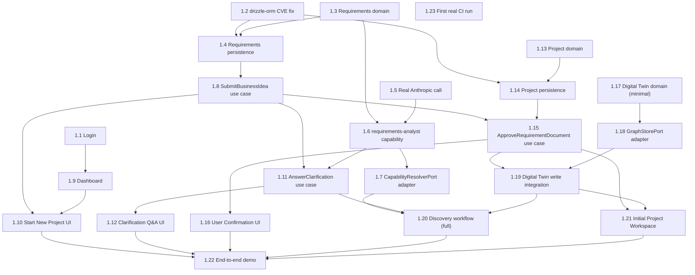

# Sprint 1 Dependency Map

**Revised 2026-07-16** for the merged, single-slice structure ([01-sprint-1-backlog.md](01-sprint-1-backlog.md), [02-vertical-slice-catalog.md](02-vertical-slice-catalog.md)).

## Epic dependencies

None — there is now exactly one Epic (Discovery-to-Project Delivery) and one Vertical Slice (VS-1).

## Vertical Slice dependencies

None — VS-1 is Sprint 1's entire deliverable.

## Task-level dependency graph

## Critical path

**1.3 → 1.6 (also needs 1.5) → 1.7 → 1.11 → 1.20 (also needs 1.19, which needs 1.15 + 1.17/1.18) → 1.22.**

Spelled out: domain (1.3) → capability implementation (1.6, gated also on the real LLM call, 1.5) → capability resolver (1.7) → clarification use case (1.11) → [in parallel: Project domain/persistence (1.13/1.14) → approval use case (1.15) → Digital Twin domain/adapter (1.17/1.18) → Digital Twin write integration (1.19)] → full workflow definition (1.20) → end-to-end demo (1.22). The Digital Twin track (1.17/1.18/1.19) is now genuinely on the critical path — it wasn't in the prior two-slice structure, because nothing needed real Digital Twin writes before this merge.

Every UI task (1.1, 1.9, 1.10, 1.12, 1.16, 1.21) and the CI task (1.23) hang off this spine without being on it.

## Parallel work opportunities

- **Day one, fully independent:** 1.1 (login), 1.2 (CVE fix), 1.3 (requirements domain), 1.5 (real LLM call), 1.13 (Project domain), 1.17 (Digital Twin domain) — six genuinely independent starting points, more than the prior structure had, because the Digital Twin and Project domains add two more zero-dependency tracks.
- **1.9** (Dashboard) only needs 1.1 — can proceed well before any backend structuring work lands.
- **1.14** (Project persistence) and **1.4** (Requirements persistence) both only need 1.2 plus their respective domain task — fully parallel with each other.
- **1.18** (`GraphStorePort` adapter) only needs 1.17 — can proceed in parallel with the entire Requirements/LLM/Capability track.
- UI tasks 1.10, 1.12, 1.16, 1.21 each proceed as soon as their respective backend dependency lands, in parallel with each other and with whatever backend work is next on the critical path.

## Blocked work

- **1.4, 1.14** blocked on **1.2** (CVE fix) — same reasoning as before, now applying to two persistence packages instead of one at a time.
- **1.6** blocked on **1.3** and **1.5**.
- **1.15** blocked on **1.8** and **1.14**.
- **1.19** blocked on **1.15**, **1.17**, and **1.18** — the single biggest new blocking node this merge introduces; nothing writes to the Digital Twin until the approval use case, the Digital Twin domain, and its adapter are all done.
- **1.20** blocked on **1.7**, **1.11**, and **1.19** — the full workflow definition cannot be finished until the Digital Twin write step it now includes actually exists.
- **1.22** blocked on effectively everything, by design.

## Recommended optimal execution order

1. **Day one, in parallel:** 1.1, 1.2, 1.3, 1.5, 1.13, 1.17 — six independent starting points.
2. **Once 1.2 lands (plus 1.3/1.13 respectively):** 1.4 and 1.14, in parallel.
3. **Once 1.17 lands:** 1.18 — start this early; it's on the critical path and easy to underestimate as "just another port adapter" when it's actually gating the whole Digital Twin write path.
4. **Once 1.3 + 1.5 land:** 1.6 — the highest-complexity task, same as before; start as early as its dependencies allow.
5. **Once 1.1 lands:** 1.9 (Dashboard) — cheap, no reason to delay.
6. **Once 1.4 + 1.18 lands and 1.9 is ready:** 1.10 (needs 1.8 too, see next).
7. **Once 1.4 lands:** 1.8; **once 1.6 lands:** 1.7; **once 1.14 lands:** (wait for 1.8 too) 1.15.
8. **Once 1.8 + 1.6 land:** 1.11 → 1.12.
9. **Once 1.15 + 1.17 + 1.18 land:** 1.19 — the new pivotal task; do not treat it as an afterthought bolted onto 1.15.
10. **Once 1.7 + 1.11 + 1.19 land:** 1.20.
11. **Once 1.15 lands:** 1.16; **once 1.15 + 1.19 land:** 1.21 — both can proceed in parallel with 1.20.
12. **1.22** once everything above is done.
13. **1.23** whenever a PR is ready and push is authorized — fully decoupled, as before.

This ordering front-loads both of the sprint's genuinely novel integration risks — the real LLM/Capability Resolver track (unchanged from the original plan) and the new Digital Twin track — rather than letting the Digital Twin work slip to the end as "the new thing," where a late-discovered problem with it would have the least runway to recover from.
