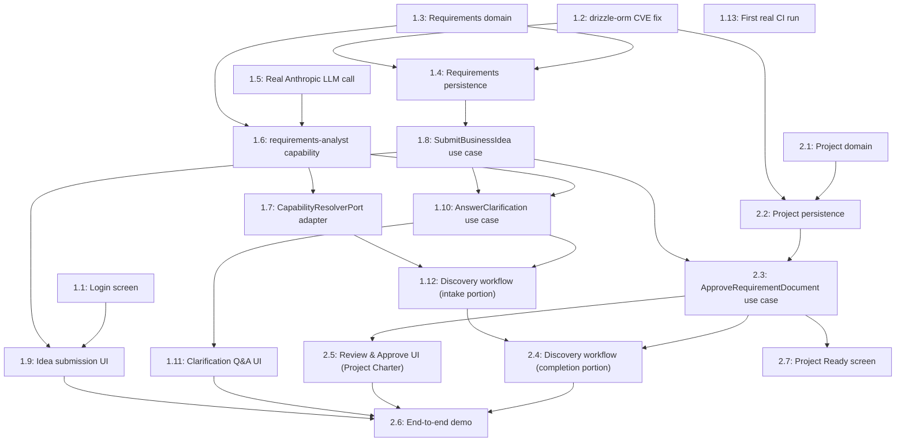

# Sprint 1 Dependency Map

## Epic dependencies

```
Epic 1 (Idea Capture & AI-Guided Structuring) → Epic 2 (Discovery Approval & Project Creation)
```

Strictly sequential at the Epic level — Epic 2 has nothing to approve until Epic 1 produces a resolved `RequirementDocument`. There is no parallel-Epic opportunity here; the real parallelism in this sprint lives at the task level, within and across Epic 1's own tasks.

## Vertical Slice dependencies

```
VS-1 (Capture and Structure a Business Idea) → VS-2 (Approve Discovery into an Approved Project)
```

Same reasoning as Epic dependencies — VS-1 and VS-2 map 1:1 to Epic 1 and Epic 2.

## Task-level dependency graph (full detail)



## Critical path

**T1.3 → T1.5 (or parallel) → T1.6 → T1.7 → T1.10 → T1.12 → T2.3 (needs T1.8, T2.2) → T2.4 → T2.6.**

Precisely: the longest true dependency chain runs **domain (1.3) → capability implementation (1.6, also needs 1.5) → capability resolver (1.7) → clarification use case (1.10) → workflow intake portion (1.12) → approval use case (2.3, also needs persistence 1.8/2.2) → workflow completion (2.4) → end-to-end demo (2.6).** Every UI task (1.1, 1.9, 1.11, 2.5, 2.7) and the CI task (1.13) hang off this spine but are not themselves on the critical path — they can trail their corresponding backend task without delaying the overall sprint, as long as they land before 2.6 (which needs the UI tasks too, per its own dependency list).

## Parallel work opportunities

- **Task 1.2** (CVE fix) can start immediately, in parallel with **Task 1.1** (login), **Task 1.3** (domain), and **Task 1.5** (real LLM call) — none of these four depend on each other.
- **Task 1.5** (real Anthropic call) is fully independent of the entire Requirements Intake domain/persistence track (1.3/1.4) until Task 1.6 needs both.
- **Task 2.1** (Project domain) has zero dependencies and can start on day one, in parallel with all of Epic 1's early tasks — it only needs to *land* before Task 2.2, not before anything in Epic 1.
- Once their respective backend task lands, **Tasks 1.9, 1.11, 2.5, and 2.7** (all four UI screens) can proceed in parallel with each other and with whichever backend task is next in the critical path.
- **Task 1.13** (first real CI run) is decoupled from the rest of the sprint's dependency chain entirely — it only needs *a* PR to be ready and push authorized; it does not gate or get gated by any other task.

## Blocked work

- **Task 1.4** (persistence) is blocked on **Task 1.2** (CVE fix) — building new persistence on a known-vulnerable dependency would manufacture new debt.
- **Task 2.2** (Project persistence) is blocked the same way, on **Task 1.2**.
- **Task 1.6** (capability implementation) is blocked on both **Task 1.3** (domain shapes) and **Task 1.5** (real LLM call) — it needs both a shape to structure into and a real provider to call.
- **Task 2.3** (approval use case) is blocked on **Task 1.8** (the document it approves must be creatable) and **Task 2.2** (the Project it creates must be persistable).
- **Task 2.6** (end-to-end demo) is blocked on effectively everything — by design, it's the sprint's final proof, not an early task.

## Recommended optimal execution order

1. **Day one, in parallel:** Task 1.2 (CVE fix), Task 1.1 (login), Task 1.3 (domain), Task 1.5 (real LLM call), Task 2.1 (Project domain) — five independent starting points, no reason to serialize any of them.
2. **Once 1.2 + 1.3 land:** Task 1.4 (persistence). **Once 1.2 + 2.1 land:** Task 2.2 (Project persistence) — both can proceed in parallel with each other.
3. **Once 1.3 + 1.5 land:** Task 1.6 (capability implementation) — the sprint's highest-complexity task; start it as early as its dependencies allow, not late.
4. **Once 1.4 lands:** Task 1.8 (SubmitBusinessIdea use case); **once 1.6 lands:** Task 1.7 (capability resolver adapter) — parallel tracks.
5. **Once 1.8 + 1.6 land:** Task 1.10 (AnswerClarification use case).
6. **Once 1.7 + 1.10 land:** Task 1.12 (workflow intake portion).
7. **Once 1.8 + 2.2 land:** Task 2.3 (approval use case) — can start well before 1.12 finishes, since it depends on 1.8/2.2, not 1.12.
8. **Once 1.12 + 2.3 land:** Task 2.4 (workflow completion portion).
9. **UI tasks (1.9, 1.11, 2.5, 2.7) proceed continuously, each starting as soon as its backend dependency lands** — never batched to the end.
10. **Task 2.6** (end-to-end demo) once everything above is done.
11. **Task 1.13** (first real CI run) as soon as any PR is ready and push is authorized — not gated on sprint completion.

This ordering is the task-level realization of [08-implementation-order.md](08-implementation-order.md)'s Epic/Slice-level recommendation — front-loading the highest-complexity, most architecture-validating work (Task 1.6, the real capability implementation) rather than deferring it behind lower-risk plumbing.
