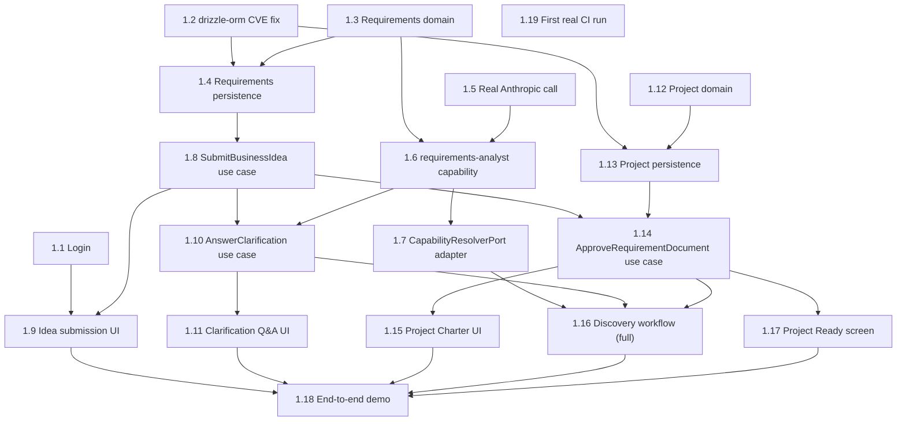

# Sprint 1 Dependency Map

**Revised 2026-07-17** for the corrected, PDR-synchronized 19-task list ([02-vertical-slice-catalog.md](02-vertical-slice-catalog.md)).

## Epic dependencies

None — one Epic (Discovery-to-Project Delivery), one Vertical Slice (VS-1).

## Vertical Slice dependencies

None — VS-1 is Sprint 1's entire deliverable.

## Task-level dependency graph

## Critical path

**1.3 → 1.6 (also needs 1.5) → 1.7 → 1.10 → 1.16 (also needs 1.14, which needs 1.8 + 1.13) → 1.18.**

Spelled out: domain (1.3) → capability implementation (1.6, gated also on the real LLM call, 1.5) → capability resolver (1.7) → clarification use case (1.10) → [in parallel: Project domain/persistence (1.12/1.13) → approval use case (1.14)] → full workflow definition (1.16) → end-to-end demo (1.18). Shorter than the 2026-07-16 revision's critical path — the Digital Twin track (former 1.17/1.18/1.19) is gone, since it was never approved scope.

Every UI task (1.1, 1.9, 1.11, 1.15, 1.17) and the CI task (1.19) hang off this spine without being on it.

## Parallel work opportunities

- **Day one, fully independent:** 1.1 (login), 1.2 (CVE fix), 1.3 (requirements domain), 1.5 (real LLM call), 1.12 (Project domain) — five independent starting points (one fewer than the 2026-07-16 revision's six, since the Digital Twin domain task is gone).
- **1.5** (real Anthropic call) remains fully independent of the Requirements Intake domain/persistence track until Task 1.6 needs both.
- **1.12** (Project domain) has zero dependencies and only needs to land before 1.13, same as before.
- UI tasks 1.9, 1.11, 1.15, 1.17 each proceed as soon as their respective backend dependency lands, in parallel with each other and with whatever backend work is next.
- **1.19** (first real CI run) remains fully decoupled — needs only a ready PR and push authorization.

## Blocked work

- **1.4, 1.13** blocked on **1.2** (CVE fix).
- **1.6** blocked on **1.3** and **1.5**.
- **1.14** blocked on **1.8** and **1.13**.
- **1.16** blocked on **1.7**, **1.10**, and **1.14**.
- **1.18** blocked on effectively everything, by design.

## Recommended optimal execution order

1. **Day one, in parallel:** 1.1, 1.2, 1.3, 1.5, 1.12 — five independent starting points.
2. **Once 1.2 lands (plus 1.3/1.12 respectively):** 1.4 and 1.13, in parallel.
3. **Once 1.3 + 1.5 land:** 1.6 — the sprint's highest-complexity task.
4. **Once 1.4 lands:** 1.8; **once 1.6 lands:** 1.7 — parallel tracks.
5. **Once 1.1 + 1.8 land:** 1.9.
6. **Once 1.8 + 1.6 land:** 1.10 → 1.11.
7. **Once 1.8 + 1.13 land:** 1.14.
8. **Once 1.14 lands:** 1.15 and 1.17, in parallel.
9. **Once 1.7 + 1.10 + 1.14 land:** 1.16.
10. **1.18** once everything above is done.
11. **1.19** whenever a PR is ready and push is authorized — fully decoupled.

This ordering is shorter and lower-risk than the 2026-07-16 revision's, precisely because it no longer carries the Digital Twin pull-forward's schedule and architecture-drift risk — the sprint validates exactly what the Product Design Review asked it to, nothing more.
