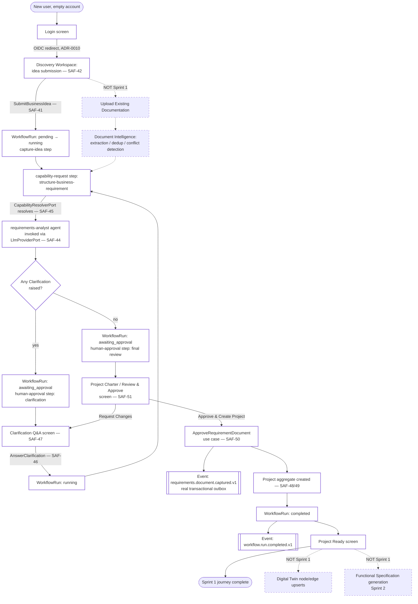

# UX Flow Diagram — Sprint 1

Represents the complete Sprint 1 experience, including the platform-internal transitions (workflow state, capability execution, events) behind each user-visible step — per the review's instruction to include decision points, alternative paths, AI interactions, workflow transitions, approvals, rework loops, artifact generation, capability execution, and platform events. Document uploads and Digital Twin updates are shown as explicitly out of scope for Sprint 1 (see [04](04-document-intelligence-review.md), [06](06-project-workspace-review.md)), not omitted silently.

## Reading the diagram

- **Solid-path nodes** are Sprint 1's real scope, in implementation order.
- **Dashed-path nodes** (Upload/Document Intelligence, Digital Twin, Functional Specification) are shown only because the review's full journey asks for completeness — none is built, none is recommended for Sprint 1.
- **Decision points:** "Any Clarification raised?" (loops back to the clarification screen or proceeds to review) and "Request Changes vs. Approve" on the review screen (loops back to clarifications or completes the workflow).
- **Rework loop:** clarification → re-structuring → clarification, bounded by the agent's own project-scoped memory (never re-asking an already-answered question, per [03-discovery-workshop-review.md](03-discovery-workshop-review.md)).
- **Approval gates:** exactly two `awaiting_approval` states — one per clarification round (a lightweight, per-answer gate) and one final review gate before `Project` creation. Neither is skippable; SAF-50's rule blocks approval while any `Clarification` is outstanding.
- **Platform events:** `requirements.document.captured.v1` (first real emission, per [BASELINE.md](../../../BASELINE.md)'s previously-designed-but-unemitted event) and the existing `workflow.run.*` events, both through the real transactional outbox — no new event types invented for this flow.
- **Capability execution:** the only capability this flow invokes is `structure-business-requirement`, resolved through `CapabilityResolverPort`'s first real adapter (SAF-45) — confirmed exhaustively in [10-capability-model-review.md](10-capability-model-review.md).
