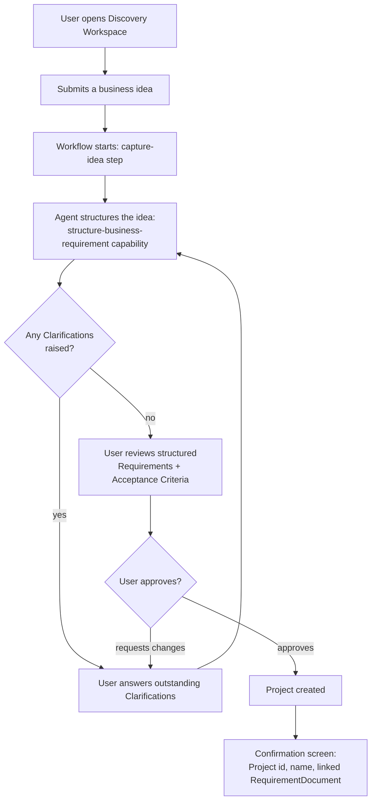

# Discovery Workspace — UX Flow and Wireframes (Sprint 1)

Companion to [docs/backlog/sprint-1-backlog.md](../backlog/sprint-1-backlog.md). Describes the user-facing experience for Epics A–D of Sprint 1's Discovery Workspace — not implementation, not yet approved for build.

## Scope decision: guided, structured flow — not open-ended chat

The Discovery Workspace is a **guided, multi-step flow with structured review points**, not a freeform chat interface. This follows directly from what's already designed, not from a UX preference invented for this document: `RequirementDocument`, `Requirement`, `Clarification`, and `AcceptanceCriterion` ([02-domain-model.md](../architecture/02-domain-model.md)) are discrete, structured entities, not a chat transcript. Building a conversational/chat UI now would require inventing a message/conversation aggregate nothing in the frozen architecture describes — that's a [Future Ideas](../../ROADMAP.md) candidate, not this sprint's scope.

## User journey



Each box after "Submits a business idea" corresponds to a real `WorkflowRun` state transition (SAF-52): `pending → running → awaiting_approval → running → ... → awaiting_approval → completed`. The user never sees workflow/step internals — only the four screens below.

## Primary screens

### 1. Idea submission (SAF-42)

The Discovery Workspace's entry point. One free-text field — deliberately unstructured on input, since structuring is the agent's job, not a form's.

```
┌──────────────────────────────────────────────────────────────┐
│  SAP App Factory · Discovery Workspace                       │
├──────────────────────────────────────────────────────────────┤
│                                                                │
│  Describe your business idea                                  │
│  ┌──────────────────────────────────────────────────────────┐│
│  │ We need a way for warehouse staff to reconcile physical   ││
│  │ stock counts against SAP inventory records at the end of  ││
│  │ each shift, and flag discrepancies over a threshold...    ││
│  │                                                            ││
│  └──────────────────────────────────────────────────────────┘│
│                                                                │
│  Workspace: [ Acme Retail Ops ▾ ]                             │
│                                                                │
│                                          [ Start Discovery ]  │
└──────────────────────────────────────────────────────────────┘
```

**Acceptance criteria this screen must satisfy:** submit is disabled for empty input; on submit, the user is taken directly to a loading/processing state, not left wondering whether anything happened (SAF-42's own AC requires visible confirmation a discovery session started).

### 2. Clarification Q&A (SAF-47)

Shown only while `RequirementDocument.clarifications` contains any unanswered entry. One question at a time or a short list — list form shown below, since the agent may raise more than one in a single pass.

```
┌──────────────────────────────────────────────────────────────┐
│  Discovery Workspace · Clarifications needed                 │
├──────────────────────────────────────────────────────────────┤
│                                                                │
│  The assistant needs a bit more detail before continuing:      │
│                                                                │
│  1. What counts as a "discrepancy over threshold" —            │
│     a fixed unit count, a percentage, or both?                │
│     ┌────────────────────────────────────────────────────┐   │
│     │                                                    │   │
│     └────────────────────────────────────────────────────┘   │
│                                                                │
│  2. Should flagged discrepancies notify a supervisor           │
│     immediately, or only appear on a review report?            │
│     ┌────────────────────────────────────────────────────┐   │
│     │                                                    │   │
│     └────────────────────────────────────────────────────┘   │
│                                                                │
│                                    [ Submit Answers ]         │
└──────────────────────────────────────────────────────────────┘
```

**Acceptance criteria this screen must satisfy:** every unanswered `Clarification` for the session is shown; submitting re-triggers structuring (SAF-46) and the user lands back on this same screen only if new clarifications come back, otherwise proceeds to review (screen 3) — matching the loop in the journey diagram above.

### 3. Discovery review & approval (SAF-51)

Shown once no unanswered `Clarification` remains. Read-mostly — the point is human judgment on the agent's structuring, not re-editing every field by hand.

```
┌──────────────────────────────────────────────────────────────┐
│  Discovery Workspace · Review & Approve                      │
├──────────────────────────────────────────────────────────────┤
│                                                                │
│  Structured from your idea:                                    │
│                                                                │
│  ▸ Requirement (functional): Reconcile physical stock counts   │
│    against SAP inventory at shift end.                         │
│      Acceptance criteria:                                      │
│      • System compares counted vs. system quantity per SKU.    │
│      • Discrepancies beyond the agreed threshold are flagged.  │
│                                                                │
│  ▸ Requirement (functional): Flag discrepancies over threshold  │
│    on a supervisor review report.                              │
│      Acceptance criteria:                                      │
│      • Flagged items appear on a per-shift report.              │
│      • Report is available to supervisor role only.             │
│                                                                │
│  ▸ Requirement (non-functional): Reconciliation must complete   │
│    within the shift-close window.                              │
│                                                                │
│         [ Request Changes ]              [ Approve & Create Project ] │
└──────────────────────────────────────────────────────────────┘
```

**Acceptance criteria this screen must satisfy:** "Approve & Create Project" is only enabled when no `Clarification` is outstanding (mirrors SAF-50's rule server-side, not just client-side); "Request Changes" routes back into the clarification loop rather than being a dead end.

### 4. Project created (confirmation)

```
┌──────────────────────────────────────────────────────────────┐
│  Discovery Workspace · Project Created                       │
├──────────────────────────────────────────────────────────────┤
│                                                                │
│  ✓ Project created: "Shift-End Stock Reconciliation"            │
│                                                                │
│  Workspace:        Acme Retail Ops                            │
│  Project ID:       proj_8f2c...                                │
│  Requirements:      3 (linked)                                 │
│  Discovery session: Complete                                    │
│                                                                │
│                                        [ View Project ]        │
└──────────────────────────────────────────────────────────────┘
```

"View Project" links to nothing yet beyond this confirmation — a real Project workspace/dashboard is out of this sprint's scope (Sprint 2+ builds on top of the `Project` this screen confirms was created).

## Explicitly out of scope for Sprint 1

- A conversational/chat interface (see the scope decision above).
- Editing structured `Requirement`/`AcceptanceCriterion` text inline on the review screen — "Request Changes" re-opens the clarification loop instead, keeping the agent (not a rich text editor) as the single place structuring happens.
- Any Project dashboard or generation trigger beyond the creation confirmation — that's Sprint 2/3 territory per [ROADMAP.md](../../ROADMAP.md).
- Real-time/async notification of a human when clarifications are ready — the flow is synchronous and single-session this sprint (see the backlog's rationale for deferring SAF-38).
